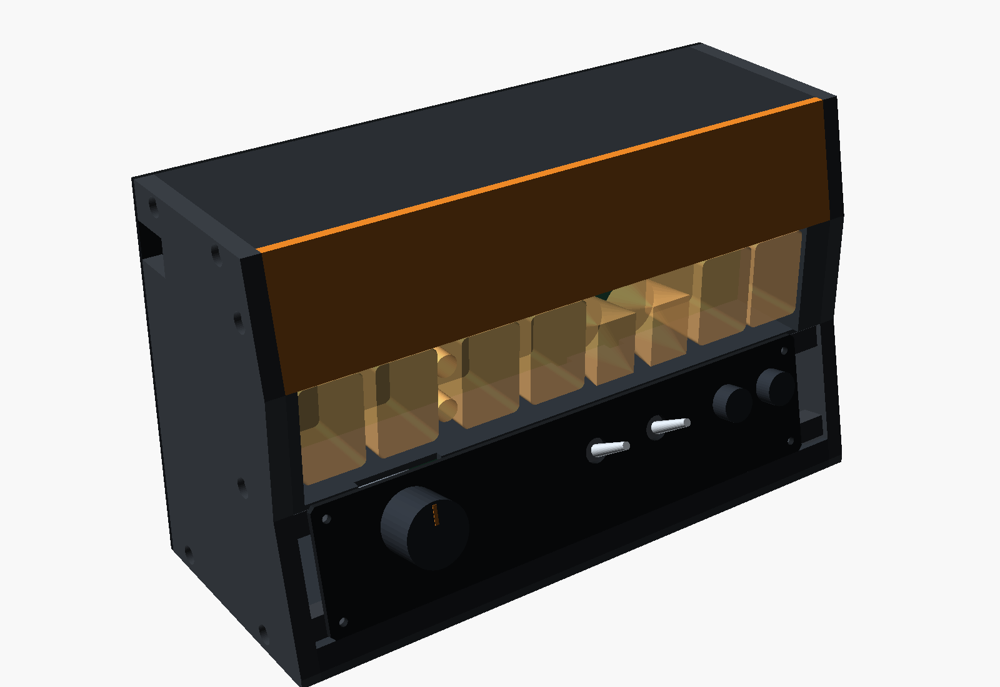

# TS06 pair case, concept A

A parametric case for the through-hole pair, TS06-DISP riding on TS06-DRV. It is drawn around
the boards as they are in this repository. The brief is the case section of
`Claude outputs/TS06-pair-review.md`. It keeps Rev F's idea: two cheeks carry everything, and
nothing else is structure. The module (both boards) hangs from four bosses and lifts out
backwards as one piece. A brow, a trench frame, a base and a rear panel close the box between
the cheeks.



| File | What it is |
|---|---|
| `case_pair.py` | The generator. It reads the boards, holds every dimension with its source, derives the geometry, runs the checks, and writes `params.scad`, `checks.md` and the drawings. |
| `case.scad` | The OpenSCAD model. It includes `params.scad` and derives the same numbers. It echoes them so they can be compared with the generator's (`--render` does this). |
| `params.scad` | Generated. Every dimension is a named variable with its kind and source, plus the board data in world coordinates. |
| `boards.json` | Generated by `--extract`. Holes, parts and courtyards of TS06-DISP, TS06-DRV and TS06-FASCIA in world coordinates, with hashes of the files they came from. |
| `checks.md` | Generated. The envelope, every interference check, and every dimension with its source. |
| `out/front.svg`, `section.svg`, `plan.svg`, `exploded.svg` | Dimensioned drawings at 1:1: front elevation, side section through M10 with the ±10° sight lines, plan section through the jack axis, exploded side view. |
| `out/*.png` | OpenSCAD views: `iso`, `iso_rear`, `front`, `exploded`, `module`. |
| `out/*.stl` | Printable parts in world position: `cheek_l`, `cheek_r`, `brow`, `trench`, `base`, `rear`, and `fascia_blank` (the PETG fit proxy that cad-component-library §5 asks for). |

**Frame.** X and Y are the FreeCAD assembly's frame, the one the review uses. X runs across the
front from the clock's left, where TS06-DISP's x = 0. Y points up: TS06-DISP's top edge is at
78 and TS06-DRV's bottom edge is at 4. Z is depth: 0 at the ИН-12 glass front, positive toward
the back. OpenSCAD maps x = X, y = Z, z = Y, so the clock faces -y.

**Where the board numbers come from.** `tools/mkpcb_disp.py` and `tools/mkpcb_drv.py` are
imported as modules. That runs their placement and hand-laid copper, with no router and no file
written. `TS06-FASCIA.kicad_pcb` is parsed directly. **The committed
`PCB/TS06-DRV/TS06-DRV.kicad_pcb` is not used.** It is still the 100 x 70 "driver half" from
commit 08a9a1c, and the generator no longer matches it.

## Envelope: 189.0 W x 120.3 H x 83.6 D (mm, outside)

| Width | mm | Source |
|---|---|---|
| Boards | 176.0 | `mkpcb_disp.W`, `mkpcb_drv.W` |
| Clearance, 2 x 0.5 | 1.0 | review, envelope |
| Cheeks, 2 x 6 | 12.0 | review, envelope |
| **Outside** | **189.0** | |

| Depth, front to back | mm | Source |
|---|---|---|
| Kick-strip toe to the face plane | 9.8 | the 12° rake (spec §6) run down to the floor |
| Glass recess behind the face | 1.0 | design: a knock lands on the case, not the glass |
| ИН-12 glass to TS06-DISP's front face | 30.0 | envD 25.5 (`3d/IN12.FCStd`) + socket seat 4.5 (**assumed**, review "≈ 30") |
| TS06-DISP | 1.6 | pcbkit |
| Stack gap | 11.0 | PBS 8.5 + PLS body 2.5 (`bom.md`); review finding 1: measure them |
| TS06-DRV | 1.6 | pcbkit |
| Tallest part, U13 (DS3231 mini standing) | 22.0 | review finding 6 |
| Air in front of the rear panel | 5.0 | review, envelope |
| Rear panel, FR4 blank | 1.6 | review suggestion 2 |
| **Outside** | **83.6** | glass front to the rear panel is 71.2 (review: 65–72) |

| Height, bottom to top | mm | Source |
|---|---|---|
| Base | 3.0 | design |
| Floor to TS06-DRV's bottom edge | 11.3 | 4.0 in the FreeCAD frame, **+ 7.3 for the fascia lead** (below) |
| TS06-DRV | 100.0 | `mkpcb_drv.H` (Y 4 to 104) |
| Top clearance | 3.0 | review, envelope |
| Top bar | 3.0 | design |
| **Outside** | **120.3** | inside, floor to top bar: 114.3 (review: ~106) |

The front face, bottom up: kick strip 7.2 · TS06-FASCIA 39.1 (40 along the 12° rake) · trench
window 36.4 · brow 34.6. The trench window is 163.5 wide.

What-ifs are one command each (see "Regenerate"):

| What changes | Outside W x H x D |
|---|---|
| This concept | 189.0 x 120.3 x 83.6 |
| U13, C7 and VT21 laid down (review finding 6) | 189.0 x 120.3 x 78.2 |
| Tubes soldered straight into the board, no socket seat (`IN12_SEAT=0`) | 189.0 x 120.3 x 79.1 |
| 7.0 mm PBS instead of 8.5 (`PBS_H=7.0`) | 189.0 x 120.3 x 82.1 |
| The floor at FreeCAD Y 0, with a trough in the base for the fascia lead | 189.0 x 113.0 x 82.1 |

## Review suggestions implemented

1. **Cheeks and boards.** Two 6 mm cheeks. TS06-DRV's H6 and H8 go to the left cheek (world X 3.5;
   Y 7.5 and 81.5), and H5 and H7 to the right (X 172.5; Y 7.5 and 100.5). Each lands on an 8 mm
   boss with an M3 heat-set insert, in front of TS06-DRV. The display rides on its four 11 mm
   standoffs, so the pair lifts out as one module.
2. **The rear panel is a board.** It is a 1.6 mm FR4 blank screwed into the cheeks' rear edges.
   Seven 2.0 mm vent slots sit above the converter (X 100–130, Y 85–100), and the panel carries
   the 12 V / 185 V / "unplug, wait 15 s" label.
3. **Connector openings.**
   - DC jack: a Ø9 hole through, and a Ø14 counterbore **from the outside** that leaves a 1.5 mm
     web. The plug engages 7.2 mm. The review's "pocket from inside" would leave the outer face
     where it is, and the plug would engage only 2.7 mm.
   - USB: a 12 x 9 slot, **open to the cheek's rear edge**. The mini-B receptacle sits 1.9 mm
     inside the cheek, so a closed window would trap the module.
4. **Brow and trench.**
   - The soffit is 0.8 mm above the tall glass. Behind the ИН-17 pair a valance rib comes down to
     Y 74.0, the "top 4 mm" of the review, and hides XP12. Over the ИН-12s and ИН-15s the rib
     cannot be there: those tubes would not come out past it.
   - The left trench wall is at X 3.0 and hides XP11. The right wall is at X 166.5 and hides the
     H4 screw.
   - A sill at Y 39.0 hides XP21–25. That is the review's "≥ 38", kept under the ИН-17 LEDs.
   - The brow is safety orange (spec §6).
5. **Fascia.**
   - The fascia is tied to the cheeks with four M2.5 bosses at its real holes. It is registered at
     X 0–176, like the boards.
   - The fascia lead runs from DRV J1 (top entry, X 44–54, Y 9) down to the floor, diagonally
     across it, and up into the fascia's J1 at X 152.
6. **Heat.** Top-of-panel vents only, as the review says.
7. **Service.** Take the rear panel off (4 screws) and the module screws out (4). Draw the module
   back, unplug DRV J1 from below, and lift it out.

## Interference results

Full table: `checks.md`. What does not simply pass:

| | Result |
|---|---|
| Rear panel vs parts | U13 is 5.0 clear, C7 7.0, VT21 8.0, the Nano 10.4 (16.6 tall, not the review's ~15), and L1 11.0 (16 tall per its footprint, not 12–14). |
| Jack engagement | Plain 6 mm cheek: 2.7 mm (**fail**). Outside counterbore: 7.2 mm (ok). The review's inside pocket: 2.7 mm (**fail**). |
| Brow at 10° from above | The digits stay visible for any cathode depth, up to 12.6° for the rearmost one. The glass top shows only for its first 3.6 of 25.5 mm; the brow takes the dome band, as spec §6's "brow reveal" describes. |
| What the brow hides | XP12 over the ИН-17s is hidden down to 43.6° below. Over the ИН-15s it shows only through the 0.8 mm slot above the glass (±0.8°), or through the glass from below. TS06-DRV's top band and XP21–25 are hidden within ±60°. |
| Left trench wall vs H10 glass | 0.475 mm nominal, 0.075 mm with the library's +0.4 glass allowance (**tight**; the trench coupon settles it). |
| Sill vs ИН-17 LEDs | 0.59 mm (**tight**). |
| SR25 rotary vs sill | The compressed fascia puts the rotary's rim 0.5 mm below its top edge. The sill steps back to Z 8.2 over X 15.5–44.5, which leaves a 7 mm slot behind the fascia's top edge. |
| Fascia lead vs floor | The fascia's J1 is side-entry and points its lead down the rake. The lead needs the floor **7.3 mm below** the FreeCAD Y 0, and that is where the model puts it. The alternative is a trough 8 mm deep in the base at X 141–163. |
| Fascia lead length | 135 mm path against a 150 mm lead: 15 mm of slack (**tight**). Make it 180–200 mm. |
| КМД1 (SW5) vs the fascia's top-right hole | 1.2 or 2.6 mm from the hole centre, depending on how the body is turned (**tight**). |
| Fascia boss vs R5 | 0.4 mm (**tight**). |
| ИН-17 pair (inherited) | Centres 13.0 apart against Ø20 stems: 7.0 mm of overlap if the drawing's Ø20 runs to the leads (**fail**). Rev F spaced them 20.5 for this reason. This is not a case problem, but it decides whether the pair builds. |

## Still assumed

- The socket seat of 4.5 mm (the ИН-12 glass front 30 in front of TS06-DISP).
- PBS 8.5 and PLS 2.5 (review finding 1).
- Part heights: U13 22, C7 20, VT21 19; the jack body 11 with its axis 6.5; F1, U14, the
  trimmer, discs and DIP sockets.
- A 9.5 mm 5.5/2.1 barrel whose nose is Ø10, needing 7 mm of engagement.
- The mini-B receptacle at 7.7 x 4.0, and its overmould at 11 x 8.
- The fascia lead's geometry: the header 4.8 high, the plug 3.0 past the header mouth, and a
  bend radius of 3.
- The control bodies behind the fascia: rotary 16 deep, МТ1 30 deep, КМД1 20 deep. The КМД1's
  orientation is not known.
- The LED flange of Ø3.8, the pin tails of 1.5, and low screw heads of 2.0.
- The fascia's registration in X. The FreeCAD assembly has it about 7 mm off (review 5).
- `PCB/TS06-DRV/bom.md` lists case screws for H5/H6 only. This model uses all four, as the review
  does.

## Regenerate

```
python3 3d/case-pair/case_pair.py --extract   # re-read the boards (imports tools/, writes boards.json only)
python3 3d/case-pair/case_pair.py             # params.scad, checks.md, out/*.svg
python3 3d/case-pair/case_pair.py --render    # + out/*.stl and out/*.png (OpenSCAD 2021.01, xvfb-run)
python3 3d/case-pair/case_pair.py IN12_SEAT=0 # what-if: prints the envelope, writes nothing
openscad -D 'PART="cheek_r"' -o cheek_r.stl 3d/case-pair/case.scad
```

The generator needs only Python 3's standard library. OpenSCAD comes from apt
(`apt-get install openscad`). The PNG views need an X server, so `--render` wraps them in
`xvfb-run`. The `--render` step also checks that `case.scad` derives the same numbers as the
generator, and prints `ok` or `MISMATCH` for each.
