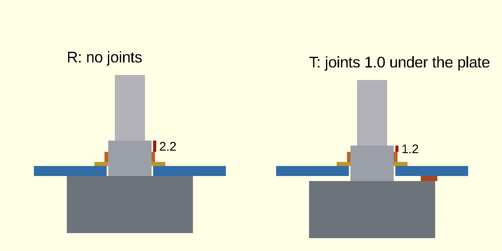
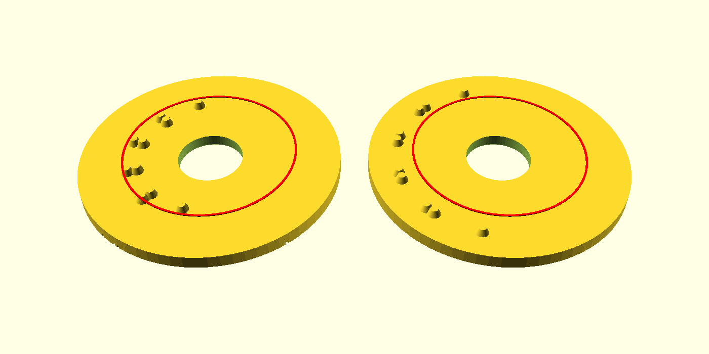
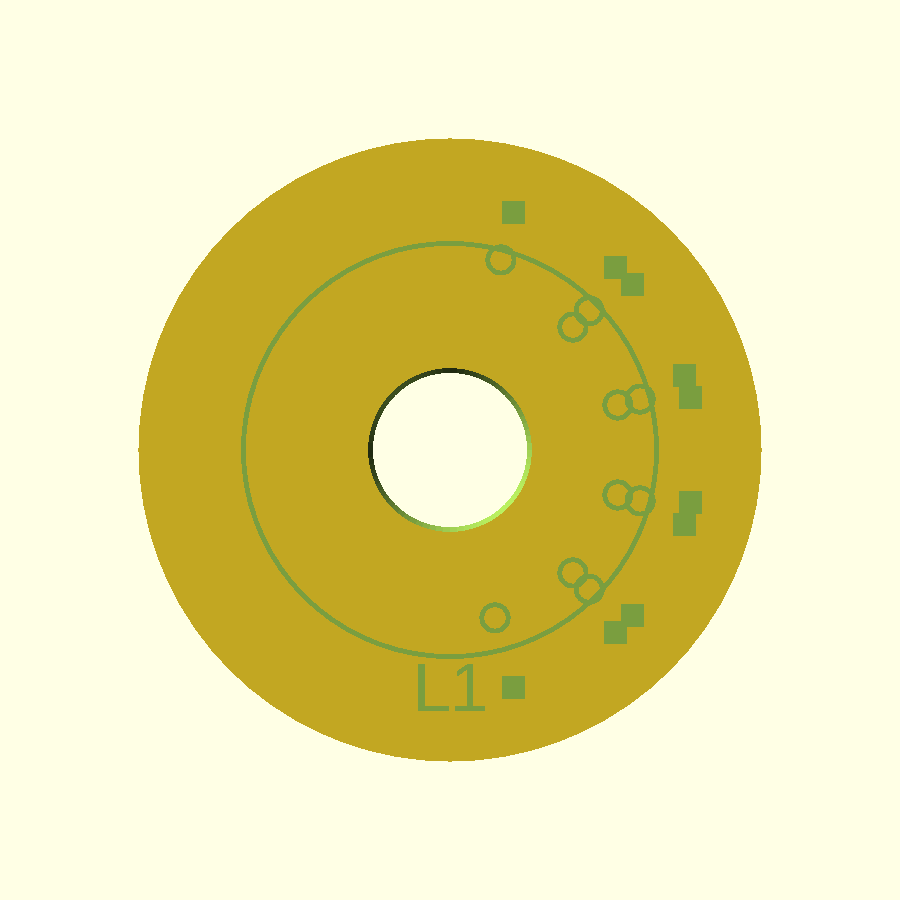

# Dry-fit jig for fascia T (the SR25, its washer and nut, a knob)

Nothing here touches `PCB/`, `fab/`, `tools/` or `recovered/`. Nothing was ordered, printed or measured on a real SR25:
the jig is a model and a set of bench steps. Items marked *inferred* are typical figures; items marked *unconfirmed* are
read from the CAD model (`3d/SR25.FCStd`, `knowledge/TERMINAL-06-spec.txt` Rev D.3) and not yet from the part in hand.

The owner's words (chat, 2026-10-07, about 12:05 UTC), the part that started this: "expand on dry run, maybe 3d printed
trest jig is in order?"

## What the jig answers

On fascia T the dial's 10 solder joints stand on the **back** of the board, under the SR25's 25 mm plate. The plate rests on them
and stands about 1 mm off the board (*inferred*). The bushing is 7.00 mm usable (CAD); the board takes 2.0 mm of it. So the
threaded stub in front of the fascia is

| Fascia | Stub in front of the face | Where it comes from |
|---|---|---|
| R as ordered | 5.00 mm | 7.00 - 2.00 |
| T, first plan (joints at r 10.6 and r 12.0, under the plate) | **4.00 mm** | 7.00 - 2.00 - 1.0 for the joints (*inferred*) |
| T, in-line layout on a bigger circle (the concepts run) | 5.00 mm **if the joints are outside the plate** | see "Layout 2" below |

The washer and the nut have to fit in that stub with the nut seated on full thread. Their sizes are not in the repo.

## The bench steps

Tools: a caliper (0.01 mm), the SR25 with its own washer and nut, a 0204 resistor if you have one, and any knob.

### 1. Measure first (write the numbers in the right-hand column)

| # | What | How | Expected (CAD / *inferred*) | Your number |
|---|---|---|---|---|
| a | Bushing thread, major diameter | jaws across the crests | 8.62 mm | |
| b | Thread length `L_th`, from the body's face to the bushing's end | depth rod, or jaws against the body | 7.00 mm | |
| c | Unthreaded neck `N` next to the body, if any | look and feel where the thread starts | none | |
| d | Thread pitch `p` | count crests over 5.00 mm, divide: p = 5 / count (or a pitch gauge) | not known | |
| e | Nut thickness `t_n` | jaws on the two faces | *inferred* 1.5 to 3 mm | |
| f | Nut across flats `AF` and across corners `AC` | jaws on opposite flats, then on opposite corners (AC should be about 1.155 x AF) | *inferred* AF 10 to 12 mm | |
| g | Washer thickness `t_w`, outside and inside diameter | jaws; a toothed lock washer is thicker and springs, measure it **tightened** | *inferred* 0.5 to 1.0 mm, OD 14 to 16 | |
| h | The stack `S` = washer + nut as tightened | nut run on to the washer, jaws across both | `t_w + t_n` | |
| i | Shaft diameter | jaws | 6.00 mm | |
| j | Shaft form: plain, D-flat (and the distance across the flat), straight knurl or teeth | look, feel, caliper across the flat | the model has a plain 6 mm cylinder: *unconfirmed* | |
| k | Shaft length beyond the bushing's end | depth rod | 13.0 mm (CAD) | |
| l | Anything on the bushing's shoulder: an anti-turn pin, tab or notch, or a key on the washer | look; if there is one, measure its radius from the shaft's centre, its size, and its angle to the shaft's flat | none in the model or the footprint: *unconfirmed* | |
| m | The face of the plate that rests on the board: flat? rivet heads or bosses standing proud? | a straightedge across it | flat | |
| n | One real joint (see step 3): a 0204 lead soldered into a 0.8 mm hole of any scrap board of 1.6 to 2.0 mm, clipped flush, fillet height on the back | depth rod from the board's back | *inferred* 1.0 mm | `h_j` = |

### 2. The arithmetic

* `F` = free thread above the nut = `L_th - 2.0 - lift - S`, where `lift` is 0 on R and `h_j` on T (1.0 until you measure it).
* **Pass** when `F >= 0.5 mm`: the bushing's end stands at least half a millimetre proud of the nut, so the nut has seated
  on full thread (*inferred* margin: one pitch of a fine thread).
* Also pass the neck test: `N <= 2.0 + lift + t_w` (the nut must stand on thread, not on the unthreaded neck).
* The break-even stack: **T passes when `S <= 4.5 - h_j`**, R passes when `S <= 4.5`.

| Stack `S` (L_th = 7.00) | R | T, joints under the plate | Verdict |
|---|---|---|---|
| `S <= 3.0` | pass | pass for any joint up to 1.5 mm | **the caliper alone settles it: build T** |
| `3.0 < S <= 4.5` | pass | pass only if `S <= 4.5 - h_j` | measure `h_j` (row n) and use the shims; this is what the jig is for |
| `S > 4.5` | **fail** | fail | **the caliper alone settles it**: this nut and washer do not fit even R's 5.0 mm. Find a thinner nut, or no T |

With the placeholders in the picture (washer 0.8 + nut 2.0 = 2.8 mm): R has 2.2 mm free, T has 1.2 mm free, both pass.

*The picture is a schematic section, front up: blue the 2.0 mm fascia, brown the joints on the back, grey the SR25 (body, bushing,
shaft), gold the washer, orange the nut, red the free thread, its length written beside it. The washer and nut are placeholders
(0.8 and 2.0 mm, 10 mm across flats); the numbers are the arithmetic above.*

### 3. The jig, when the caliper does not settle it

1. Print the flat plate and the shims first (step "Printing"). Measure the three shim rings with the caliper and write down the real
   thickness of each (they will not be exactly 0.5).
2. Put the SR25 behind the plate: its bushing through the hole from the **back** (the side with the bumps), the plate face against the
   SR25's body. Nothing between them is R. One, two, three shim rings between them is a lift of about 0.5, 1.0 and 1.5 mm.
3. Washer and nut on the front, tightened as it would be in the clock (snug, by hand and a light turn of a spanner). Measure `F` with the
   depth rod or the jaws from the nut's top to the bushing's end. Pass is `F >= 0.5` for the lift you set.
4. Print the L1 plate. Its 10 bumps, 1.0 mm high, stand where the plan's joints stand, so the SR25's plate rests on them as it would on
   fascia T: check that it sits flat (no rocking), and that the lugs and any rivet head on the SR25's plate do not touch a bump.
5. Slide a knob on (the owner's own, or a printed one from `3d/knob/`). Its rim must clear the plate's front by at least 0.5 mm and the
   nut must stand inside its pocket without touching.
6. Look at the hole: R's dial hole is 9.2 mm and the bushing 8.62, so there is 0.29 mm a side. Push the SR25 sideways: that is the play
   the clock will have until the nut is tight.
7. If row l found a tab or pin: the jig has parameters for it (`tab_mode`, `tab_r`, `tab_ang`, `tab_d` at the top of `jig.scad`:
   1 = a hole, 2 = a notch in the rim). **Note for R**: the ordered fascia R has no tab hole; if the SR25 has a pin it needs one, and
   that is a finding for R as well as T.

### Layout 2: joints outside the plate

The SR25's plate is 25.00 mm across (radius 12.5). A joint's pad is 1.9 mm across. A joint whose centre is at radius `r` is out from
under the plate when `r - 0.95 > 12.5`, so with a 0.35 mm margin **`r >= 13.8 mm`**. At the placeholder radius of 15 mm the pad's
inner edge is at 14.05 mm, 1.55 mm clear of the plate: **the plate rests on the board, `lift` is 0, and T has R's 5.0 mm**. The dry fit is
then only about the nut, and the caliper settles it (`S <= 4.5`). The concepts run gives the real radius; `r_l2` in `jig.scad` is the one
parameter. Its in-line resistors also change the spans: the chord between two taps 30 degrees apart on radius `r` is `2 r sin 15`:
7.76 mm at r = 15. With each tap's two holes 1.4 mm apart (the jig's default, `l2_pair = 2`) the nearest holes of two neighbouring taps are
6.36 mm apart: a 0204 fits (it needs about 5.1 mm), a 0207 (7.62 mm span at the very least) does not. With one shared hole per tap
(`l2_pair = 1`, which needs holes of about 1.1 mm for two 0.5 mm leads) the span is the full 7.76 mm and a 0207 fits, which it cannot
on the plan's r 11.3.

## The jig

*Both plates seen from the back at 3/4 view, the red ring the SR25's 25 mm edge. Left: layout 1, the plan's 10 joints inside the ring.
Right: layout 2 on r = 15, all 10 outside it.*

| Part | File | What it is |
|---|---|---|
| Plate, flat | `jig_plate_flat.stl` | 38 mm round, 2.0 mm thick, the dial hole (model 9.4 mm for a 9.2 mm print, see below), no bumps: the shims go on it |
| Plate L1 | `jig_plate_L1.stl` | the same with 10 bumps, 1.0 mm high, 1.9 mm across at the foot, at the first plan's joints: tap 1 outer (r 12.0) only, taps 2 to 5 both (r 10.6 and 12.0), tap 6 inner (r 10.6) only; the taps are 30 degrees apart, tap 1 at 75 degrees (up-right as the fascia is seen from the front) |
| Plate L2 | `jig_plate_L2.stl` | the same on `r_l2` = 15 mm: 10 joints, two per tap 1.4 mm apart along the tangent, one at each end tap (a placeholder for the concepts run) |
| Shims | `jig_shims.stl` | three rings 25.0 mm outside, 10.0 mm inside, 0.5 mm thick: stack 0 / 1 / 2 / 3 for 0 / 0.5 / 1.0 / 1.5 mm |
| Lead former | `jig_former.stl` | 18 x 29 x 6.5 mm block with five rows: two 0.9 x 3.2 x 5 mm lead slits at the span, and a cradle for the body between them: 6.0 (the plan's dial span, 0204), 9.0 (the plan's ladder span), 7.62 and 10.16 (0207, tight and normal), and 6.36 (layout 2's nearest-hole span) |
| Source | `jig.scad` | one file, `part=` plate / shims / former / set / compare / section, `bumps=` 0, 1, 2 |
| Commands | `make.sh` | the commands that wrote the STL files and pictures (run one by one) |

Every plate has marks cut 0.3 mm into its FRONT face, so you can see where things stand from the side you look at: the SR25's 25 mm edge
(a ring), layout 1's joints (rings), layout 2's joints (small squares), and the plate's name (FLAT, L1, L2).

*The front face of plate L1 (the side facing down on the bed), seen from the front: names to the right as on the fascia, the rings the
plan's joints, the squares layout 2's, the long ring the SR25's edge.*

*One bed: plate L1, three shims, the former (top view; the bumps point up).*

How the former is used (a lead-forming slot, not a press): lay the resistor in the cradle, body centred between the two slits, press each
lead into its slit with a flat blade (or a card) so that it bends 90 degrees at the slit's edge, and pull the part out. The leads then stand at
the span, 0.5 mm wire in 0.9 mm slits. It is a guide for hand work, not a precision tool: check the first part against a caliper.

## Printing

All of this is *inferred* (typical FDM figures, no printer was asked).

* **Printer:** FDM, 0.4 mm nozzle, PLA or PETG. No supports, no brim. Orientation as the STL is: plates front face down on the bed (the
  face with the marks), bumps up; shims flat; former with the slits up.
* **Layers:** 0.2 mm layers, first layer 0.2 mm. For the shims 0.1 mm layers are better (0.5 mm is five layers). With 0.2 mm layers the
  slicer rounds 0.5 mm to 0.4 or 0.6, so **measure the printed rings** and use the measured thickness in the arithmetic.
* **Walls and fill:** 3 or 4 perimeters, 100 % infill. The plate is 2.0 mm, so nearly all of it is wall anyway.
* **Hole compensation:** a vertical hole printed on a 0.4 mm nozzle comes out about 0.1 to 0.3 mm under size (*inferred*). The model's hole
  is 9.2 + 0.2 = **9.4 mm** (`hole_comp` in `jig.scad`) so that the print is near R's 9.2 mm, and a 0.3 mm 45-degree chamfer on the front edge
  keeps the first layer's squash out of the hole. **Print the flat plate first, measure the hole with the caliper, and if it is outside
  9.1 to 9.3 mm change `hole_comp` by the difference and export again.** The bushing is 8.62 mm: with any of these it goes in.
* **The bumps:** 1.9 mm cones 1.0 mm high with a 1.1 mm top: a small print on the plate's top, which a 0.4 mm nozzle handles; do not
  expect a sharp top.
* **The slits:** 0.9 mm wide; if a 0.5 mm wire does not slide in, ream with a 0.8 mm drill by hand.
* **Time and plastic:** the plate about 15 minutes, the shims 5, the former 20, about 15 g of filament in all (*inferred*).

## What is inferred or unconfirmed

* The joint height (1.0 mm), the washer (0.8 mm) and nut (2.0 mm, 10 mm across flats) in the picture, the 0.5 mm margin, the printer
  compensation and times: *inferred*.
* The SR25's shaft form, thread pitch, nut and washer, any anti-turn tab, the real shaft and bushing lengths: *unconfirmed* until step 1 is done.
* The layout 2 radius (15 mm) and its two-holes-per-tap pairing: a placeholder for the concepts run.
* A note on the plan's picture: it says the shaft stands 11 mm above the fascia ("13.0 from the shoulder less 2.0"). By the CAD model the
  shaft stands 13.0 mm beyond the **bushing's end**, so 5.0 + 13.0 = **18.0 mm** above R's face (17.0 on T), not 11. Row k of step 1
  settles it on the real part; the knobs in `3d/knob/` depend on it.
