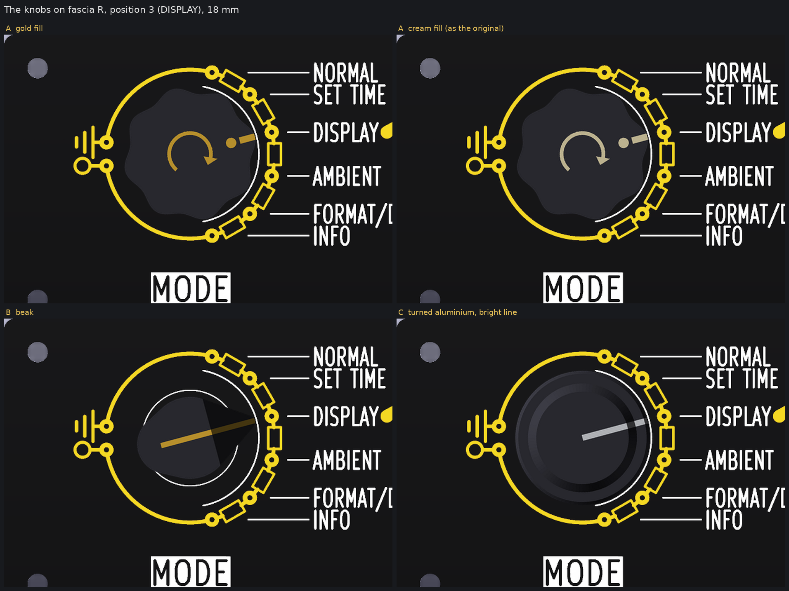
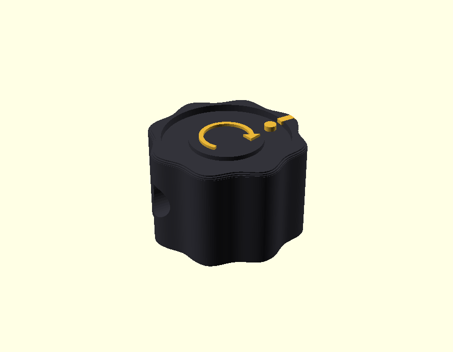
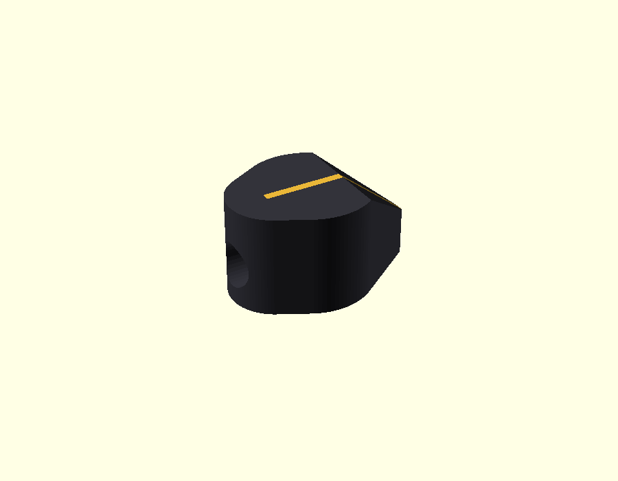
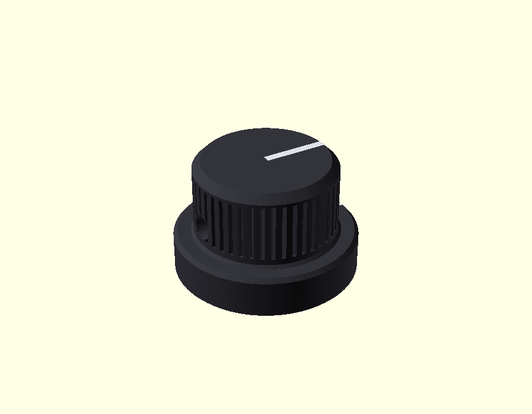
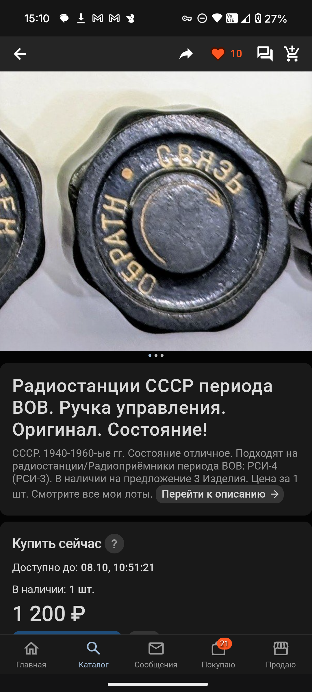
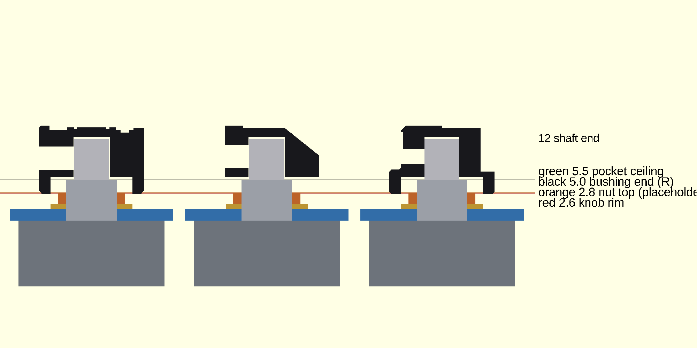
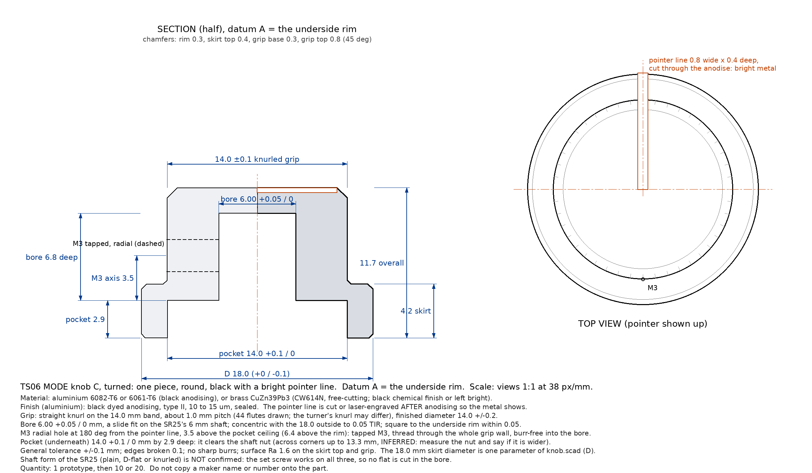

# MODE knobs for the SR25's 6 mm shaft: three designs, how to print or turn them, and the meshok search

Nothing here touches `PCB/`, `fab/`, `tools/` or `recovered/`. Nothing was ordered, uploaded or sent; no account was made and no quote
was asked for. Items marked *inferred* are typical figures; items marked *unconfirmed* come from the CAD model of the SR25 and not from the part
in hand.

The owner's words (chat, 2026-10-07, about 12:05 UTC): "come up with your own knob, we can 3D print or even order metal, you can alsso
search for soviet genuine oness on meshok, Ill attach an example". The examples arrived as two screenshots
(`qa/knob/reference/` on the branch, committed at 5f77444): a black lobed knob from the РСИ-4 / РСИ-3 radio sets (1 200 ₽), and a page of "клювик" (beak) knobs at 20 to 25 ₽.

*Knob A (twice, gold and cream fill), B and C on fascia R at scale, each pointing at position 3 (DISPLAY). The face is the picture of the
ordered fascia R (`fab/preview/fascia-R-divider-top.png`), 12.07 px/mm, with the knob's top view laid over it at the same scale; the diameter is 18.0 mm.*

## The three knobs

| | A, RSI reading | B, beak | C, turned |
|---|---|---|---|
| Picture alone |  |  |  |
| Six positions on R | `face_A-six-positions.png` | `face_B-six-positions.png` | `face_C-six-positions.png` |
| Look | the owner's example: black lobed rim, flat engraved ring, raised round cap with a curved arrow | a Soviet instrument chicken-head: tall hub, beak sloping to the tip | a turned instrument knob: skirt, knurled grip, one bright line |
| How it points | a gold dot and a short gold line on the ring, out over the rim | the beak, with a gold line along its back | a 0.8 mm bright line from the centre of the top, down the grip, across the skirt to the rim |
| Diameter `D` (one parameter) | 18.0 (lobe crests), 16.2 at the troughs | tip radius 9.0, so 18.0 tip to centre, hub 11.0 | 18.0 skirt, 14.0 grip |
| Height above the fascia's face | rim 2.6, top 14.3 | underside 5.5, top 14.3, tip 9.5 | rim 2.6, skirt top 6.8, top 14.3 |
| Pointer's height above the dial art | 14.3 | 9.5 at the tip | **6.8** |
| Shift of the pointer against the art for a viewer 10 degrees off the face's normal | 2.5 mm | 1.7 mm | **1.2 mm** |
| Shaft fix | M3 heat-set insert and a set screw, opposite the pointer | the same, in the tail | M3 tapped in the metal, a cup-point set screw |
| Made as | printed (FDM or resin) | printed (FDM or resin) | printed to look at, **turned aluminium or brass** to keep |

The pointer shift is `height x tan(angle)` (a plain figure, *inferred* viewing angle). The dial's marks stand at r 11.3 and the knob stops at r 9.0,
so a pointer that sits high looks off its mark when the owner is not square on. C is the lowest.

### What every knob shares (all heights are from the fascia's FRONT face)

* **The shaft.** The CAD model has a plain 6.00 mm cylinder: no flat, no knurl (*unconfirmed*; the sheet says only "6 mm"). So all three are fixed with a set
  screw, which holds on a plain shaft, a D-flat or a knurl alike, and lets you set the pointer on the first stop by hand. If the real shaft has a D-flat,
  turn it under the screw.
* **How long the shaft is.** By the model the shaft stands **13.0 mm beyond the bushing's end**: 18.0 mm above R's face, 17.0 above T's. (The plan's
  picture says 11 mm; that subtracts the 2.0 mm board twice.) A knob has to take all of it or the shaft has to be sawn. **The default models assume the
  shaft sawn to 12.0 mm above the fascia face** (measured with the switch bolted in), which leaves 6.5 mm of shaft in the knob, and the bores are 6.8 mm deep.
  The `*_uncut.stl` files are the same knobs with the shaft left as it comes (`shaft_top = 18`): 6.0 mm taller, top at 20.3 mm. Say if the saw is not wanted.
* **Gap above the nut.** The nut is in a pocket under the knob: Ø 14.0 mm, ceiling at 5.5 mm. With the placeholder stack (washer 0.8 + nut 2.0 = 2.8 mm) the ceiling is
  **2.7 mm above the nut**, 0.5 mm above R's bushing end (5.0) and 1.5 mm above T's (4.0). A and C stand on a rim 2.6 mm above the face; the rim is 1.8 mm above
  the washer, and 0.6 mm above the tallest thing on T, a 0204 raised on its leads (2.0), 1.0 mm above one lying flat (1.6). B has no pocket: its flat underside is
  5.5 mm up. The pocket clears a nut up to **11.5 mm across flats** (13.3 across corners plus 0.7, *inferred*); a wider nut needs `recess_d` and `D` raised
  (`recess_d = 1.1547 x AF + 0.7`, `D >= recess_d + 3`). Measure the nut: step 1 of `3d/jig/README.md`.
* **Diameter and the resistors on T.** The plan's resistor bodies start at r 9.83, so `D = 19.66` is where a skirt would overhang the nearest body; 18.0 leaves
  0.83 mm (the art's own 9.0 mm keep-out), 19.0 leaves 0.33. For the in-line layout on a bigger circle (r 15 as a placeholder) the pads start at r 14.05, so a skirt up to
  about `D = 27` keeps the bodies in view; the concepts run gives the number for each concept and the dial's marks (now at r 11.3) have to be drawn for it. `D` is the first line
  of `knob.scad`; B's `D` is its tip radius times two.
* **The six positions.** The dial's marks are 30.00 degrees apart from 75 to -75 degrees (position 1 at the top, 6 at the bottom; `tools/fascia_art.py`). With the shaft
  turned to the first end stop, set the pointer on position 1 and tighten the screw. The pictures `face_*-six-positions.png` show each knob at all six marks.

## A: the РСИ reading

What is kept from the owner's knob: the lobed rim (8 lobes; the photo shows 8 or 9), the flat ring below the rim, the raised round cap with a curved arrow, and a dot.
What is changed: the size (18 mm, the radio's is larger; its diameter is not given), and the words. "СВЯЗЬ" and "ОБРАТН" are controls of a radio and mean nothing here, and
the fascia already prints the six names beside the dial. The ring therefore carries **only the pointer**: the dot and a short line out over the rim, on the same bearing.
(Six marks or six names on the ring would turn with the knob, so they could not stay under the fascia's own names; a name on the knob would be wrong five times in six.) The cap
keeps its arrow, and the arrow is true here: it points clockwise, the way the positions count from 1 to 6.

**Fill colour: gold, with cream as the fall-back.** The marks the pointer answers are gold ENIG (tap rings, the arc, the keys), and the names are white. Gold ties the
pointer to the marks it points at. Cream is what the original has and is closer to the white names. The picture above shows both (A, left, and A, right) on R. A painted
"gold" is usually brassier than ENIG; if the match looks poor in the hand, use cream.

| Number | Value |
|---|---|
| Lobes | 8, depth 0.9 mm (crests 18.0, troughs 16.2) |
| Height | rim 2.6 to top 14.3 mm (11.7); the top edge rounded 0.6, the rim edge chamfered 0.45 |
| Ring | outer edge Ø 14.4, floor 0.8 mm below the rim top; the cap Ø 8.4, its top 0.3 mm below the rim top |
| Marks (cut) | the dot Ø 1.4 at r 5.7, 0.4 deep; the groove 0.9 wide, 0.45 deep from r 6.9 out over the rim; the arrow an arc r 2.8, 0.5 wide, 0.3 deep, head clockwise |
| Pocket under it | Ø 14.0, from the rim (2.6) to 5.5; wall at a trough 1.1 mm |
| Bore | printed 6.2 mm (6.0 + 0.2 for a vertical hole, *inferred*), 6.8 mm deep from 5.5 |
| Screw | an M3 heat-set insert in a Ø 4.0 mm hole, axis 3.2 mm above the pocket's ceiling, 180 degrees from the pointer; an M3 x 4 cup-point set screw |

## B: the chicken-head

The shape of the knobs on meshok's "клювик" page, drawn for this shaft: a tall hub, a tail bulge behind the shaft where the screw goes, and a beak that falls from the flat top to a narrow
tip. The pointer is the beak itself, with a gold line along its back so it reads from above. Its underside is flat and stands 5.5 mm up (no pocket), so it is the highest-pointing
of the three and its beak is the longest overhang: tip radius 9.0 over a 5.5 mm air gap. It is also the only one that needs no skirt.

| Number | Value |
|---|---|
| Plan | hub Ø 11.0, a tail Ø 8.0 centred 3.2 mm behind the shaft, a tip 1.8 mm wide at r 9.0 |
| Height | underside 5.5, flat top 14.3 out to 3.0 mm from the shaft, then falling to 9.5 at the tip (39 degrees) |
| Line | 0.7 wide, 0.35 deep, from 4 mm behind the shaft to the tip |
| Bore and screw | as A: 6.2 mm, 6.8 deep; the insert hole Ø 4.0 at 3.5 mm above the underside, into the tail, along the line opposite the beak |

## C: the turned instrument knob

*Section through the three knobs on the stack (R: the fascia in blue, the SR25 grey, washer gold and nut orange as placeholders, the shaft sawn to 12.0). The thin lines are
heights above the face: 2.6 the rim (red), 2.8 the nut's top (orange), 5.0 the bushing's end (black), 5.5 the pocket's ceiling (green). Left to right: A, B, C. A's cut passes through its
pointer groove and the set-screw hole.*

Skirt Ø 18.0 and 4.2 mm tall, a 14.0 mm grip with a straight knurl (44 flutes drawn), a flat top, and **one pointer line**: 0.8 mm wide, 0.4 mm deep, from the centre of the top, down the
grip's side and across the skirt to its rim. On black-anodised aluminium that line, cut through the anodised layer, is bare bright metal; in brass it is the metal against a black finish.
This is the design this clock's own language asks for (a black instrument with a clear bright line) and the one with the lowest pointer.

| Number | Value |
|---|---|
| Skirt | Ø 18.0, from the rim (datum A) 4.2 tall, edges broken 0.3 and 0.4 |
| Grip | Ø 14.0, knurled to 0.35 mm, 7.5 mm tall above the skirt, top chamfer 0.8 |
| Overall | 11.7 mm from the rim (top at 14.3 above the face) |
| Pocket | Ø 14.0 +0.1/0, 2.9 mm deep |
| Bore | Ø 6.00 +0.05/0, 6.8 mm deep |
| Screw | M3 tapped, axis 6.4 mm above the rim (3.5 above the pocket's ceiling), 180 degrees from the line; an M3 x 4 cup-point set screw (brass-tipped if the shaft must not be marked) |
| Line | 0.8 wide x 0.4 deep, cut or laser-engraved after anodising |

The turner's drawing: **`knob_C-drawing.svg`** (vector, opens in a browser or any CAD or drawing program) and `knob_C-drawing.png` (the same picture).

## How to make them

### Printed (A, B, C: for the look, for a fit test, or to keep A and B)

*Inferred throughout: no printer or resin was asked.* The STL files are in the print orientation, **top face down** (`flip=1`): the pocket and the bore open upward, nothing needs supports
inside. The set-screw hole is horizontal; a 4 mm hole bridges without help, and the first print shows if it sags.

* **FDM:** 0.4 mm nozzle, PLA, PETG or ABS; 0.12 to 0.16 mm layers for A (its lobes and its engravings are fine); 3 or 4 perimeters, 30 % infill is enough, 100 % near the hub.
  The bore is modelled 6.2 mm for a 6.0 mm shaft (a vertical hole prints 0.1 to 0.3 mm small): print one, try it on the shaft or on a 6 mm drill shank, and change
  `bore_set` in `knob.scad` if it is tight or loose. Do not print the bore at 6.0: it will not go on.
* **The screw:** a heat-set M3 insert (about 4.6 mm across and 3 to 4 mm long, **check your insert's data sheet** and set `m3_insert_d`, now 4.0 mm for the hole): push it in from the outside with a
  soldering iron at the plastic's temperature (about 200 to 220 degrees C for PLA or PETG, *inferred*), flush, with the screw's axis square to the bore. No insert: tap the plastic
  M3 (works, strips after a few turns).
* **Resin:** the same STL, tilted 30 to 45 degrees with supports on the underside and in the pocket, none on the top face. The marks are 0.3 to 0.45 mm deep and print crisply. Wash and cure,
  then fill the marks: rub gold (or cream) acrylic or enamel into them with a toothpick and wipe the surface with a damp cloth, or rub in a wax crayon.
* **Finish:** primer, then satin black. C's 0.35 mm knurl is marginal for FDM (a flute is about one and a quarter nozzle widths wide); it prints as a soft knurl. Metal is the real route for C.
* **Time:** each knob 1 to 2 hours at 0.15 mm layers, 5 to 8 g (*inferred*).

### Turned (C; B and A only as milled work)

C is made for a lathe. The drawing says everything a turner or a CNC shop needs; **send it as the drawing, not the STL** (most shops want a drawing or a STEP file; `knob.scad`
makes STL only: a shop that insists on STEP can rebuild C from the drawing in minutes, it is a plain solid of revolution with a knurl and a hole).

* **Material:** aluminium 6082-T6 or 6061-T6 for black anodising, or brass CuZn39Pb3 (CW614N, free-cutting) for a heavier knob with a black chemical finish, or bright.
* **Finish for aluminium:** black dyed anodising, type II, 10 to 15 um, sealed. The pointer line is cut or laser-engraved after anodising so the metal shows. (Anodising shops usually have a
  minimum charge; ask for 10 or 20 parts together.)
* **What to ask:** a quote for 1 (prototype), 10 and 20 parts, with the drawing, the material, the finish, and the line after anodising. Do not copy any maker's name onto the part.
* **Public price figures, weak:** the search tool's snippets (pages not read) show ready-made black anodised aluminium control knobs for 6 mm shafts at about 7 to 9 USD each at 50 to 500 pieces
  and a one-off CNC-machined black anodised knob at about 30 USD on eBay (2026-10-07). A custom turned and anodised knob at 1 to 10 pieces is quote-only; **I found no public price for it**.
  *Inferred* only: tens of USD a piece at 1 to 10 pieces, falling to single digits at hundreds. This is not a quote, none was asked for, and ordering is the owner's own hand.
* **A and B in metal** would be milled or cast work (A's lobes are not a turned shape; B's beak needs a mill). Not drawn here; the printed knobs are the sensible form of A and B.

## Genuine Soviet knobs on meshok

**The site could not be read.** `WebFetch` to `meshok.net` returned `EGRESS_BLOCKED` ("Access to meshok.net is blocked by the network egress proxy") for two different pages, and the same for a chipdip PDF
I tried for a size reference. I did not work around it (no other fetch route, no cached copies, no mirror). The search tool (`WebSearch`) did answer, with page titles and links but no prices or sizes and no listing text.
So **diameter, bore and fixing of every item below are "not read"**, and no listing was opened. What is known comes from the owner's two screenshots (read by eye, 2026-10-07, phone clock 15:10) and from search titles.

| # | Listing | Link | Price (when seen) | Diameter | Bore and fixing | Skirt, pointer | Source device | Fits the 6 mm shaft and the look? |
|---|---|---|---|---|---|---|---|---|
| 1 | "Радиостанции СССР периода ВОВ. Ручка управления. Оригинал. Состояние!" (the owner's example) | not in the screenshot; the search did not find it | 1 200 ₽ per piece, buy now until 08.10 10:51, 3 pieces offered per the description (the page also says "в наличии: 1 шт.") | not shown | not shown | lobed rim, flat ring with cream-filled words "СВЯЗЬ" and "ОБРАТН", a dot, a raised cap with an arrow; no pointer line | РСИ-4 / РСИ-3 radio sets, 1940-1960 (the description says "отличное" condition) | look: yes, it is the example. Size: **unknown and probably larger than 18 mm** (*inferred*; the next knob is visible at the photo's left edge, same size). Bore: unknown. **Ask the seller (the owner's own hand) for the diameter, bore and fixing before anything else** |
| 2 | "Ручка клювик приборная * радиоаппаратура *…" | not in the screenshot | 20 ₽ (shipping "уточняйте у продавца") | not shown; wedge knobs, a few cm | not shown; a metal insert or screw shows in some of the photos | beak | instruments and radio gear | the look: a beak; the 6 mm: not stated. Seller Presto-A (416), 4 photos |
| 3 | "Ручки клювики,приборные." | not in the screenshot | 20 ₽ (shipping "уточняйте у продавца") | on the seller's ruler photo (marks 0 to 5 cm) the knobs are about 2.5 cm long (*read by eye, 0.3 cm*) | not shown; a slotted screw head is visible on the top | beak | instruments | beak look; 6 mm unknown. Seller BAI (2902), 2 photos |
| 4 | "Ручка переключателя типа "клювик" (6 мм)…" | not in the screenshot | 25 ₽, shipping 250 ₽ | not shown | **6 mm stated in the title**; fixing not shown | beak (a brown, bakelite-looking set in the photo) | switches | **the closest fit on the page**: stated for 6 mm. Seller name cut off in the screenshot (rating 3648) |
| 5 | "Ручка для регулятора черная с валом 6мм…" | not in the screenshot | 25 ₽, shipping 500 ₽ | not shown | **6 mm stated in the title**; fixing not shown | plain small black knobs in bags | regulators | 6 mm yes; the look: ordinary, round, no pointer line. Seller djkranoll (480); the page's top two rows (also djkranoll, shipping 500 ₽) are cut off |
| 6 | "★ Ручка верньер" (title only) | meshok.net/item/232550354 | not read | not read | not read | vernier knob for a radio | radio set | not assessed |
| 7 | "★ Ручка радиоприемник Искра 53" (title only) | meshok.net/item/55850841 | not read | not read | not read | a receiver's knob | Iskra 53 receiver | not assessed; receiver knobs are usually larger than 18 mm |
| 8 | "★ Ручка радиоприемник Рига 10" (title only) | meshok.net/item/124690413 | not read | not read | not read | a receiver's knob | Riga 10 receiver | not assessed, as above |
| – | the page "ручки для приборов" (a category listing, not read) | `https://meshok.net/en/listing?ut%5B%5D=%D1%80%D1%83%D1%87%D0%BA%D0%B8+%D0%B4%D0%BB%D1%8F+%D0%BF%D1%80%D0%B8%D0%B1%D0%BE%D1%80%D0%BE%D0%B2` | not read | – | – | – | instruments | the owner's best starting page to look through by hand |

Things the numbers say, without reading anything more: the beak knobs cost 20 to 25 ₽ and their shipping (250 to 500 ₽ where it is shown) is ten to twenty times the knob, so a lot of them in one order is the way to buy them;
a genuine РСИ-4 knob is 1 200 ₽ and its size is the open question. **A genuine knob can be bigger than the art allows**: on R the art keeps 9.0 mm from the shaft (D 18), on T layout 1 the skirt cannot pass D 19.66, and it must be
a 6 mm bore with a fixing the owner can use. Two questions to put to the seller before buying: "диаметр ручки, диаметр отверстия, чем крепится (винт, цанга, плоскость на валу)".

## My pick

**C, the turned knob, in black-anodised aluminium with the bright line.** It has the lowest pointer (6.8 mm above the face, 1.2 mm of shift at 10 degrees, against 1.7 mm for B and 2.5 mm for A), it is the one that is really a
black instrument with a clear bright pointer, it is the only one of the three that is natural in metal, and one drawing quotes it as aluminium or as brass. **A is the runner-up and the one to print first**, because it is the owner's example and the
look is a matter of taste: print A and C in resin or FDM (each an hour or two), put them on the SR25 and the dry-fit plate, and choose with the hand and eye. A is best printed or cast, and with the shaft sawn shorter (`shaft_top = 10`)
it is 2 mm lower and its pointer is less far off the art. B is the cheapest to buy genuine (20 to 25 ₽, 6 mm stated) but the weakest for this clock: the highest underside, a tip that overhangs a body on T.

## What to measure before anything is ordered

1. The nut (across flats, across corners, thickness) and the washer (thickness, diameter): the pocket Ø 14.0 assumes a nut up to 11.5 mm across flats.
2. The shaft: diameter, **form** (plain, D-flat with its width across, knurl or teeth), and **length beyond the bushing's end** (13.0 by the model): the knobs assume it; the saw is a separate question.
3. Any anti-turn pin or tab on the bushing's shoulder (`3d/jig/README.md`, step 1, row l).
4. For a genuine Soviet knob: its diameter, bore and fixing, from the seller.

## Files

| File | What it is |
|---|---|
| `knob.scad` | the three knobs; `part=` A, B, C (and `X_fill`, `picX`, `section` for the pictures); `D`, `shaft_top`, `ang`, `flip`, `fillc` are the parameters worth changing |
| `knob_A.stl`, `knob_B.stl`, `knob_C.stl` | print files, top face down, the shaft sawn to 12.0 above the face; binary STL |
| `knob_A_uncut.stl`, `knob_B_uncut.stl`, `knob_C_uncut.stl` | the same for the shaft left as it comes (6 mm taller) |
| `knob_X-oblique.png`, `face_compare.png`, `face_X-six-positions.png`, `knobs-section.png` | the pictures above |
| `knob_C-drawing.svg`, `knob_C-drawing.png`, `drawing.py` | the turner's drawing and the script that writes it |
| `face.py` | lays the knobs' top views on fascia R's picture at scale (the six-positions sheets and the comparison) |
| `make.sh` | the commands that wrote all of this (run one by one; `build/` holds scratch files and is not committed) |
