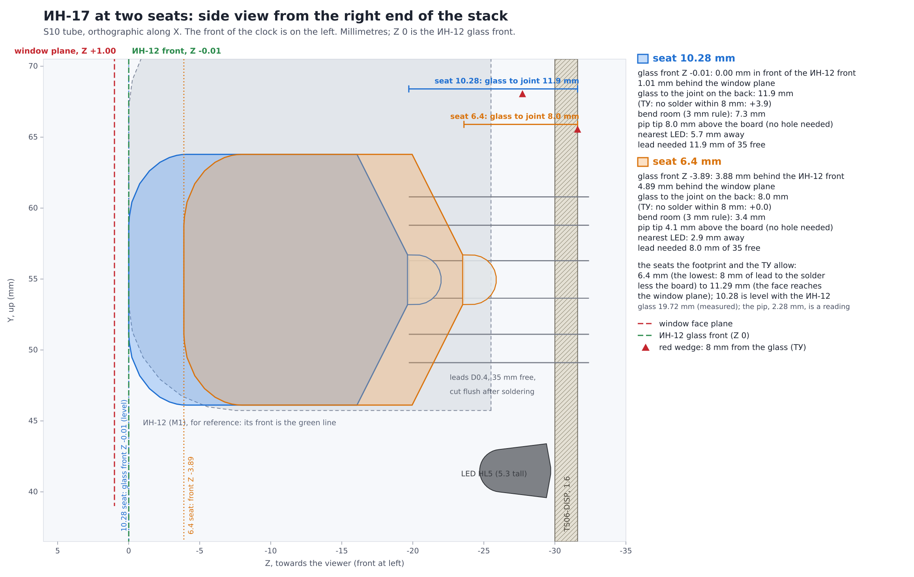

# TS06 boards with every component drawn

Populated renders of the three TS06 boards (TS06-DISP, TS06-DRV and the fascia **R**, `PCB/TS06-FASCIA-rhythm`),
the three together as they stand in the case, the GLBs the product page's 3D view can load, the fit table made
from the placed models, and everything that regenerates them. Nothing under `PCB/` or `fab/` was edited: the
models are attached to a scratch copy of each board at render time (`tools/models3d.json`).

**The fascia is drawn as it is ordered**: R with the Plates white print and the **Divider gold** (`fab/ORDER.md`),
not the committed board with its plain silk. The committed `PCB/TS06-FASCIA-rhythm` carries no gold; `tools/fascia_gold.py
divider OUT --base R` builds the art board in a scratch directory (the board `tools/mkfab.sh` plots), and the render
reads that, with the same model map, so the controls keep their bodies. The option is `--gold VARIANT` (`none` is the
committed board; `divider` is the default of `tools/populated_all.sh`; the other three golds are laid out for the
narrower fascia A and stop on their own checks on R).

Everything below is regenerated by one command, `tools/populated_all.sh` (about 8 minutes: KiCad 10 in Docker,
then headless Chromium). Each picture's own command is in the tables.

## Pictures

All PNGs are transparent, trimmed to the board, at most 2400 px wide and under 3 MB.

| File | Shows | Command |
|---|---|---|
| `TS06-stack-front.png` | The assembled stack seen from the front: TS06-DISP (tubes, lamps, LEDs) in front of TS06-DRV, the fascia R (with its Plates print and Divider gold) in front of both, placed from `3d/case-pair/case_pair.py`'s geometry. The gold lines are real geometry in the fascia's GLB (see below); this scene gives the metallic gold a diffuse lean so it reads as gold and not as the pale cream a mirror-metal gives in a dim room | `node 3d/populated/stack/render_stack.mjs 3d/populated/stack.json 3d/populated 3d/populated front` |
| `TS06-stack-iso.png` | The same, from the front right and above | `... render_stack.mjs ... iso` |
| `TS06-DISP-top.png` `-iso.png` `-bottom.png` | The display board: six ИН-12/15 on their socket contacts, two ИН-17 on wire leads (the glass 19.72 mm long, its pip under it), the two ИНС-1 colon lamps, nine LEDs; bottom = the face that meets TS06-DRV, with the XP headers on their pads | `python3 tools/render_populated.py TS06-DISP 3d/populated` |
| `TS06-DRV-top.png` `-iso.png` `-bottom.png` | The driver board: 14 DIP chips in their sockets, the Nano on its PBS strips, the RTC module on its header, the choke L1, the МЛТ resistors, the fuse; bottom = the display-facing face, the PBS strips on their pads | `python3 tools/render_populated.py TS06-DRV 3d/populated` |
| `TS06-FASCIA-rhythm-top.png` `-iso.png` `-bottom.png` | The fascia R **as ordered, with the Plates print (white names, the MODE / FIELD / SUB nameplates, hairlines) and the Divider gold** (the dial's six taps as pads with a resistor between each pair, the FIELD / SUB rule, the divider chain, the - and + frames): the dial (SR25), two МТ1 levers and two КМД1 buttons with their bodies, the bushings in the panel holes; bottom = the back, with the bodies, the eight 1206 resistors and the JST header. KiCad draws the ENIG gold yellow | `python3 tools/render_populated.py TS06-FASCIA-rhythm 3d/populated --gold divider` |
| `before/TS06-*-iso.png` | Today's bare render of each board (only the models the boards carry themselves), same camera: the "before" half of the review pairs | `python3 tools/render_populated.py TS06-DRV 3d/populated/before --views iso --no-glb --bare` |

## 3D files

| File | What | Size |
|---|---|---|
| `TS06-DISP-populated.glb` | the populated display board | 6.0 MB (5.7 MiB) |
| `TS06-DRV-populated.glb` | the populated driver board | 14.0 MB (13.4 MiB) |
| `TS06-FASCIA-rhythm-populated.glb` | the populated fascia R, with its Plates print and the Divider gold. The gold is graphic lines on F.Cu under openings in the mask; KiCad writes copper graphics only with `--include-tracks`, so `--gold` exports this GLB with the copper (without it the mask is open over bare FR4 and the gold is not in the file) | 1.24 MB (1.19 MiB) |
| `stack.json` | where each board stands in the case: a 4x4 matrix per board, the case numbers the fit table uses; `fascia_gold` names the gold of the fascia it was made for | small |

The GLBs of TS06-DISP and TS06-DRV are exported with `--fuse-shapes` and **without the copper tracks** (they lie under the black mask; pads, silk,
mask and every part are in). TS06-DRV with tracks and fused shapes is 15.7 MB (15.0 MiB), and 19.6 MB without
`--fuse-shapes`, so the tracks stay out to keep each file under 15 MB; `--glb-tracks` puts them back.
The fascia R's GLB is the exception: it is exported **with** the copper, because its gold is copper graphics that KiCad writes only then (the file grows from 0.64 to 1.19 MiB; 953 copper pieces under the mask openings).

Frame of a board's GLB: KiCad's: metres, x right, y up out of the board, z = the board's y (down the page); the
board's back face at y = 0, its component face at y = thickness (1.6 mm; fascia 2.0 mm). To stack them in three.js:
load each GLB, `scene.scale.setScalar(1000)` (to millimetres), and put the group under
`new Matrix4().set(...stack.matrix["TS06-DISP" | "TS06-DRV" | "fascia"])`. The stack frame is X across the front from
the clock's left, Y up, Z towards the viewer, the ИН-12 glass front at Z = 0.
`stack/stack.html` + `stack/render_stack.mjs` do exactly that (three.js r186 vendored in `stack/vendor/three`, MIT).

## The fit table

`fit-table.md` (and `fit-table.json`): per board and side, the tallest parts as drawn against the space
`case_pair.py` gives. Command: `python3 tools/fit_table.py 3d/populated 3d/populated/fit-table.md 3d/populated/fit-table.json --gold divider`
(27 PASS, 8 TIGHT, 0 FAIL). `tools/stack_frame.py` and `tools/fit_table.py` read the fascia board for its outline, holes and
parts; with `--gold divider` they read the art board, which has the same ones (the gold and the print change no footprint, hole
or edge: `fascia_gold.py` asserts it), so the numbers are the same as for the committed board, and the files now say which board
they were made for.
`python3 3d/case-pair/case_pair.py --extract` still ends `checks: 3 FAIL, 7 NOTE, 62 OK, 9 TIGHT`, the same three
FAILs as before: the two rejected jack openings and the fascia boss on R5 (variant A). Running it changes only a
stale source hash in `3d/case-pair/boards.json` (`tools/mkpcb_disp.py` was committed after the last extract); the
geometry is identical, and that file was left as committed.

The control holes in the table are read from the fascia board, not typed. Under the table is the same three bushing rows for the
`holes04` variant (every control hole opened 0.4 mm, +0.29 a side instead of +0.09; `fab/HOLES-VARIANT.md`): shown beside the
table, not in its tally or in `fit-table.json`'s rows, because the committed board and the zip in `fab/ORDER.md` keep the 0.09.
`--in17-seat MM` seats the ИН-17 glass at another height than the case model's 10.28 (next section); without it the table is the case model's seat. The ИН-17's three rows (the glass front against the window plane, the lead against the ТУ's 8 mm and the tube's 35 mm, the nearest part) are in the table at whatever seat.

## ИН-17: the measured tube at its seat

**The glass is 19.72 mm.** The owner measured one ИН-17 on the bench, dome to the end of the glass: 19.72 mm (caliper, 2026-10-02; `case_pair.py`
IN17_D, kind `measured`). The outline drawing's 22.0 mm is read to include the exhaust pip, which stands out of the glass end between the
leads (`knowledge/TERMINAL-06-measurements-IN17.txt`: "12 leads on a circle round a central pip"), so the pip is about **2.28 mm** (`case_pair.py`
IN17_PIP, kind `reading`). **That 2.28 is a reading, not a measurement:** the pip has not been measured, and the drawing's 22 was not shown to be
taken to the pip's tip.

**What changed in the model.** `3d/IN17.step` is 24.3 mm from the dome to the end of its stalk, and then 5.5 mm of lead stubs. `tools/models3d.json` now scales the whole
model along the tube's axis by 19.72 / 24.3 = 0.8115 (a `scale` on the model line, the axis being the STEP's own x), so the glass is 19.72 mm
and the stubs 4.46 mm; the section (12.25 x 17.67) is the STEP's own and is not touched. The pip is a made model (`models/tube_pins.scad`,
variant `in17_pip`: D3.5 with a round tip, 2.28 mm out of the glass end, centred on the leads; the length is the reading above, the diameter is
inferred), and the wire leads start where the scaled stubs end.

**The seat.** The case model seats the glass so that its face is level with the ИН-12 faces (`case_pair.py`: IN17_STANDOFF = Z_DISP_F - IN17_D =
30.0 - 19.72 = **10.28 mm** from the board's front face to the glass end; it was 8.0 at 22.0). The model is placed there: the dome at 30.0 above the
face, the glass front at Z -0.01 as the ИН-12 faces are, 1.01 mm behind the window plane. The fit table's ИН-17 front row, a FAIL at -1.29 mm before, is a PASS at +1.01.

`IN17-two-seats.png`: the S10 tube seen from the right end of the stack (front of the clock on the left, orthographic along X, the board in
section), at the case model's 10.28 mm seat and at 6.4 mm, the lowest the footprint and the ТУ allow (the footprint's own glass-to-board minimum,
which is also the ТУ's 8 mm of lead to the solder less the board's 1.6). The window face plane (Z +1.00) and the ИН-12 front (Z 0) are the two lines.
Command (about 15 s): `python3 tools/in17_seats.py 3d/populated/IN17-two-seats.png`, which also prints the numbers below;
`python3 tools/fit_table.py 3d/populated /tmp/t.md /tmp/t.json --gold divider --in17-seat 6.4` gives the fit-table rows for another seat.

| | seat 10.28 (the case model's) | seat 6.4 (the lowest) |
|---|---:|---:|
| glass front, Z | -0.01 (level with the ИН-12) | -3.89 (3.88 behind it) |
| window plane minus glass front | +1.01 | +4.89 |
| glass to the solder joint on the back (seat + 1.6) | 11.9 | **8.0** |
| against the ТУ's "no solder within 8 mm" | +3.9 | 0.0 |
| lead between a 3 mm bend and the board face | 7.3 | 3.4 |
| lead from the glass end to the back face, of the tube's 35 mm free | 11.9 | 8.0 |
| lead tail past the back face, lead trimmed to 15 / 20 mm | 3.1 / 8.1 | 7.0 / 12.0 |
| pip tip above the board face | 8.0 | 4.1 |
| nearest part to the glass (box gap): LED HL5 | 5.68 | 2.94 |

**The leads reach their pads and meet the ТУ at the case seat.** The tube comes with 35 mm of lead (the kit manual trims it to 15-20 mm); 11.9 mm is
needed to reach the back face at 10.28, so the lead is long enough either way, and trimmed to 15 mm it still stands 3.1 mm past the back face
to solder. The ТУ's "solder no closer than 8 mm from the glass" has 3.9 mm to spare (the joint on the back is 11.9 mm from the glass), and
there are 7.3 mm of straight lead between the glass and the board's front face for a bend (the ТУ allows none within 3 mm; how much splay the 11
pads need depends on the lead circle, which is not dimensioned, `knowledge/TERMINAL-06-measurements-IN17.txt` row 5). The seat can go
as low as 6.4, where the joint is exactly 8.0 mm from the glass, and as high as 11.29, where the face reaches the window plane; 10.28 is the
one where the face is level with the ИН-12. (With the old 24.3 mm model a level face needed a 5.7 mm seat, which the ТУ forbade: that conflict
was the model's length, and is gone.)

**The pip needs no hole.** It hangs in the gap between the glass end and the board: its tip is 8.0 mm above the board face at 10.28 (4.1 at
6.4), so it is clear of the board whatever its true length, as long as it is under 8 mm. The footprint has no hole for it, as before.

**Does the glass clear every part under it? Yes.** Nothing stands under the glass in plan. The nearest part is the LED HL5, 2.73 mm below the glass
outline in the board's plane (its top is 5.29 mm above the board, the glass end 10.28: 5.68 mm between the boxes at the case seat, 2.94 at 6.4; the
fit table's row, 2.77, takes the glass's box with its stubs and pip, which reach down to the board). The ИН-12 beside it (M1) is 5.36 mm away
sideways, the other ИН-17 8.25, the colon lamps 48.5 mm away (they are between the hours and minutes tubes). Silk art does not count. The gaps are
bounding-box gaps, so they can only understate the room.

## Where the models come from

* **The kicad Docker image has no 3D library.** There is no `*.3dshapes` directory in `mirror.gcr.io/kicad/kicad:10.0`
  and `KICAD10_3DMODEL_DIR` is unset, so every `${KICAD10_3DMODEL_DIR}/...` path in the boards points at nothing
  until a library is mounted. The one library copy on this machine had 31 files and lacked two the boards name:
  `Module.3dshapes/Arduino_Nano_WithMountingHoles.step` (that is why the Nano drew as an outline) and
  `Fuse.3dshapes/Fuse_Bourns_MF-RG1100.step`. The 29 files the boards use are kept in `kicad3d/` (CC-BY-SA 4.0 with
  KiCad's exception; see its README). No network was used.
* **The repo's own STEP files** (`3d/`): `IN12.step` (ИН-12А/ИН-15 glass envelope, 19.47 x 28.86 x 25.5 plus pins),
  `IN17.step` (scaled along its axis to the measured 19.72 mm of glass, see the ИН-17 section), `INS1.step`, `KMD1.step`, `MT1.step`, and `SR25.step` (the **dial**: a 6-position 2-pole galette
  rotary, body D25, bushing D8.62, shaft D6).
* **Made here** (OpenSCAD source `models/*.scad`, VRML output `models/*.wrl`, built by `tools/build_models3d.py`;
  KiCad reads VRML in 0.1 inch units, which `build_models3d.py` allows for). Every dimension is marked in the
  `.scad` header:

| Model | Used on | Dimensions | Kind |
|---|---|---|---|
| `dip_chip_4/8/16/28` | the 14 chips in DIP sockets (U2-U3, U5-U12, U15-U17, RN1) | body 4.6 / 9.3 / 19.2 / 34.7 long, 6.35 wide (7.11 for the 28-pin), 4.5 thick on a seat 4.0 above the board | seat 4.0 **measured** (the KiCad socket models); the rest **inferred** (JEDEC MS-001 typical; 4.5 so socket + chip = 8.5, as `case_pair.py` FP_H) |
| `mlt05_lying` | R27-R32, R56-R63 (14) | body D4.2 x 10.8, leads D0.8, pitch 15.24 | **measured** (footprint descr, `bom.md`); axis height inferred |
| `l1_axial` | L1 | body D11.5 x 22.9, leads D0.8, pitch 27.94 | **measured** (footprint descr, `bom.md`) |
| `ds3231_module` | U13 | module 17.5 x 14.0 x 1.2 on a 5-way socket 2.54 x 12.7 x 8.5, 14.9 tall overall | footprint outline **measured**; thickness, ICs, socket **inferred** |
| `nano_on_pbs` | U1 | PCB 17.78 x 43.18 x 1.6, mini-B 7.62 x 10.16 x 4.0 overhanging 2.54, PBS-15 strips 8.5, header body 2.5 | PCB, rows, USB outline **measured** (footprint F.Fab); heights from `case_pair.py` (assumed there); chips **inferred** |
| `fuse_ptc` | F1 | 17.5 x 3.0 x 13.0, leads D1.0 | width x thickness **measured** (footprint F.Fab); height **inferred** (`case_pair.py` FP_H) |
| `led3` | HL1-HL9 | D3.0, 5.3 tall, flange D3.8 x 0.6, leads D0.5 | D and height **measured** (footprint descr); flange, leads **inferred** |
| `tube_pins` `in12_contacts` | V1-V4, V9, V10 | 12 contacts D1.7 x 4.5 on the pad ring | pads **measured**; contact size and height 4.5 **inferred** (`case_pair.py` IN12_SEAT, assumed) |
| `tube_pins` `in17_wires` | V5, V6 | 11 wires D0.4 from the end of the scaled stubs (5.82 above the board) to 0.8 mm past the back face | pads **measured**; wires **inferred** |
| `tube_pins` `in17_pip` | V5, V6 | the exhaust pip D3.5 with a round tip, 2.28 mm out of the glass end, between the leads | length a **reading** (22 - 19.72); diameter **inferred** |
| `smd_fascia` `r1206_back` | fascia R1-R8 | 3.2 x 1.6 x 0.55 | **inferred** (standard 1206) |
| `smd_fascia` `jst_s6b_sm4_back` | fascia J1 | housing 13.9 x 7.6 x 4.8, tabs 1.5 x 3.4 | footprint B.Fab **measured**; height **inferred** (`case_pair.py` FJ_HDR_H, assumed) |

## Placement choices that are inferred (and what they affect)

* ИН-12/15 glass 4.5 mm above the board face (`case_pair.py` IN12_SEAT, assumed there); contacts drawn to match.
* ИН-17 glass end 10.28 mm above the board face (`case_pair.py` IN17_STANDOFF = Z_DISP_F - IN17_D, so the faces are coplanar with the
  ИН-12s), the glass 19.72 mm (**measured**, the owner's bench caliper, 2026-10-02). The exhaust pip below the glass, 2.28 mm, is a
  **reading** (the drawing's 22 less the measured 19.72), its diameter (3.5) inferred. `IN17.step` is scaled along its axis to match;
  its section (12.25 x 17.67) is the STEP's own and is smaller than the drawing's 14 face and Ø20 stem that `case_pair.py` uses.
* ИНС-1 colon lamps: tip flush with the ИН-12 faces; no source states their height.
* Fascia controls: bushing on the panel's back face, body turned with its long side (the lug plate) up the panel, away
  from the landing pads and R7/R8. No source constrains the turn about the bushing axis.
* Parts marked DNP in the board (R33-R44, 510k) are left empty, as the bench builds them.

## Problems found in the boards' own 3D models (not fixed in `PCB/`)

* The models of the footprints on the **back** face (TS06-DISP XP11-XP25, TS06-DRV XS11-XS25 and J1) are turned
  as for a front-side part (`tools/pcbkit.py` does not allow for KiCad flipping a back-side footprint), so each strip
  or header draws one body length away from its pads. `tools/models3d.json` replaces them with the right turns.
* The Nano and the fuse name model files that do not exist.

## Checks

* `python3 tools/model_coverage.py` : every footprint resolves to a model file that exists or is on the short
  allowlist (bare holes, and the DNP footprints), else FAIL and exit 1. Today: TS06-DISP 30 footprints, 26 resolved,
  4 allowlisted, 0 missing; TS06-DRV 116, 96, 20, 0; fascia R 18, 14, 4, 0. `--bare` shows the boards as they were (97 of
  164 resolved) and `--prove` shows it can fail. The 28 allowlisted footprints, one row each with its reason, are in
  `allowlist.md`.
* `python3 tools/model_pad_coverage.py [BOARD]` : the other half, that the model sits on the pads and not only that its file
  exists: each footprint's drilled pads against the plan outline of its own part in the populated GLB. Only the allowlisted
  footprints may have a pad outside their model, else FAIL and exit 1 (TS06-DRV 435 pads: only the 20 allowlisted; DISP 189: its 4;
  fascia 9: its 4).
* `bash tools/verify_pair.sh` : 27 PASS, 0 FAIL, 0 SKIP, with these files in the tree.
