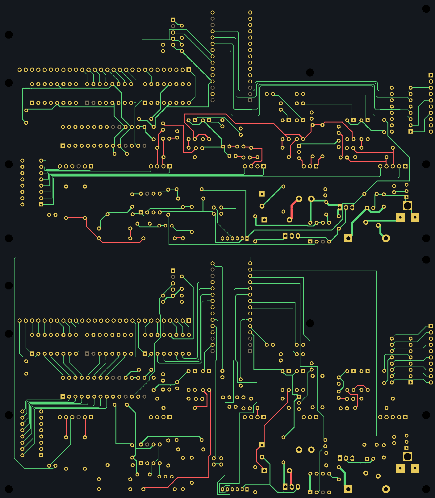

# TS06-DRV, swap layout: logic on top, power at the bottom

## Concept

The bands are turned round. Everything that switches or carries 12 V/185 V (jack, fuse, polarity diode, 5 V regulator, the whole converter and its control, J1, the AM/PM anode resistors) is in the bottom band. The Nano stands on end at the top edge with USB out the top. The MCP23017 sits straight under the two ИН-15 decoders, so port A becomes eight 10 mm diagonals instead of a lap round the board.

## Verdict: better on floor, port A and convergence; not simpler everywhere

- **Better:**
  - The routing floor drops 11 %.
  - Port A shrinks from 889 mm of hand-laid bus to 98 mm.
  - The board converged with zero vias in 12-15 negotiation rounds, about 12 min per run. Both variants I ran converged.
  - Hand-laid copper is 322 segments / 2.5 m, against the baseline's 369 / 3.3 m.
- **Not simpler:**
  - D12 (the "m" LED) now laps the board: top edge, left edge, 198 mm.
  - The four fascia lines run 110 mm down the middle to J1.
  - The LED ribbon is as long as the baseline's.
  - The 185 V distribution spine runs along the top of the anode cells (y 46-50), with clearance but directly under U17's A0-A3 lanes and beside the 470R hop resistors.
  - The bottom band is full, so the full 100 mm of height is still used.
  - USB moves to the case's top face.

The verdict is **moderately better**, pending the coordinator's baseline numbers for track length and DRC.

## Scorecard

| Item | Swap | Baseline (my measurement, same method) |
|---|---|---|
| Converged | **yes**: 0 nets sharing, `B.check` 0 problems, mate clean | (coordinator) |
| Vias | **0** | 0 |
| Total track length | 5276 mm (GND tree 616, non-GND 4660) | (coordinator) |
| MST floor (`placecheck.py`) | **3780 mm** | 4268 mm (generator's pads, same MST) |
| Ratio track / floor | 1.23 (non-GND vs floor, which excludes GND); 1.40 including GND | – |
| Track segments | 1053 | – |
| Axis-aligned share of length | 79 % | – |
| Hand-laid segments | 322 (2520 mm) | 369 (3309 mm) |
| Distinct DIP pin-1 orientations | 3: left (U3, U11, U12, U15-U17), down (U2, RN1), right (the six optos) | 3 |
| Board height used | 100 mm (courtyards from -1.6, USB proud, to 100.0) | 100 mm |
| Tallest part | DS3231 module on U13, ≈21-22 mm, top band (70, 8-18) | same part, bottom band |
| USB | top edge, x ≈ 86-101, 1.6 mm proud | right edge |
| DC jack | right edge, bottom-right corner (y 88) | left edge, top |
| GND pour islands | 17 on F.Cu, 13 on B.Cu (KiCad refill; every island reaches a GND pad; the routed GND tree carries continuity) | – |
| KiCad 10 DRC (`kicad-cli pcb drc --refill-zones --severity-all`, HV class from the .kicad_pro) | **0 clearance, 0 unconnected**; 1 error `starved_thermal` (U1 pin 29, GND, F.Cu: 1 spoke of 2, also joined by track); warnings: 22 silk overlap, 2 silk/edge (the Nano's USB overhang, by design), 103 "library TS06 not configured" (container only) | (coordinator) |

Other tall parts, all in the bottom band:

| Part | Height | Position |
|---|---|---|
| VT21, TO-220 standing | ≈19 mm | (115-121, 95.5) |
| C7, Ø10 | 16-20 mm | (106, 78-84) |
| L1 | 12-14 mm | (121-126, 80.5) |

The Nano on its sockets (≈15 mm) is in the top band. As the brief expected, the tall power parts all share one band. The DS3231 is the one exception and could lie flat on a right-angle header, as the review suggests.

The switching loop (drain → VD1 → C7 → source) spans a 14.6 × 17 mm pad box, about 248 mm². The baseline's is 19.9 × 13 mm, about 259 mm², so the loop is comparable, not tighter. SW is 17 mm of copper.

## Key placement decisions

- **Nano: vertical, USB up**, at x 86-101 just right of U17 and XS12's end. The analogue column faces U17 and the digital column faces the cells.
  - Its pin-1 end sits so that the gaps of the idle TX/RX/RST pins are level with U2's input gaps. A0 and A1 leave eastwards through those gaps; A2 and A3 pass under the module's end.
- **A0-A3 split at the Nano's pads:**
  - West branch on B.Cu: down the 5 mm gap between U17 and the module, into U17's inputs from below.
  - East branch on F.Cu: inside the module, up under H3 at y 33-35, down into U2's baseline input stubs.
  - All of it is hand-laid, and neither branch crosses anything on its face.
- **U3 under U15/U16 (rot 90, pin 1 at 25.4, 59.0):** GPA7..GPA0 lie left-to-right in exactly the order U16's then U15's inputs want. Port A is eight 45° lines on B.Cu with no remap needed.
- **RN1 at the left edge (x 9-17, y 65-83),** not under U3. There is no vertical room for decoder + fan + U3 + RN1 + ribbon above the bottom strips; I measured ~5 mm short.
  - Port B runs in lanes under U3 and drops between RN1's columns into its left column.
  - The right column feeds the LED ribbon, which runs under the bottom strips on **F.Cu**, like the baseline's, but on the front face.
- **Anode cells:** the baseline's cells over the bottom strips, with S turned to `cell_right` (away from U3).
  - The 185 V comes up from the converter through the strip-row gaps. It crosses the ribbon on B.Cu and changes face at the opto/ballast pads.
  - AM/PM anode resistors R56/R57 lie in the bottom band and rise into XS25 from below, so no 185 V goes near U3/RN1.
- **Where lines change face (all at pads of parts already in the circuit):**
  - D13 and D3 come down inside the module to their 470R hops (R25, R26) below it. The OPT lines then cross the J1 lines westwards on F.Cu.
  - D2/D4/D5/D6 end in standing 470R near the Nano's east side.
  - D9 ends in R66 east of the J1 lines, and PWM_G crosses them on F.Cu to the comparator.
  - A6/A7 change face at their ladder filters C5/C6 just above J1, to cross D7/D8 into J1's pin order.
- **J1:** bottom edge, back face, as in the baseline, so the fascia cable stays short.
  - Putting J1 in the top band would save ~4 × 100 mm of track and the C5/C6 hop.
  - It would cost ~100 mm more cable, and a cable that has to leave the top of the stack and come round the display board to a fascia below the tubes. I judged that worse.
- **Mounting holes:** H5 (3.5, 96.5), H6 (172.5, 96.5), H7 (3.5, 14.0) moved below D12's corner, H8 (172.5, 3.5).

## Remaps (all firmware-only; `TS06_DRV_VARIANT=swap` in `tools/ts06pair.py`, off by default so the baseline netlist is unchanged)

| Remap | Swap | Baseline |
|---|---|---|
| Opto pins (`TUBE_PIN4`; the firmware `opts[]` for BOARD_TYPE 4 must follow) | H10 D6, H1 D5, **M10 D2, M1 D4, S10 D13, S1 D3** | M10 D4, M1 D3, S10 D2, S1 D13 |
| Port B → LED (`BL_OF_GPB`) | [8,7,6,5,4,3,2,1]: GPBk lights HL(8-k) | – |
| RN1 elements | GPBk on RN1 pin 9+k, its LED on pin 8-k | – |

- **All 470R opto resistors are the standing 2.54 mm footprint** (the baseline had H10/H1 lying). This is a footprint choice the brief allows.
- **Port A is unchanged:** `XA_IN` and `GLYPH_Q` are exactly as before.
- **Not touched:** J1's order, the RTC's order, the strip order, the A0-A3 → decoder mapping and the digit map.

## Remaining problems

1. The `starved_thermal` DRC error on the Nano's GND pin 29. It is connected by track; adding a spoke or a pad-connection override on that pad would clear it.
2. The HV185 spine at y 46-50 runs beside the tube band's logic: the hop resistors, U17's A-lanes on the other face, and U10/U9's LED side.
   - It keeps the 0.6 mm class clearance, but a keep-out band there (forcing it between optos and resistors, as the cell was designed) would be cleaner. I did not try it.
3. D12's 198 mm lap round the top and left edges. It is forced: D12 is fixed to the "m" LED, at XS25 on the far left, and its pin is at the Nano's east top.
4. Thirty GND pour islands. Each touches a GND pad, but the pour is fragmented in the dense bottom band.
5. Silk overlaps (22) in the crowded bottom band.
6. The USB opening moves to the case's top face.
7. The whole 100 mm of board height is still used, so the swap buys no smaller board.
8. **Shared files:** `ts06pair.py` gained the variant switch (backward-compatible). `pcbkit`'s `write_library` added rotated footprint copies under `PCB/lib/TS06.pretty/`, and they are committed. `pcbkit.py` and `netroute.py` are unchanged.
9. **A baseline bug I noticed:** `B.plot(color=lambda n: ... else None)` crashes in the current pcbkit. My generator returns a colour instead.

 — front face above, back face below (seen through). [placement.png](placement.png) shows parts and hand-laid copper.

## Reproduce

```sh
git checkout pcb/drv-alt-swap
pip install numpy scipy pillow
python3 tools/mkpcb_drv_swap.py --place     # placement.png only
python3 tools/mkpcb_drv_swap.py             # board from the saved routes (tools/mkpcb_drv_swap_routes.json)
python3 tools/mkpcb_drv_swap.py --route     # route afresh: NetRouter(turn45=6), dirmul [1,1.5]*4, Negotiator 60 rounds, polish
TS06_ORDER=power python3 tools/mkpcb_drv_swap.py --route   # variant B: power nets first (also converged, 12 rounds)
python3 tools/placecheck.py PCB/TS06-DRV-swap/TS06-DRV-swap.kicad_pcb
docker run --rm -v $PWD/PCB/TS06-DRV-swap:/w -w /w mirror.gcr.io/kicad/kicad:10.0 \
  kicad-cli pcb drc --refill-zones --severity-all --format json -o /w/drc.json /w/TS06-DRV-swap.kicad_pcb
```
