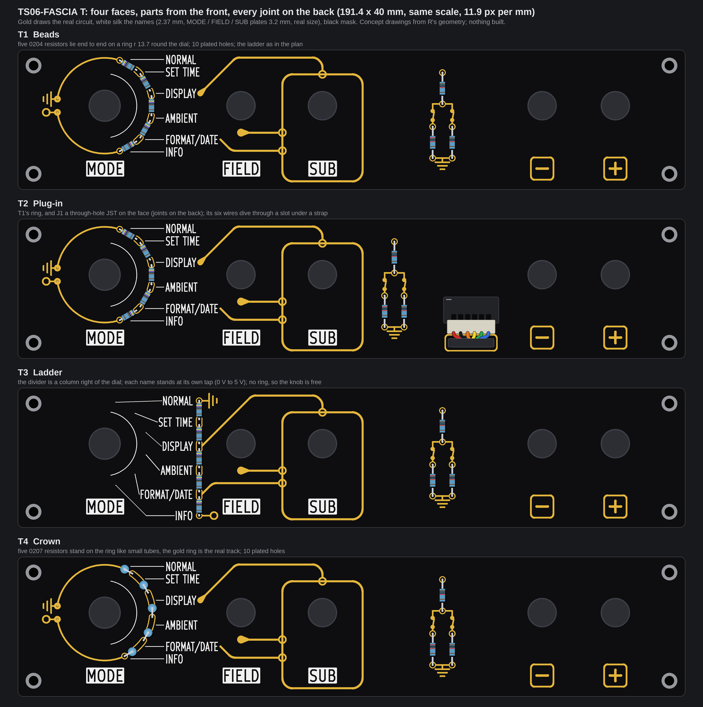
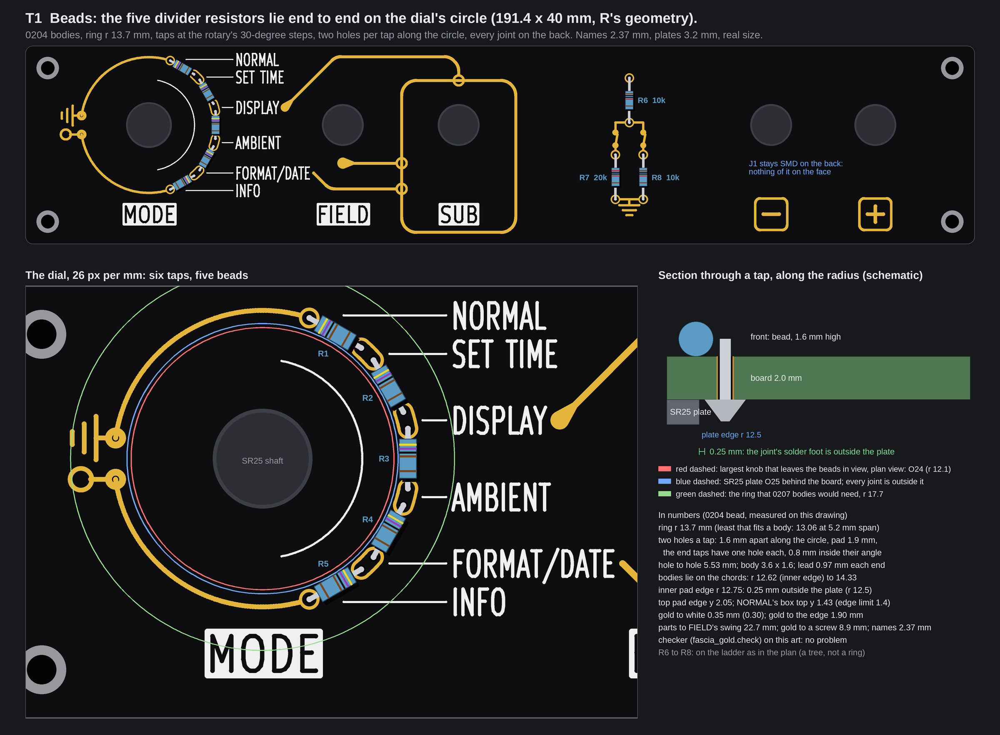
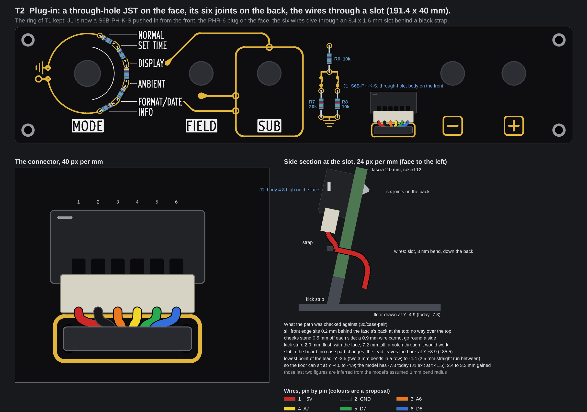
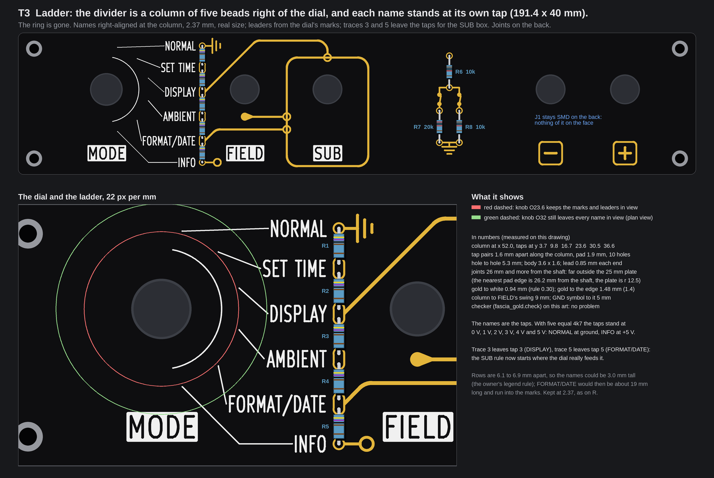
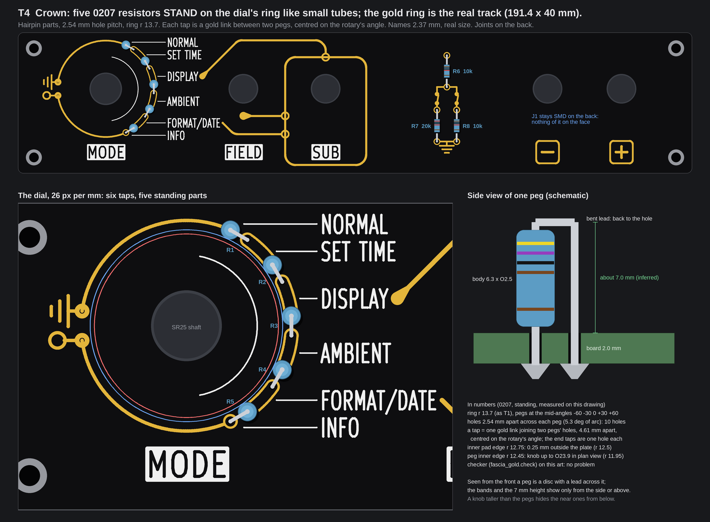

# TS06-FASCIA T: the resistors in line with the circle, and three more faces (concepts, nothing built)

No board file, generator, footprint or `fab/` file was touched, and no board was built. The pictures are drawn from R's real
geometry (the committed fascia R board with its control holes opened, the one that was ordered), with the white silk and the
Divider gold that `tools/fascia_art.py` and `tools/fascia_gold.py` draw, run from a scratch script. The names are drawn with
KiCad's own stroke font at their real size (2.37 mm; the MODE, FIELD and SUB plates 3.2 mm), taken from `kicad-cli`'s SVG export,
so nothing is stretched and nothing overlaps (the first plan's picture drew the names at the wrong size, and they overlapped).
The checker of `tools/fascia_gold.py` (`check()`) was run on the art of every concept: it reports no problem for T1 to T4.
Items marked *inferred* are typical figures, not something a datasheet, a measurement or a fab told us here. There is **no
price** on this page: none was looked up. The scratch scripts are in the run's output folder, not in the repo.

All four keep the board (191.4 x 40 mm, 2.0 mm), the five controls where R has them (SW1 to SW5), the SUB rule, the keys and the
white plates. The only control that moves is the dial in T1's 0207 variant, which is rejected (section 2).

**The knob, as numbers (for the knob run).** The largest knob that leaves the resistors in view, in plan view, skirt included
(a knob h mm tall hides a further 0.176 h mm for a viewer 10 degrees off axis: take that off the radius):

| | T1 and T2 (ring, 0204) | T3 (column) | T4 (ring, 0207 standing) |
|---|---|---|---|
| Largest knob, plan view | **Ø24** (r 12.1) | **Ø23.6** keeps the marks and leaders in view; **Ø32** still shows every name and all five resistors | **Ø23.9** (r 11.95) |
| At 6 / 10 / 15 mm tall | Ø22.1 / Ø20.7 / Ø19.0 | marks: Ø21.5 / Ø20.1 / Ø18.3; names: Ø30.1 / Ø28.7 / Ø26.9 | Ø21.8 / Ø20.4 / Ø18.6 |
| What limits it | the beads' inner edge, r 12.62 | the leaders start at r 12.3; the nearest name box is 16.6 mm out; the resistors are 26 mm out | the pegs' inner edge, r 12.45 |

## 1. The owner's words

The owner, in chat on 2026-10-07 at 11:28 UTC, about the through-hole fascia (verbatim):

> also plan the third option of THT fascia, my preference is that we populate the components from the front so solder work is still on the backside and not visible to the user

And at about 12:05 UTC, after seeing `TS06-FASCIA-THT-front-plan.png` (verbatim, typos as written):

> 3. looking at the pic, I dont really like how the resistors are staggered, maybe you can increase the gap between them
> so they're inline with the circle? also I want byou to come up with 3 more design comcepts in our language, maybe you
> can even integrate a tht connector but with solder on the back and a clever routing of the wires back around the
> fascia? its just an idea to explore in one

## 2. T1, Beads: the five divider resistors lie end to end on the circle

**The layout.** R1 to R5 lie along a ring round the dial, end to end, like beads. The taps stay at the rotary's real angles
(-75, -45, -15, +15, +45, +75 degrees, 30 degrees apart, the knob points at them). The ring is bigger than the plan's, so each
body has room, and there is no stagger.

* **The two holes of a tap** both sit **on the ring** (r 13.7), 1.6 mm apart along it, 0.8 mm (3.35 degrees) either side of the
  tap's angle, joined by one curved gold pad 1.9 mm wide. The wall between the two 0.8 mm holes is 0.8 mm (the plan's limit is
  0.5). Each hole holds one lead: the previous bead's, in the hole at the smaller angle, the next bead's, at the larger. The
  end taps (GND, +5V) have one hole each, 0.8 mm inside their angle, and their gold tails run round the dead side of the ring
  to the GND symbol and the +5V terminal, as the Divider art draws them. (A curved pad in KiCad is two round pads and a short
  netted arc, *inferred*.)
* **A body lies on the chord** between its two holes: 5.53 mm hole to hole, body 3.6 x 1.6, 0.97 mm of lead each end. At its
  middle it sits 0.28 mm inside the ring (the sagitta of a 5.5 mm chord on r 13.7), so it reads as lying on the ring.
* Hole centres (x, y in mm on the face, y down from the top edge; dial centre 24.89, 16.0):
  tap 1 (29.20, 3.00); tap 2 (34.00, 5.76) and (35.13, 6.89); tap 3 (37.89, 11.69) and (38.31, 13.23);
  tap 4 (38.31, 18.77) and (37.89, 20.31); tap 5 (35.13, 25.11) and (34.00, 26.24); tap 6 (29.20, 29.00).

**The radius, for 0204 and for 0207 (0.25 W, 6.3 mm) bodies.**

| | 0204 (3.6 x 1.6, KiCad `R_Axial_DIN0204`) | 0207 (6.3 x 2.5, 0.25 W) |
|---|---|---|
| Hole span used | 5.2 mm least (0.8 mm of lead each end); 5.53 drawn | 7.62 mm (the library's `P7.62mm` footprint; 0.66 mm of lead each end, tight) |
| **Least ring radius** | **13.06 mm** | **17.72 mm** (18.46 at a span of 8.0, 20.19 at 8.9) |
| **Radius drawn** | **13.7 mm** | 17.72 mm, dial moved (see below) |
| Why that radius | the joints must clear the 25 mm plate (13.45 or more) and the top name must keep 1.4 mm from the edge (13.76 or less): the window is 13.45 to 13.76 | the least that takes the body |
| Fits the 40 mm face? | **Yes, with nothing moved.** The dial stays at (24.89, 16.0); the checker finds no problem | **Not as the face stands** (below) |

* **0204 at r 13.7, against the keep-outs:** gold to white silk 0.35 mm (rule 0.30); gold to the board edge 1.90 mm (1.4); top
  pad edge y 2.05; NORMAL's box top y 1.43 (the 1.4 mm edge rule); names stay 2.37 mm with level leaders (rows 3.54 mm apart
  where NORMAL meets SET TIME, 3.54 where FORMAT/DATE meets INFO; the least is 2.93); parts to FIELD's swing 22.7 mm (the
  swing starts at x 61.99); gold to a screw 8.9 mm (rule 3.0); gold to the knob keep-out 9.0 mm: 3.75 to spare; the MODE plate
  clears the ring's lower tail by 1.8 mm. Bodies reach r 12.62 (inner edge) to 14.33 from the shaft.
* **0207 at r 17.72.** The ring only just fits the height: the dial must move down to y 20.0 (taps then run y 2.2 to 37.8; the
  names must stay at least 1.4 mm in: r 17.87 is the most that fits). Moving it also left to x 21.5 keeps FORMAT/DATE 0.76 mm
  short of FIELD's plate. Then the checker reports two conflicts: the +5V pad overlaps the MODE plate (0.34 mm), and position 5's
  SUB trace, which leaves FORMAT/DATE's end level with its tap at y 32.5, runs straight into FIELD's plate (y 31.7 to 36.3, from
  x 58.7; 1.0 mm overlap) and has nowhere else to go. The GND symbol and the +5V terminal also have no room at the left edge. On paper a fix exists (MODE
  moved 3.5 mm left, FORMAT/DATE's leader bent up so it is no longer level, the symbols turned inward); **I did not draw
  or check it, and it breaks the level-leader rule for one name.** Verdict: **0207 does not fit this face** without that
  redesign. T4 is the way to get 0207 bodies on it.

**Do all the dial's joints now sit outside the SR25's 25 mm plate? Yes.** Every pad's inner edge is at r 12.75, the plate's rim at
r 12.5, so all ten joints of the dial sit **0.25 mm outside it**. The "joints under the plate" problem of the first plan (the
plate resting on ten joints, 1 mm off the board, leaving 4.0 mm of the bushing) is **gone**: the plate lies flat on the board
again and the bushing keeps the 5.0 mm it has on R. The margin is thin and it rests on the plate being Ø25.00, which
`knowledge/TERMINAL-06-measurements-ROTARY.txt` says is **from a listing photo, not a caliper** (25 mm or 19 mm not even
settled). If the real plate is larger than about Ø25.5 (the withdrawn figure was 26.94) T1's joints touch it again, and the
dial would have to move or T3 be used. The washer and nut stand on the front, inside r 7 (*inferred*: a 6 mm bushing), far from the ring.

**R6 to R8: kept on the ladder as in the plan.** They are a tree, not a chain: R6 in series from +5V to the node A7, then two
legs, each a lever contact and a resistor to ground. The ladder shows that and the open lever contacts; a row or a ring would hide
it. They are already in line (R7 and R8 side by side, R6 on the same centre line), with the bodies the same 0204. Moved
nothing: the six holes are not under any control body.

| T1, Beads | |
|---|---|
| Parts and bodies | R1 to R5 4k7, R6 and R8 10k, R7 20k, all 0204 axial 1 %, lying on the face; J1 SMD on the back (as R); the colour bands show |
| Plated holes | 16 x 0.8 mm: 10 on the ring, 6 on the ladder |
| Where the joints are | all on the back; the ring's ten are outside the plate by 0.25 mm |
| What could show on the front | a bright meniscus of solder at a hole's mouth, under the lead and the body: the plan's black moat (pad 1.9, gold ring 0.3 wide, mask closed over the inner 0.25 mm, *inferred* 0.1 mm mask limit) is kept; nothing else |
| Conflicts | knob (below); rotary plate: 0.25 mm, thin and on an unmeasured plate; levers, buttons: none (22.7 mm, nothing near); case: nothing stands in front of the face (`3d/case-pair`) |
| Build cost (*inferred*, the plan's table) | the plan's four runs, 1.3 to 1.5 M tokens and 4 to 6 hours of runs; the ring changes the art and the footprint set, not the order of work |
| Risks | the 0.25 mm plate margin; the 0.3 mm window for r; the curved pad; plan's DFM questions (plated drill, moat) unchanged |

**Largest knob that leaves the beads in view.** In plan view the bodies' inner edge is r 12.62, so the knob's footprint, and any
skirt, can be **Ø24 at most** (r 12.1, 0.5 mm of air). A knob h mm tall hides a band of h x tan 10 degrees beyond its edge for a
viewer 10 degrees off axis (the case's `VIEW_DEG`), so the largest is r = 12.1 - 0.176 h: **Ø22.1 at 6 mm tall, Ø20.7 at 10, Ø19.0 at
15, Ø17.2 at 20**. A skirt wider than that sits over the beads. R's art assumes a knob of Ø18 (the 9.0 mm keep-out); T1 shows
the beads behind it for a knob up to 17.7 mm tall.

## 3. T2, Plug-in: the owner's connector, body on the face, joints on the back

**The idea.** T1's ring and ladder are kept. J1 becomes a **through-hole JST S6B-PH-K-S** (side entry, 6 way, the repo's footprint
`TS06_JST_PH_S6B-PH-K-S_Back`, here flipped to the front) pushed in from the front: the black housing stands on the face, its
six pins go through and are soldered on the back, and its front pads sit under the plastic. The PHR-6 plug mates on the face and
its six wires leave towards the bottom edge, go **through a slot in the board** and drop behind the fascia into the case.

* **Where it stands:** body x 122.05 to 137.95, y 22.3 to 29.9 (outline from the repo footprint: 15.9 x 7.6 mm; height 4.8 mm,
  *inferred* from the SMD part's figure in the case model); pins at y 24.5, x 125 to 135, pitch 2.0, pad 1.7, drill 0.9. The
  ladder moves 13.8 mm left (x 108) to make room; the connector's joints are 6.9 mm from the "-" button's body envelope (x 141.9
  and up, the worse of its two orientations), the housing outline on the front 4 mm.
* **The wires:** the mated plug stands 3.0 mm beyond the housing's mouth (the case model's `FJ_PLUG_OUT`), the wires fan from the
  plug's 2.0 mm pitch to a flat run of 1.0 mm pitch and dive through an **8.4 x 1.6 mm slot** at (130.0, 35.5). The visible wire
  is about 2 mm long: a white plug with six coloured stubs that vanish under a black strap.
* **How they are held:** the plug's own lock (PH housings latch, *inferred*); a black nylon strap (2.5 mm wide, *inferred*) that
  goes through two 1.2 x 3.0 mm slots either side of the wire slot, round the wires on the back, and shows on the face only as a
  black band over the dive; the slot's edges. A gold stadium (0.4 mm line) round the three slots echoes the key frames; it is 1.9 mm
  from the edge. No glue, no tie hole in the face apart from those two slots.
* **How they look:** six colours: +5V red, GND black, A6 orange, A7 yellow, D7 green, D8 blue. Pins 3 to 6 take the resistor
  colour code's colours for 3, 4, 5 and 6, so the cable and the bands on the beads speak the same language. *The colours are a
  proposal; the lead is bought or made to them.*

**Where the wires can go, checked against `3d/case-pair`** (the face plane, the 12 degree rake, the sill, the trench, the kick
strip, the cheeks):

| Route | Verdict | Why (case numbers) |
|---|---|---|
| Over the top edge | no | the sill's front edge stands 0.2 mm behind the fascia's back at the top (`Z_SILL_F = Z_FACE + FASCIA_T/cos 12 + 0.2`): that is not a path. Over the edge the wires would lie on the sill top, in the lit trench window under the tubes, then drop through the 2.5 mm gap behind the sill (`BACK_GAP`), where XP21 to XP25's pin tails (1.5 mm) are |
| Under the bottom edge | possible, one case change | the kick strip is flush with the face for 7.2 mm below the fascia and 2.0 mm thick: a notch about 10 mm wide cut through its top is needed, and the wires show a further 7 mm down the face |
| A notch in the board's outline | the same, not better | the kick strip stands directly under the notch, so it needs its own notch as well |
| **A slot through the board (T2)** | **yes, no case part changes** | the wires pass inside the outline, behind the fascia, into the space the SMD J1's lead uses today; the slot is 3.7 mm from the bottom edge |
| Round a side | no | the cheeks stand 0.5 mm off each board edge (`CHEEK_CLR`); an AWG28 wire is about 0.9 mm (*inferred*); the corner screw bosses are there |

**What the slot does to the case (*inferred* from the model's assumed 3.0 mm bend radius):** the lead leaves the back at about
Y +3.9 (the slot is at 35.5 mm down the face), so its lowest point is about Y -3.5 (two bends in a row) to -4.4 (with 2.5 mm of
straight run). The model sets the floor 0.5 mm under the lead's lowest point, rounded down: Y -4.0 to -4.9, where it has -7.3
today (the side-entry SMD J1 sends the lead out at 41.5 mm down the face): **2.4 to 3.3 mm less case height**. The lead's own path
to DRV J1 is about 26 mm shorter (its fascia end moves from X 156.3 to X 130). The wire slot, the strap slots and the floor
height are the only new case questions; `case_pair.py` was not run or changed.

| T2, Plug-in | |
|---|---|
| Parts and bodies | T1's, plus J1 as a through-hole S6B-PH-K-S on the face (15.9 x 7.6 x 4.8 mm) with its PHR-6 plug and a 190 mm lead; the SMD J1 goes |
| Plated holes | 22 x: 16 as T1, plus 6 of J1 (0.9 mm drill). Also 3 unplated slots (8.4 x 1.6 and two 1.2 x 3.0) |
| Where the joints are | all on the back; J1's six front pads are under the housing |
| What could show on the front | the connector body (a large black block on the black face), the plug and the wires (by design), the strap, the three slots; a meniscus at the ring's holes as T1 |
| Conflicts | knob as T1; rotary plate as T1; the "-" button: its joints 6.9 mm from the body envelope; levers: none; case: the floor and the lead path (above), the three slots |
| Build cost (*inferred*) | T1's four runs (1 and 4 grow), 1.3 to 1.5 M plus 0.15 to 0.2 M: a front S6B-PH-K-S footprint and its 3D model, three board slots, the back tracks to the new J1, the case lead and floor |
| Risks | the plug's insertion force goes into six joints (the footprint notes the part has no retention tabs); the housing is tall (4.8 mm, *inferred*) next to the owner's wish for a clean face; the slot near the edge of a 2.0 mm board; the wires' look is the cable maker's, not ours |

**Largest knob:** as T1, **Ø24 in plan view, Ø22.1 at 6 mm tall down to Ø17.2 at 20 mm** (the same ring).

## 4. T3, Ladder: the divider is a column, and each name stands at its own tap

The ring is gone. The five 0204 beads stand one above the other in a column at x 52.0, right of the dial, **in line** (hole
to hole 5.3 mm, 0.85 mm of lead each end). Each of the six names sits at its own tap, right-aligned against the column, and the
dial's marks reach the names by leaders. With five equal 4k7 the taps stand at 0, 1, 2, 3, 4 and 5 V: NORMAL at ground, INFO at
+5V, which the face now says in its geometry. The GND symbol and the +5V terminal stand to the right of the column's ends.
The SUB rule changes: traces 3 and 5 now leave **the taps** (DISPLAY's and FORMAT/DATE's) instead of the end of a name, and
trace 5 climbs 45 degrees into the box's side above FIELD's plate. Tap rows at y 3.7, 9.8, 16.7, 23.6, 30.5, 36.6; holes at
(52.0, y): 3.7; 9.0 and 10.6; 15.9 and 17.5; 22.8 and 24.4; 29.7 and 31.3; 36.6.

| T3, Ladder | |
|---|---|
| Parts and bodies | as T1: five 0204 in the column, three on the ladder, J1 SMD on the back |
| Plated holes | 16 x 0.8 mm |
| Where the joints are | all on the back, 26 mm or more from the shaft: **nowhere near the rotary's plate**, so its problem cannot occur whatever the plate's true size; the column is 5 mm from the lever's body envelope |
| What could show on the front | as T1 |
| Conflicts | knob (below); rotary plate: none; FIELD: column to its swing 9 mm; the names, leaders and rule change (silk and gold redrawn); case: none |
| Build cost (*inferred*) | T1's four runs (run 2, the art, grows), 1.3 to 1.5 M plus about 0.2 M: new silk layout (right-aligned names, leaders), a new SUB-rule routine |
| Risks | the face looks different from R and from every earlier picture (a bigger decision for the owner); FORMAT/DATE's leader is steep; the names are 2.37 mm still, though the rows (6.1 to 6.9 mm) would allow 3.0 mm if FORMAT/DATE (about 19 mm at 3.0) is given room |

**Largest knob:** there is no ring round the shaft, so the resistors are never behind the knob (the nearest body is 26 mm out). In plan
view **Ø23.6 keeps the marks and the leaders in view** (r 11.8) and **Ø32 still leaves every name in view** (the nearest name box
is 16.6 mm out); allow r = 16.1 - 0.176 h for a viewer 10 degrees off axis (Ø28.7 at 10 mm tall), or r = 11.8 - 0.176 h to keep the marks.

## 5. T4, Crown: five 0207 resistors stand on the ring like small tubes

The 0207 body does not fit lying (section 2), but it fits **standing**: a hairpin part (`R_Axial_DIN0207_L6.3mm_D2.5mm_P2.54mm_Vertical`,
*inferred* to be in KiCad 10's library) needs only a 2.54 mm hole pitch. Five pegs stand on T1's ring (r 13.7) at the mid-angles
-60, -30, 0, +30 and +60 degrees, their two holes 2.54 mm apart across the peg (5.3 degrees of arc). A **tap** is a gold link
between the previous peg's bent-lead hole and the next peg's straight-lead hole, 4.61 mm apart and centred on the rotary's real
angle; the gold ring is the real track, and the two tails run round as in T1. From the front a peg is a disc with a lead across
it; the bands and the height (about 7.0 mm, *inferred*: 6.3 body + lead) show from the side and from above, like a crown of
small tubes echoing the nixies. Hole centres: R1 (30.61, 3.55) and (32.81, 4.82); R2 (36.07, 8.08) and (37.34, 10.28); R3 (38.53,
14.73) and (38.53, 17.27); R4 (37.34, 21.72) and (36.07, 23.92); R5 (32.81, 27.18) and (30.61, 28.45). R6 to R8 are drawn as in
T1 (0204 lying); they would be 0207 standing as well if one look is wanted (not drawn).

| T4, Crown | |
|---|---|
| Parts and bodies | R1 to R5 0207 4k7 standing (6.3 x O2.5, 0.25 W, metal film 1 %); R6 to R8 as T1; J1 SMD on the back |
| Plated holes | 16 x 0.8 mm |
| Where the joints are | all on the back; the ring's ten at r 12.75 inner edge: 0.25 mm outside the plate, as T1 |
| What could show on the front | the pegs (by design), their bent leads over the disc, a meniscus as T1 |
| Conflicts | knob (below); rotary plate as T1; a knob taller than the pegs hides the near ones from below; case: nothing stands 7 mm out in front of the face |
| Build cost (*inferred*) | T1's four runs (run 1 grows), 1.3 to 1.5 M plus about 0.1 M: a standing 0207 footprint and 3D model, the link pads |
| Risks | the pegs are tall and sit at an angle to the viewer, so the colour bands read less than T1's; a finger can bend a bent lead; the same 0.25 mm plate margin |

**Largest knob:** the pegs' inner edge is r 12.45, so in plan view **Ø23.9** (r 11.95); for a viewer 10 degrees off axis r = 11.95 - 0.176 h
(**Ø21.8 at 6 mm tall, Ø18.6 at 15**).

## 6. The four together

| | T1 Beads | T2 Plug-in | T3 Ladder | T4 Crown |
|---|---|---|---|---|
| Divider | 5 x 0204 lying on a ring r 13.7 | the same | 5 x 0204 lying in a column | 5 x 0207 standing on the ring |
| Plated holes | 16 | 22 (+3 slots) | 16 | 16 |
| Joints on the back | yes | yes | yes | yes |
| Joints against the 25 mm plate | outside by 0.25 mm | the same | 26 mm away | outside by 0.25 mm |
| Visible on the face | beads | beads, a 4.8 mm connector block, plug, 6 wires | beads, names at taps | pegs |
| Largest knob, plan view | Ø24 | Ø24 | Ø23.6 (marks) / Ø32 (names) | Ø23.9 |
| Change from the plan's face | the ring bigger, no stagger | + J1 on the face, ladder 13.8 mm left | new layout, SUB rule re-routed | the ring with standing parts |
| Build, beyond the plan's 1.3 to 1.5 M (*inferred*) | none | +0.15 to 0.2 M | +0.2 M | +0.1 M |
| Main risk | plate margin 0.25 mm | the tall connector, plug force in the joints | a different face | tall pegs, bands read less |

**Recommendation (mine, the owner decides).** Build **T1** as the divider: it is exactly what was asked (in line, on the circle),
it passes every check without moving anything, it removes the joints-under-the-plate problem on paper, and it keeps the face the
owner has already seen. Gate it with **one caliper pass on the SR25's plate** (and which of the 25 mm and 19 mm bodies is on
order): if the plate is larger than about Ø25.5, take **T3**, which does not care. Keep **J1 SMD on the back** (T1, T3, T4): the
connector on the face (T2) works, and the slot route needs no case part changed and lets the floor rise 2.4 to 3.3 mm, but it puts a 15.9 x
7.6 x 4.8 mm black block and six wires on a face the owner wants clean. T2's connector zone is independent of the dial, so
**T2 can be added to T1 later** without redoing it. T4 is the way to the bigger 0207 look, but its pegs hide their bands from the
front; I would not start with it.

## 7. Questions for the owner

1. **Ring or column for the divider?** *Recommendation: the ring (T1), as you asked, after the plate is measured; the column (T3) if
   the plate turns out bigger than about Ø25.5, or if you prefer the names standing at their taps.*
2. **J1 on the face (T2) or SMD on the back?** *Recommendation: SMD on the back, so the face stays clean; ask for T2 only if you want the
   cable as part of the look. A dry fit of an S6B-PH-K-S body and plug on the 2.0 mm board would show how tall it reads.*
3. **Can you caliper the SR25's plate, and say which body (25 or 19 mm) is on order?** *Recommendation: yes, before anything is
   built: T1's 0.25 mm margin rests on the unmeasured Ø25.00 of a listing photo.*
4. **Which resistor look: 0204 lying (T1, T2, T3) or 0207 standing (T4)?** *Recommendation: 0204 lying: low, the bands read from the
   front, and 0207 lying does not fit this face (section 2).*
