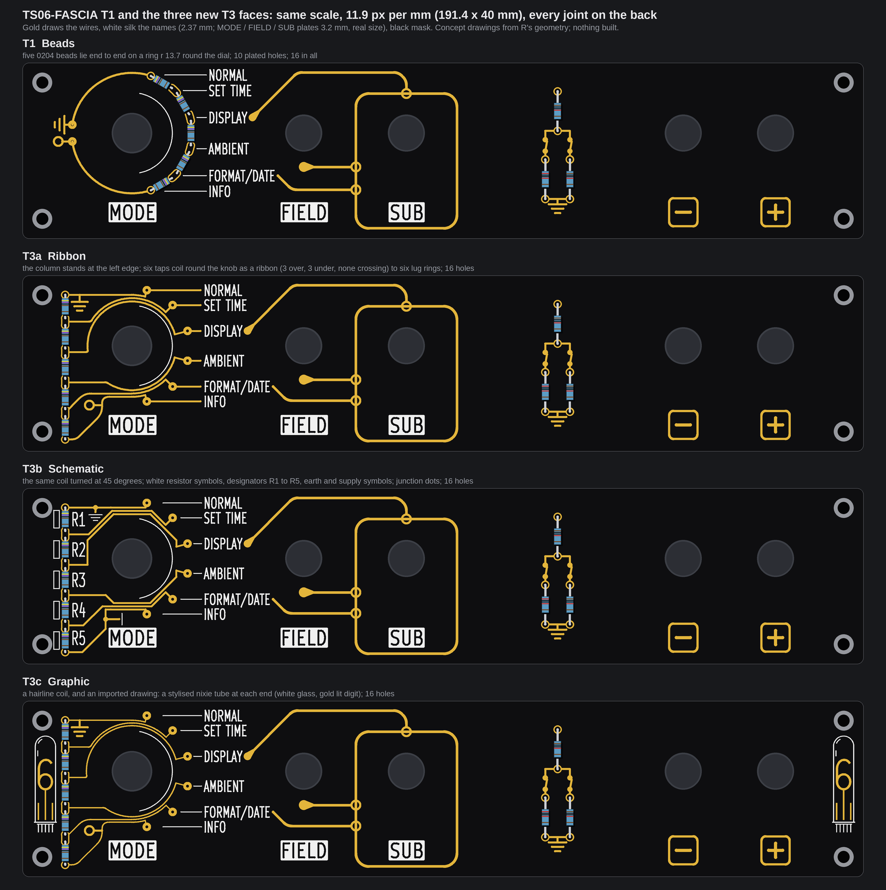
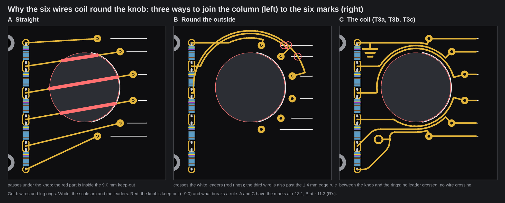
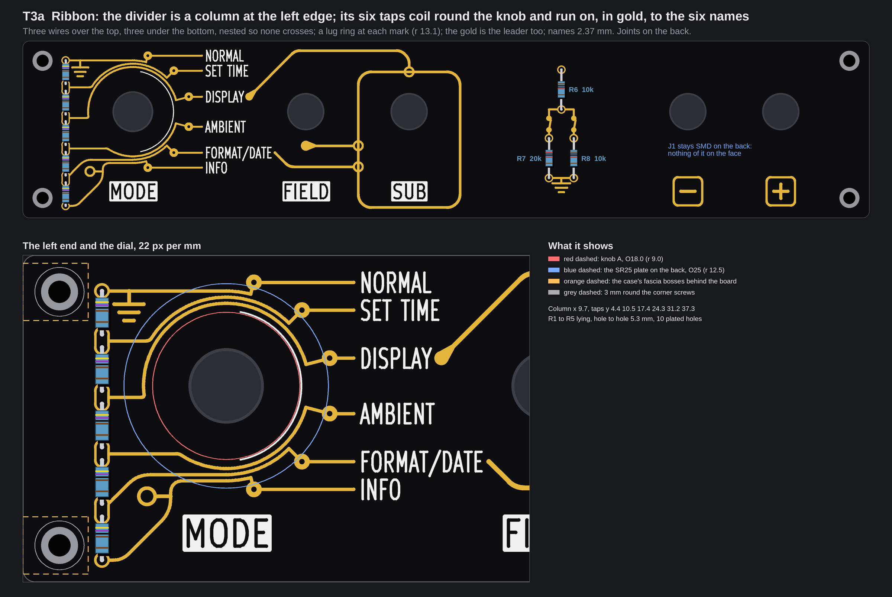
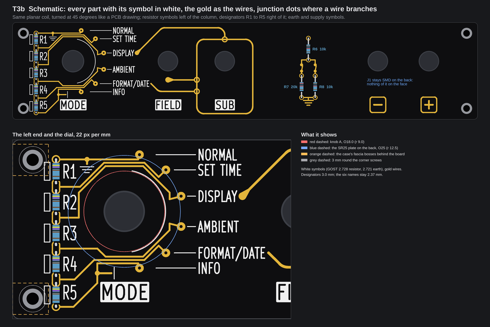
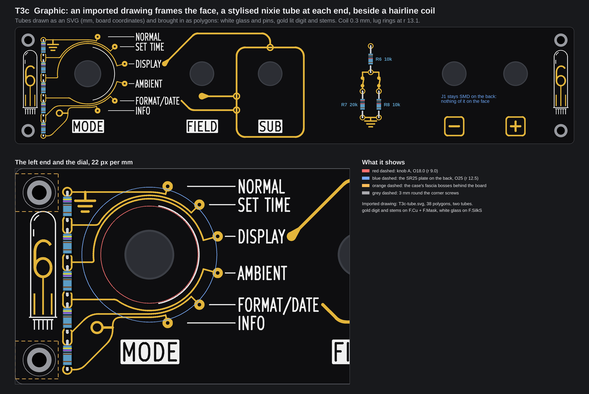

# TS06-FASCIA T3, the column left of the dial: three faces (concepts, nothing built)

> Next: [`TS06-FASCIA-pass1.md`](TS06-FASCIA-pass1.md), the first pass of whole faces at right angles (rails, harness, medallions, and one of mine), with the ladder answer.

No board file, generator, footprint, `tools/` file, `fab/` file or page source was touched, and no board was built. The pictures are drawn
from fascia R's real geometry (the committed board with its control holes opened, the one that was ordered), with the names at their real
size (2.37 mm; the MODE, FIELD and SUB plates 3.2 mm, KiCad's own stroke font taken from `kicad-cli`'s SVG export), and each face was run
through `check()` of `tools/fascia_gold.py`. Items marked *inferred* are typical figures, not something a datasheet, a measurement or a fab
told us here. There is **no price** on this page: none was looked up. The scratch scripts are in the run's output folder, not in the repo;
the one source file of a drawing (T3c's tubes) is in the pictures folder.

## 1. The owner's words and the answers

The owner, in chat on 2026-10-07 at about 14:50 UTC, after seeing `TS06-FASCIA-T-concepts/contact-sheet.png` (verbatim):

> also t1 looks good and t3 intrigues me, maybe that row can move to the left of the rotary near the edge? letting us
> combine more gold leads between the switch and levers?
> 1. both but t3 changes into 3 more versions with diverse design implemeting gold traces, white silkscreen, maybe
> imported graphics. in our style
> 2 kept on back
> 3 25
> 4 A
> 5 tbd

What the answers mean: (1) keep **both** T1 (beads on the ring) and T3 (the column); T3 becomes three new versions. (2) J1 stays **SMD on the
back**. (3) The rotary on order is the **25 mm** SR25; its plate is still not measured with a caliper. (4) The knob is **A** (the РСИ-style
knob, `3d/knob/`, Ø18.0; whether the shaft may be sawn is not answered). (5) The bench measurements are to be done. The resistors stay 0204
lying.

## 2. Where the column can stand

The five 0204 beads (R1 to R5) stand in a column at **x = 9.7 mm**, 5.2 mm right of the two left corner holes. The dial does **not move**
(24.89, 16.0). The column is **not shorter** than T3's: hole to hole 32.9 mm (taps at y 4.4, 10.5, 17.4, 24.3, 31.2, 37.3; pairs of holes
1.6 mm apart on the four middle taps, 5.3 mm hole to hole on each bead, 0.85 mm of lead each end), pads from y 3.45 to 38.25, 10 plated holes.

| What limits x | Value | Margin at x = 9.7 |
|---|---|---|
| The case's fascia bosses, on the back (`3d/case-pair`: a bar from the cheek to hole x + 3.5, 7 mm tall round each corner hole: x up to 8.0 at y 1 to 8 and 32 to 39) | pad edge at least 8.0 + 0.5, so x of 9.45 or more | pad edge at 8.75: **0.75 mm**. It bites the three joints inside those bands (tap 1, tap 5's second hole, tap 6) |
| The corner screws (4.5, 4.5) and (4.5, 35.5), M2.5; the art keeps gold 3.0 mm from a screw centre | not limiting | nearest pad edge 4.25 mm from the centre, **2.95 mm from the screw head** (r 2.25, as drawn) |
| The SR25's plate, Ø25 on the back, rim at x 12.39 on the shaft's line | pad edge at most 11.4 for 1.0 mm to spare, so x of 10.45 or less | nearest pad (tap 3, y 17.4) edge x 10.65, rim x 12.47: **1.8 mm**. The plate may be up to Ø28.6 before it touches a pad (the withdrawn figure, Ø26.94, still leaves 0.8 mm) |
| Knob A, Ø18.0 (r 9.0) | the knob's left edge is at x 15.89 | 5.2 mm from the pads |
| The case's cheek (6 mm, 0.5 mm off each board edge), the trench's left wall, the sill | nothing stands in front of the face | the column is 8.75 mm from the board edge: none |

So the window for x is 9.45 to 10.45 (1.0 mm wide); 9.7 sits at its left side, which keeps the plate margin large. The window is that narrow
because the bosses and the plate both want the same strip; the column lies **beside** the corner holes, not between them (between them, at
x 4.5, a pad centre may only stand at y 8.45 to 31.55 for the 3 mm rule, 23.1 mm, which holds 3 beads at this pitch, not 5). *If the column ever had to be
shorter:* a shared hole per tap (two 0.5 mm leads in one 1.3 mm hole, *inferred* workable, not drawn) gives 26.5 mm hole to hole; a bend would
need a second column. Neither is needed.

**What the move costs.** The 0.25 mm plate margin of T1 becomes 1.8 mm, so the face no longer depends on the unmeasured plate. Three things
come with it that are new:

* **SW1's own wire pads on the back collide with the column.** On R the rotary's six wire pads (SMD, B.Cu: GND, TAP2 to TAP5, +5V, and the
  wiper A6) stand in a row at y 31, from x 8.89 to 56.89, 8 mm apart. The +5V pad (8.89, 31; 2.2 x 1.5 mm) lies **under tap 5's pads**
  (9.7; 30.4 and 32.0). A T3 board therefore has to move that row or drop it: (a) the six lug wires are soldered straight to the column's
  joints (no pad row, no tracks; fiddly, *inferred*), or (b) the row moves right by at least 3.2 mm (so the +5V pad clears tap 5's pad by 0.3 mm) and B.Cu tracks join the column to it
  (they nest without crossing, like a staircase; *inferred*, not routed; they would pass under the plate, whose face is bare metal over
  solder mask, *inferred*). This is an open question for the owner (section 8).
* **The fascia boss of the corner hole (4.5, 35.5) no longer lands on R5's pad** (the case checks' FAIL, "-1.20 mm"): R5 is a bead now, not a
  1206. Its joint is 0.75 mm from the boss. The case model stands on the 176 mm fascia; for the 191.4 mm board the left end is *inferred* to
  be the same.
* The gold of each tap is **the copper of that tap** (it starts at the tap's pad), not netless art like the Divider's. The DRC will see
  six nets 0.2 mm apart in copper; the fab limit is 0.15 mm (*inferred*).

## 3. The wiring problem, and why the wires coil

The brief's idea was six gold wires from the column to the six marks. On R's dial the marks stand on the **right half** (angles -75 to +75 degrees,
position 1 at the top); the column is on the left. So every wire has to get round the dial.

What was found:

* **Straight is out**: a straight wire to a mark passes under the knob (gold may not come within 9.0 mm of the shaft).
* **Round the outside is out**: a wire that passes outside the lug rings crosses the white leaders of the marks it passes (silk and gold may not
  touch). With the marks where R and T1 have them (r 11.3, rings out to r 12.25) the leaders start at r 13.4, so at most one wire fits between
  ring and leaders; the others would have to cross leaders.
* **Between the knob and the ring is free** of leaders. Knob A stops at r 9.0 and the white scale arc is at r 9.2, so lanes can run from r 9.9
  out. Six lanes do not fit side by side, but **three on each side do**: the top three go over the dial, the bottom three under it, each peeling
  off outward at its mark. Taking the marks to **r 13.1** (rings out to r 14.05) gives the lanes room (ring inner edge at r 12.15).
* **The order works out by itself.** Because the lane of the first mark on each side is the outermost, the wires nest with no crossing, and the
  column keeps its natural order (GND at the top, +5V at the bottom). Every wire is a group of its own in the checker, so the checker proves
  that no two touch (narrowest gap 0.31 to 0.35 mm, rule 0.30). A column in the other order (+5V at the top) would make the top and the bottom
  group cross each other at the right of the dial.
* **The marks moved out** from r 11.3 to 13.1, so the rows of the level leaders are now 3.35, 6.74, 12.61, 19.39, 25.26 and 28.65 mm (R had 5.09
  to 26.91): at least **3.39 mm apart** (R: 2.93). The names could then be **2.8 mm** (the checker passes at 2.8 and fails at 2.9); the pictures
  keep 2.37 mm as the brief says. A ring's nearest edge is 3.15 mm beyond knob A's rim (R and T1 had the marks 2.3 mm beyond it); the wire's
  radial run to the ring is the bridge between the pointer and the mark: 2.05 mm for taps 3 and 4, 1.3 mm for taps 2 and 5, 0.55 mm for taps 1 and 6.

The band between the names and FIELD's lever stays free in all three, and so do the SUB rule's own traces (unchanged from R). The gold leads
that the owner wanted "between the switch and levers" are drawn, in T3a, as the wires' last stretch to the names.

## 4. T3a, Ribbon: the gold is the whole wire, from the tap to the name

Six gold wires, 0.4 mm wide at 0.75 mm pitch (lanes r 11.6, 10.85, 10.1), leave the column, coil round the knob like a ribbon cable (three over,
three under) and peel off to a lug ring at each mark; from the ring the gold runs **on, level, to the name**, so the white leaders are gone: white
is only the names, the scale arc and the MODE, FIELD and SUB plates. GND (an earth of three bars) hangs from the first wire; +5V is a terminal
ring on a stub off the last. The wires are 19.1, 27.2, 37.9, 31.1, 27.0 and 24.4 mm long to their rings.

**Checker (`check()`)**: no problem. Gold to white 0.35 mm (rule 0.30); gold to the edge 1.75 mm (1.4); gold to a screw 4.25 mm (3.0); gold to
the knob keep-out 0.89 mm over the rule (the lane's edge is at r 9.89); narrowest mask web between two separate gold pieces 0.34 mm
(DFM limit 0.10); thinnest silk line 0.20 mm and text strokes 0.30 mm (DFM limit 0.15); thinnest gold line 0.40 mm (DFM track limit 0.15).

| T3a, Ribbon | |
|---|---|
| Parts and bodies | R1 to R5 4k7 and R6 to R8 (10k, 20k, 10k) 0204 axial, lying on the face, as T1; J1 SMD on the back |
| Plated holes | 16 x 0.8 mm: 10 in the column, 6 on the lever ladder |
| Where the joints are | all on the back, the column's at x 8.75 to 10.65 |
| What could show on the front | the bead bodies (bands), a bright meniscus of solder at each hole's mouth under the lead, as T1 and T3; the gold's whole route |
| Conflicts | knob A: **0.9 mm** between its rim and the nearest lane (the rim is 2.6 mm tall, so for a viewer 10 degrees off it hides 0.46 mm: still clear; *inferred* from the knob README's heights); SR25 plate: 1.8 mm; corner holes: 2.95 mm to the head; case: bosses 0.75 mm from the end joints; the levers: none; SW1's back pad row: **collides** (section 2) |
| Build cost (*inferred*) | the plan's four runs (1.3 to 1.5 M tokens) plus about 0.25 M: a coil-and-leader routine, the new mark radius, the column footprint, the SW1 pad decision |
| Risks | the lanes are 0.9 mm from the knob (a knob wider than Ø19.8 sits on them); the busiest left end of the four faces; the gold is real net copper (six nets 0.2 mm apart) |

**Largest knob that keeps the lanes in view:** Ø19.8 in plan view; with the 2.6 mm rim at 10 degrees off axis, Ø18.9. The lug rings stay in view for
a knob up to Ø24.3.

## 5. T3b, Schematic: every part with its symbol in white

The same planar coil, turned at 45 degrees like a PCB drawing (octagonal lanes of the same pitch, gold 0.4 mm), with **white symbols and designators**.
A plain white rectangle (the ГОСТ 2.728 resistor, 1.25 x 4.0 mm) stands left of each bead, and **R1 to R5 in 3.0 mm** letters right of it, in the gaps
between the wires. GND is a filled junction dot on the first wire and a gold stem that ends 0.3 mm short of a white three-bar earth (ГОСТ 2.721);
+5V is a junction dot and a stub that ends short of a white bar. The names keep **white leaders** from the rings to the names (2.37 mm), as R has them.
The gold is the wires only.

**Checker**: no problem. Gold to white 0.325 mm (the earth and the supply bar are the nearest); gold to the edge 1.75 mm; gold to a screw
4.25 mm; gold to the knob keep-out 0.90 mm over the rule; narrowest mask web 0.35 mm; thinnest silk line 0.20 mm (the symbols), text strokes
0.30 mm; thinnest gold line 0.40 mm.

| T3b, Schematic | |
|---|---|
| Parts and bodies | as T3a, plus six white symbols and five designators (silk only) |
| Plated holes | 16 x 0.8 mm |
| Where the joints are | all on the back |
| What could show on the front | as T3a; the white symbols sit 0.4 to 0.75 mm from the column's pads |
| Conflicts | as T3a. The designators (3.0 mm, the owner's legend rule) had to go right of the column: left of it they land on the corner screws' heads (r 2.25). The symbols for R1 and R5 stand 0.35 mm clear of those heads. The symbols and designators for R6 to R8 and the levers are **not drawn** (the ladder keeps its blue labels in the picture only) |
| Build cost (*inferred*) | T3a's plus about 0.1 M: five designators (new text strings need font metrics in the generator), the symbols, junction dots |
| Risks | the most white on the left end; the symbols are small (1.3 mm wide); the names are 2.37 mm beside designators at 3.0 mm, so the small names read as the lesser text |

**Largest knob that keeps the lanes in view:** as T3a (the flats of the octagon are at r 9.9).

## 6. T3c, Graphic: an imported drawing frames the face

The coil is thinner and further from the knob (0.3 mm gold, lanes r 11.6, 10.98 and 10.36, 0.62 mm pitch), the leaders are white as on R, and **a
stylised nixie tube stands at each end of the face**, between the corner screws: white glass (a dome, straight sides, a foot and five pins, two
small highlights), a **gold lit digit "6"** with a gold lead and two electrode stems. The left tube stands beside the column (its glass 1.2 mm
from the pads); the right one balances it in the strip right of the "+" key. The digit is a drawing, not a font; the shape is an original made for this page, with no logo, no
emblem and no existing mark.

**Checker**: no problem. Gold to white 0.35 mm; gold to the edge 1.75 mm; gold to a screw 4.25 mm; gold to the knob keep-out **1.2 mm** over the
rule; narrowest mask web 0.31 mm (the lanes); thinnest silk line 0.20 mm, text 0.30 mm; thinnest gold line 0.30 mm.

**How the graphic gets onto the board.**

* **Source file**: `TS06-FASCIA-T3-variants/T3c-tube.svg` in this folder: 38 `<polygon>` elements in millimetres, in board coordinates (viewBox
  0 0 191.4 40, y down), class `gold` or `silk`. 19 per tube: 7 gold, 12 silk; 420 vertices in all (4 to 50 per polygon). Each stroke of the
  drawing is already a filled polygon (butt ends, mitred corners, curves in 6 to 15 degree steps), the way an SVG import or KiCad's image
  converter gives them.
* **Layers**: a `gold` polygon becomes `gr_poly` on **F.Cu** (grown 0.05 mm a side) and **F.Mask** (the opening); a `silk` polygon becomes `gr_poly` on
  **F.SilkS**. The generator's `emit()` already writes polygons for both inks (it does so for the gold teardrops); it needs a small loader for the
  SVG and a place on the board (the scratch script's loader is 10 lines; the generator itself was not changed).
* **Smallest features against the fab's limits** (`tools/dfm_check.py`, *inferred*): silk strokes 0.20 mm (limit 0.15), the narrowest gap between
  two silk polygons 0.25 mm; gold strokes 0.50 mm (the digit) and 0.30 mm (the stems) against a track limit of 0.15; the narrowest gap between two separate
  gold polygons 1.30 mm against a mask-web limit of 0.10; the gold stems are 0.45 mm from the glass (rule 0.30).

| T3c, Graphic | |
|---|---|
| Parts and bodies | as T3a (the leaders stay white) |
| Plated holes | 16 x 0.8 mm; the tubes are drawing only |
| Where the joints are | all on the back |
| What could show on the front | as T3a, and the tubes: a lit gold digit in a white glass, 4.6 x 24 mm each |
| Conflicts | knob A: **1.2 mm** between the rim and the nearest lane (the best of the three); plate, holes, case as T3a; the left tube's glass is 1.3 mm from the corner screw's head band (the glass starts at y 8.0, the heads end at y 6.75), 1.2 mm from the column's pads |
| Build cost (*inferred*) | T3a's plus about 0.2 M: the SVG loader, `gr_poly` on three layers, the drawing's checks, a second look at the tubes' shape |
| Risks | the tubes say nothing about the divider (they are the owner's taste: the clock's own subject); the 0.3 mm gold lanes and stems are the thinnest gold on any face; fine gold hairlines show every bit of mask misregistration; the glass and the digit are small (4.6 mm wide) and read only at close range |

**Largest knob that keeps the lanes in view:** Ø20.4 in plan view (the lane's edge is at r 10.21); Ø19.5 with the 2.6 mm rim at 10 degrees off axis.

## 7. T1 and the three, side by side

| | T1 Beads | T3a Ribbon | T3b Schematic | T3c Graphic |
|---|---|---|---|---|
| Divider | 5 x 0204 lying on a ring r 13.7 round the dial | 5 x 0204 in a column at x 9.7, left | the same | the same |
| Plated holes | 16 | 16 | 16 | 16 |
| Joints against the 25 mm plate | outside by **0.25 mm** | **1.8 mm**, up to a Ø28.6 plate | the same | the same |
| Gold | the ring is the divider | six wires round the knob and on to the names | six wires, 45 degree turns, junction dots | six hairline wires, tubes |
| White | names, level leaders | names only | names, leaders, symbols, designators | names, leaders, tube glass |
| Largest knob, plan view | Ø24 | Ø19.8 (lanes) | Ø19.8 | Ø20.4 |
| Marks | r 11.3 | r 13.1 | r 13.1 | r 13.1 |
| The knob's margin to the nearest gold | 0.5 mm of air at Ø24 (Ø18: 3.6) | 0.9 mm | 0.9 mm | 1.2 mm |
| Left end | free (dead-side tails and symbols) | busy | busiest | busy, framed |
| Build, beyond the plan's 1.3 to 1.5 M (*inferred*) | none | +0.25 M | +0.35 M | +0.45 M |
| Main risk | plate margin 0.25 mm on an unmeasured plate | knob must stay under Ø19.8; SW1's back pads | white symbols small | thin gold, the tubes are taste |

Against T1: the column buys the plate margin (0.25 to 1.8 mm) and a free ring round the dial's rim, and costs the knob's room (Ø24 down to Ø19.8
to Ø20.4) and a busier left end. Knob A (Ø18.0) fits all four.

## 8. Recommendation (mine, the owner decides)

Take **T3a** if the column is wanted: it is the face that answers "gold leads": the wire is gold from the tap to the name, it passes every check,
it does not depend on the plate, and it has the least white. Keep **T1** as the face if the plate measures Ø25.5 or less and the ring look is
still preferred; T3a is the way out if the plate is bigger. **T3c's tubes can be added to T3a later** (the left tube only needs the column to stand
where it does; the SVG is a separate layer), as T2's connector could have been added to T1. **T3b's** designators and symbols could be
offered for the five beads only, if the owner wants the schematic reading; I would not start with it (the most white, the smallest symbols).
To settle before anything is built: the SW1 pad row (question 2 below), the caliper pass on the plate (question 3 of the concepts, now only a
check for T3), and the case's fascia bosses for the 191.4 mm board (the case model stands on the 176 mm one).

## 9. Questions for the owner

1. **T1 or T3a as the build?** *Recommendation: T3a, with T1 kept as the fallback: it does not depend on the unmeasured plate, and the gold goes all
   the way to the names. Say T1 if the ring round the dial matters more than the knob's room (Ø24 against Ø19.8).*
2. **The rotary's wire pads on the back: lug wires to the column's own joints, or keep a pad row (moved right) with tracks?** *Recommendation: lug
   wires to the column's joints (no pad row, no tracks under the plate); both are drawn on paper only, and a dry fit of the lug wires on the
   2.0 mm board would show if the joints are big enough for a lead, a lead and a wire.*
3. **Names: keep 2.37 mm, or 2.8 mm now that the rows are 3.39 mm apart?** *Recommendation: 2.8 mm (the checker passes; it is closer to the 3 mm
   legend rule), drawn in the next run; and, if T3c's tubes are liked, say so then, as they are a separate layer.*
