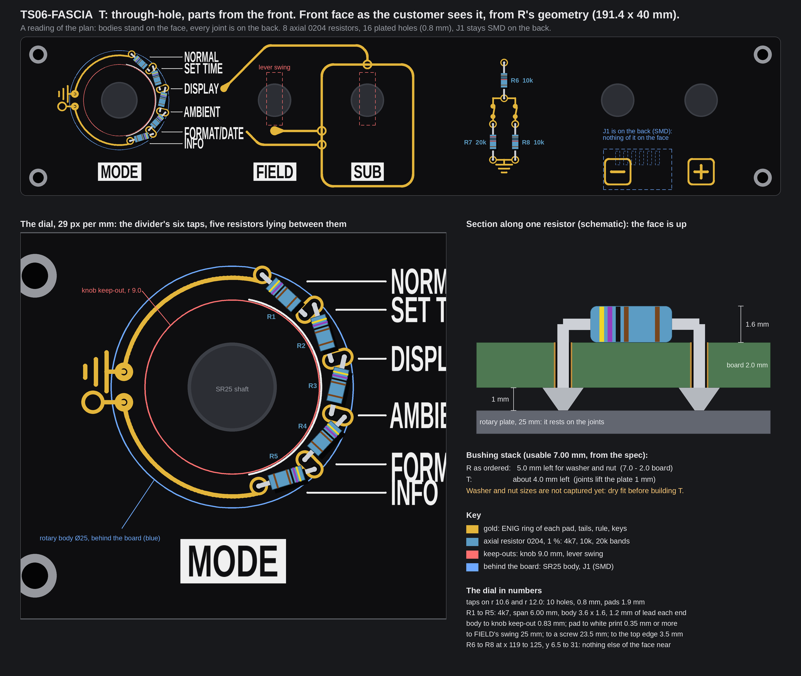

# TS06-FASCIA T: a through-hole fascia, parts from the front (a plan, not a board)

Nothing was built or changed for this page. No board file, generator, footprint or `fab/` file was touched. The numbers
were measured on the committed fascia R board (control holes opened, the ordered one) and on the Divider gold that
`tools/fascia_gold.py` draws on it, with a scratch script. Items marked *inferred* are typical figures, not something a
datasheet or a fab told us here. The scratch scripts (`model.py`, `draw.py`) are in the run's output folder, not in the repo.

The picture is the plan's recommended face, drawn from R's real geometry: the whole face on top, the dial enlarged
below, a section along one resistor on the right.

## 1. The owner's words, and my reading

The owner, in chat on 2026-10-07 at 11:28 UTC, verbatim:

> also plan the third option of THT fascia, my preference is that we populate the components from the front so solder work is still on the backside and not visible to the user

**My reading (the owner corrects it):** a through-hole fascia whose parts are pushed in from the FRONT face, so every
solder joint is on the back and the customer sees none. The part bodies then stand on the front, so they become part of
the face.

What exists today:

| Fascia | Parts | Where the joints are |
|---|---|---|
| R (ordered) | all surface-mount on the back: eight 1206, one JST | back; the front is black mask and gold art, no hole |
| TS06-FASCIA-THT (the older through-hole one, 176 x 52 mm, 2.0 mm, 37 plated pads and 9 unplated holes, never ordered) | R1 to R5 axial on the FRONT, R6 to R8 and J1 on the back | **on the front**: the divider's joints are bare solder fillets on gold, and J1's pins and the back parts' holes show on the face. Spec Rev D.4 calls it "the other aesthetic": the solder on show |

T is the opposite of the old through-hole board: bodies on show, solder hidden. The old one stays as it is.

## 2. What goes where

| Part | Side of the body | Joints | Shows on the front? | Plan |
|---|---|---|---|---|
| R1 to R5, 4k7 (the divider) | front, lying flat | back, 10 plated holes on the dial | the bodies, yes (that is the idea); a joint could show through the hole | taps staggered on two radii (section 3); black moat round each hole (below) |
| R6 10k, R7 20k, R8 10k (the lever ladder) | front, lying flat, on the ladder the gold already draws between the SUB box and the buttons | back, 6 plated holes | as above | stand where the art draws them; the art is redrawn (section 6) |
| J1, 6-way JST PH | back | back | no | see "J1" below |
| SW1 to SW5 (dial, two levers, two buttons) | behind the panel | hand-wired to landing pads on the back (SMD pads, no hole) | no | unchanged from R |
| Four M2.5 corner holes, five bushing holes | unplated | none | the holes, as on R | unchanged |
| GND and +5V tails of the dial, GND symbol | front copper | none | gold, as today | become real front copper on the GND and +5V nets (a netless gold line that touches a netted pad fails KiCad's DRC) |

**Every place a joint could still show on the front, and what stops it:**

| Place | Why it could show | What stops it |
|---|---|---|
| A plated hole's front ring | solder wicks up the barrel to the front pad | black moat, or no plating; see "Plated holes" |
| J1 | a through-hole J1 put in from the back has its joints on the front (the old board) | J1 stays surface-mount on the back |
| The controls' wiring | lugs are soldered to the landing pads | those are SMD pads on the back, no hole, as on R |
| A hole with no part over it | a bare hole is a visible dot | none: all 16 plated holes have a lead through them |
| Lead stubs | a long cut lead on the front | leads clipped flush on the back; the visible leads are the bent ones, 0.5 mm wire |
| Assembly | flux, solder spatter or a hot iron on the face | tape or a fixture on the face, wash after |
| The fab's order number | printed by some fabs on the front | ask for none, as `fab/ORDER.md` says for R |

### J1: the options

J1 is where the cable plugs in from behind, so a through-hole J1 pushed in from the back would put its joints on the front.

| Option | Joints | Trade-off |
|---|---|---|
| **A. SMD J1 on the back (R's part, S6B-PH-SM4-TB)** | back | the one part that is not through-hole; hand-soldered 2 mm pads, the two tabs carry the load. The case model, the lead path and the kick-strip check already assume it. |
| B. Through-hole J1 pushed in from the front, right-angle body | back | the connector body, plug and cable are on the face and the lead would have to run over the front: against the aim |
| C. Through-hole J1 from the back (S6B-PH-K-S) | front | the old board's way; shows six fillets |
| D. No connector: the lead's six wires soldered to six back pads | back | no connector part, but the fascia cannot be unplugged on its own, the strain relief needs a clamp (a screw boss; a tie hole would show on the face), and a wire joint on a 2 mm pad is weaker |

**Recommendation: A.** It adds nothing to the face and changes nothing in the case. D is the fallback if the owner wants no surface-mount part at all.

### Plated holes: how much shows

A plated hole is copper on both faces, so solder can wick up the barrel (0.8 mm hole, 0.5 mm lead, 2.0 mm board; *inferred*,
hand soldering with flux does this readily).

| Choice | What shows | Cost |
|---|---|---|
| Plain ENIG gold ring over the hole (R's ring look) | a bright solder meniscus 0.3 to 0.6 mm across on part of the joints, silver on gold (*inferred*; a sample shows the share) | none; the simplest art |
| **Ring with a black moat: pad 1.9 mm, the mask stays closed over its inner 0.25 mm round the hole, so the gold ring is 0.3 mm wide** | at most a hairline at the hole mouth, under the lead and the body | the ring is 0.3 mm of gold instead of the art's 0.6; the fab must hold the mask 0.25 mm moat (its limit is 0.1 mm, *inferred*) |
| Unplated holes, back pads only | nothing: there is no barrel for the solder to climb | the joint is one fillet on a 0.035 mm copper pad with no barrel; its pull strength is a fraction of a plated joint (*not measured*; a finger can catch a body and lift a pad). Test three joints on a sample first |

**Recommendation: the black moat.** It keeps the gold ring and the plated joint. If the sample still shows solder, fall back to unplated holes with larger back pads.

## 3. The face: where the bodies stand

**The idea tested: the five divider resistors stand exactly where the Divider gold draws them.** Result: yes in place, no
in the drawing as drawn. The art's bodies are 2.9 x 1.7 mm, between rings 5.85 mm apart. Real ones fit only in a
smaller size, and each tap needs two holes, so the taps are staggered.

**What the arc allows** (the dial's six taps are 30 degrees apart on r 11.3 mm round the shaft at (24.89, 16.0)):

| Body | Size | Lead span it needs | Fits the 5.85 mm between taps? |
|---|---|---|---|
| 0.25 W axial, DIN 0207 (the repo's DISP and DRV resistors) | 6.3 x 2.5 mm | 7.62 mm at the very least (the library's tightest footprint) | **no** |
| 0204 axial (KiCad R_Axial_DIN0204, 1/6 W) | 3.6 x 1.6 mm | about 5.1 mm | **yes**: 1.2 mm of lead each end at the 6.0 mm span used |
| Either, standing on end | 0204 about 4.4 mm tall, 0207 about 7 mm (*inferred*) | holes 2.5 mm apart | no: the taps are 5.85 mm apart |

**The layout (the picture):**
* Each tap has two holes, 1.4 mm apart along the radius: r 10.6 and r 12.0, joined by one pad, so no hole holds two leads
  and no two drills sit on one spot. R1 to R5 each run from the outer hole of one tap to the inner hole of the next,
  like a turbine. Lead span 6.00 mm, body at about 16 degrees to the tangent.
* GND (tap 1) has one outer hole and +5V (tap 6) one inner hole.
* R6, R7, R8 stand upright on the ladder at x 119 to 125, y 6.5 to 31: three identical bodies, lead span 9.0 mm, with the
  open lever contacts still drawn above R7 and R8 as art. R7 is one 20k body (the ordered art drew it as two 10k).
* Holes: 10 on the dial, 6 on the ladder, 16 in all, 0.8 mm.

**Numbers against the keep-outs** (from the generator's own rules, measured on the picture's layout):

| Item | Value | Rule |
|---|---|---|
| Body to the shaft | 9.83 mm at the nearest | the knob keep-out is 9.0 mm: **0.83 mm to spare** |
| Inner pad edge to the white hairline arc | 0.35 mm | silk to gold 0.30 mm |
| Outer pad edge to the white leaders | 0.45 mm | 0.30 mm |
| Highest pad to the top edge | 3.46 mm | gold at least 1.4 mm in |
| Dial parts to FIELD's swing | 25.0 mm | swing is 2.0 mm either side, 7.0 up, 6.3 down from the lever |
| Ladder to SUB's swing | 28.6 mm | same |
| Ladder to the "-" key frame | 21.7 mm | 6.0 mm to a button |
| Dial parts to the nearest screw | 23.5 mm | 3.0 mm |

**What stands in front of the fascia: nothing.** In `3d/case-pair` the face plane is the fascia's own front: it runs
through the sill's front edge, raked 12 degrees, and the tube glass is 1.0 mm behind it. The sill, the trench window and
the brow are above the face, the kick strip below, the cheeks 0.5 mm each side. So the only limits on height are the
owner's eye and the controls.

**Height off the face:**

| Thing | Height |
|---|---|
| 0204 lying (the plan) | 1.6 mm, up to 2.0 if raised on its leads |
| 0207 lying (does not fit) | 2.5 to 3.0 mm |
| Dial bushing | 5.0 mm (7.0 usable less the 2.0 board) |
| Lever and button bushings | 5.8 mm (7.82 less 2.0) |
| Shaft | 11 mm (13.0 from the shoulder less 2.0) |

The bodies are the lowest thing on the face. The knob's size is **not in the repo** (the art simply keeps 9.0 mm from the
shaft), so the 0.83 mm margin to the knob is only as good as that rule.

**The one real conflict is behind the board.** The SR25's plate (25 mm) sits on the board's back (the model puts its
shoulder on the fascia's back face). All 10 dial holes are under it: the inner ones at r 10.6, the outer ones at r 12.0
with pads out to r 12.95, against the plate's r 12.5. Each joint is about 1 mm high (*inferred*), so the plate rests on
the joints and sits about 1 mm off the board. The bushing is 7.00 mm usable: 5.0 mm is left for washer and nut on R,
about 4.0 mm on T. The washer and nut sizes are not captured (`knowledge/TERMINAL-06-measurements-ROTARY.txt`). Spec
rule 2 ("nothing sits inside those envelopes") was written for parts; a joint is a small bump of the same kind. The
ladder's holes are not under any control body.

## 4. Parts

| Ref | Value | Tolerance | Body | Today (R) |
|---|---|---|---|---|
| R1 to R5 | 4k7 | 1 % | 0204 axial, 3.6 x 1.6, lead 0.5 mm | 1206 |
| R6, R8 | 10k | 1 % | same | 1206 |
| R7 | 20k | 1 % | same | 1206 |

* **Power is not a limit:** the divider is 5 V across 23.5 k, 0.21 mA, about 0.2 mW in each resistor. The part is chosen by size.
* **Tolerance:** the spec says the 1 % is there so one firmware threshold table fits every clock, not for accuracy.
* **Sourcing:** metal film, 1 %, 0204 (often sold as 1/6 W or 1/8 W). Read the datasheet drawing: body not over about
  3.6 x 1.8 mm, lead not over 0.55 mm (the hole is 0.8 mm; the fab's tolerance on a finished hole, from the repo's J1
  footprint note, is +0/-0.13, so 0.67 mm worst case). Body colour is a look choice: blue, tan or black.
* **Colour bands** (1 %, five bands): 4k7 yellow violet black brown brown; 10k brown black black red brown; 20k red black
  black red brown. They show on the face, so they should read right.
* **BOM changes:** eight 1206 and their back paste layer go; eight axial 0204 come in (the same three values, no new
  value); J1 and the 190 mm lead are unchanged. For the 10-board run that is 80 axial parts, plus spares.
* **Assembly changes:** hand work: parts pushed in from the front, board turned over, 16 joints soldered on the back, leads
  clipped, flux washed off. The 5.85 mm and 6.0 mm lead spans want a forming jig.

## 5. The board

| Item | R today | T |
|---|---|---|
| Thickness | 2.0 mm | **2.0 mm**: the case is drawn for it, and the bushing stack is already short |
| Layers, vias | 2, no via | 2, no via (the plated barrels join F.Cu pads to B.Cu) |
| Plated holes | 0 | **16 x 0.8 mm** (finished; the fab's tolerance +0/-0.13) |
| Unplated holes | 9 (one 9.2, four 8.4, four 2.7 mm) | the same 9 |
| Pad | none on the front | 1.9 mm round, annular ring 0.55 mm (limit 0.15; 0.25 wanted for hand soldering) |
| Hole to hole | not an issue | 0.6 mm wall between a tap's two holes (limit 0.5): the stagger of 1.4 mm is the least that passes |
| Aspect ratio | none | 2.5 : 1 (2.0 mm over 0.8 mm), well inside a typical limit (*inferred*) |
| Front mask | open over the gold | open over the gold ring only; closed over the inner 0.25 mm moat of each pad |
| Front copper | netless gold only | gold plus 16 netted pads, and the dial's tails on the GND and +5V nets |
| Back | pour and tracks | the pour and tracks, plus new tracks from the dial's pads to the rotary's landing pads and from the ladder to the lever pads and J1 |
| Finish | ENIG | ENIG (also what the plated holes want) |
| Fab zip | no plated drill file | a plated drill file; no 1206 paste layer (J1's stays) |

The new back tracks are nested, so they do not cross: the six landing pads run +5V to GND left to right, the six taps run
bottom to top. The GND pour still has to reach every GND pad, which is the check that cost R its re-placement.

DFM limits are `fab/ORDER.md`'s (*inferred*, typical of a cheap two-layer service). T meets every row on paper; the
fab's own rows (plated drill, mask web 0.25 mm, ENIG over the barrels) need the fab's answer. There is **no price in
this plan**: plated holes cost more than R's none, and no quote was looked up.

## 6. The build: a real variant T next to R

R stays the ordered fascia and its zip is not touched. T gets its own folder, `PCB/TS06-FASCIA-T`, and its own zip.
The estimates are guesses from the size of the comparable R work in the repo.

| Run | What | Tokens | Time |
|---|---|---|---|
| 0, the owner, 15 min at the bench | the dry fit: the SR25 on a 1 mm shim under its plate, with its washer and nut; the knob; a 0204 sample against the 6.0 and 9.0 mm spans | none | 15 min |
| 1, footprints and board | `tools/mkfp.py` gets an axial 0204 front footprint (pad 1.9, drill 0.8, moat ring on F.Mask) at 6.0 and 9.0 mm spans, with a 3D model entry; `tools/mkpcb_fascia_tht_front.py` writes the board from R's layout: dial taps and R1 to R5, the ladder R6 to R8, J1 and the controls as on R, the new back tracks (the router and the saved routes), the GND pour check | 0.45 to 0.5 M | 90 to 120 min |
| 2, art and checks | `tools/fascia_gold.py` gets a divider-for-T gold (the rings come from the pads, the tails are nets, the ladder redrawn on the real holes, the lever contacts kept); `front_copper_free()` and `same_copper()` are changed for a front that has pads; KiCad DRC, `checkpcb`, `checkcopper`, `audit`, `checkmatch` | 0.35 to 0.4 M | 60 to 90 min |
| 3, fab and pictures | `tools/mkfab.sh` for T (plated drill file, mask openings read back from the Gerbers), `tools/dfm_check.py` rows for plated holes and the moat, `tools/fab_preview.py`, `tools/render_populated.py` with the resistor models | 0.3 to 0.35 M | 45 to 60 min |
| 4, case and page | `3d/case-pair` with `FASCIA_PCB` on T (the back joints under the dial; the fit table); the page's fascia selector and Order view (`recovered/viewer2`), the page suite | 0.2 to 0.25 M | 40 to 60 min |

About 1.3 to 1.5 M tokens and 4 to 6 hours of runs in all. If R6 to R8 stay as the 1206 parts on the back (question 3),
run 1 loses the ladder and its tracks and the total falls by about 0.3 M.

## 7. Risks and open questions for the owner

1. **The joints under the dial.** The SR25's plate would rest on 10 joints, lifting it about 1 mm and leaving about
   4.0 mm of the 7.00 mm bushing for washer and nut. *Recommendation:* do the 15-minute dry fit first (run 0). If the
   washer and nut fit in 4.0 mm, build T as drawn; if not, the divider cannot go on the face with this rotary, and the
   fallback is R6 to R8 only, or no T.
2. **The size of the bodies, and the knob.** A 0.25 W body (6.3 mm) does not fit between the dial's taps; only a 0204
   (3.6 x 1.6 mm) does, so the resistors on the face will look small. And the knob's diameter is not in the repo: the
   bodies start 0.83 mm outside the 9.0 mm keep-out. *Recommendation:* accept 0204, and tell me the knob's diameter and
   whether it has a skirt (over about 19.7 mm across it overhangs the bodies).
3. **How much of T is through-hole.** *Recommendation:* all eight resistors on the face (R6 to R8 on the ladder the gold
   already draws), and J1 stays surface-mount on the back, so T has one SMD part. The cost is a bigger board job
   (section 6); the gain is that the drawn circuit is the real circuit and no hole is left unexplained. The smaller job
   is the divider only, with R6 to R8 as 1206 on the back as on R.
4. **How the holes look.** *Recommendation:* plated holes with the black moat, and a 10-board T sample before T is
   thought of as the order; look at what solder shows, and pull-test a few joints if unplated holes come up. R's zip
   stays the one to order meanwhile.
