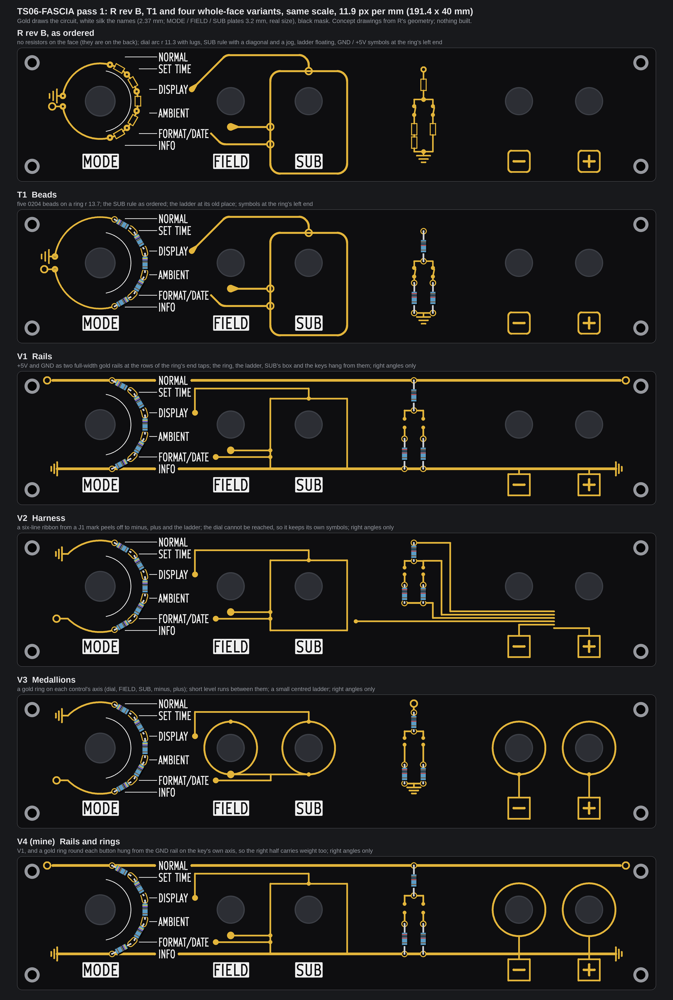
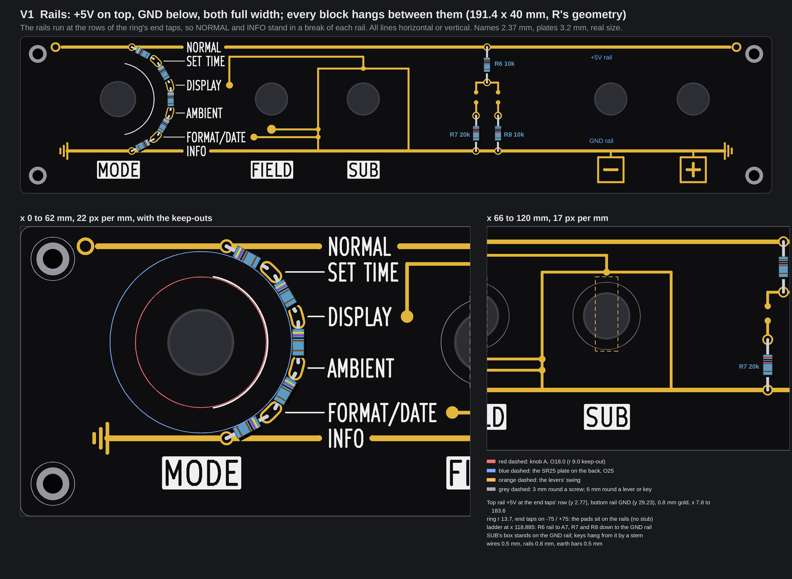
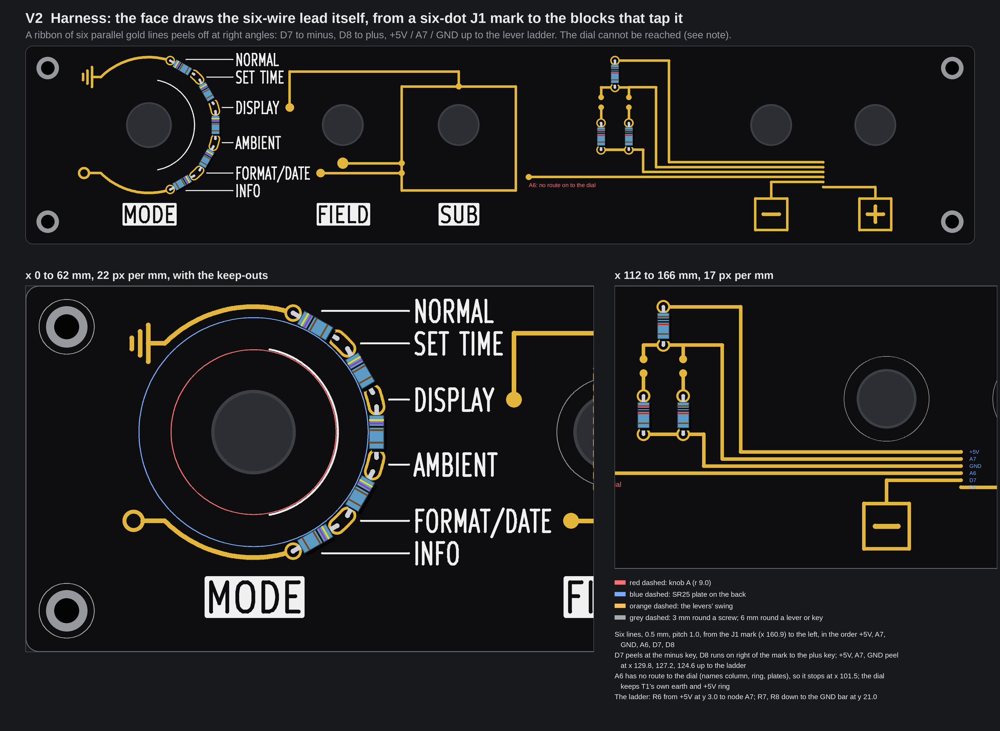
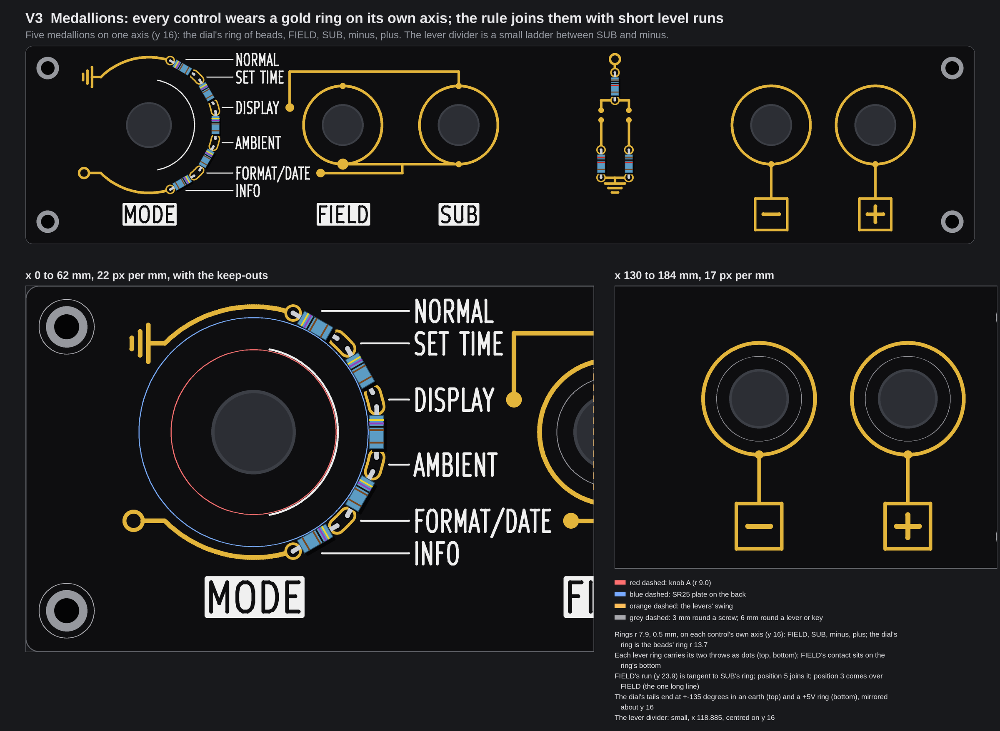
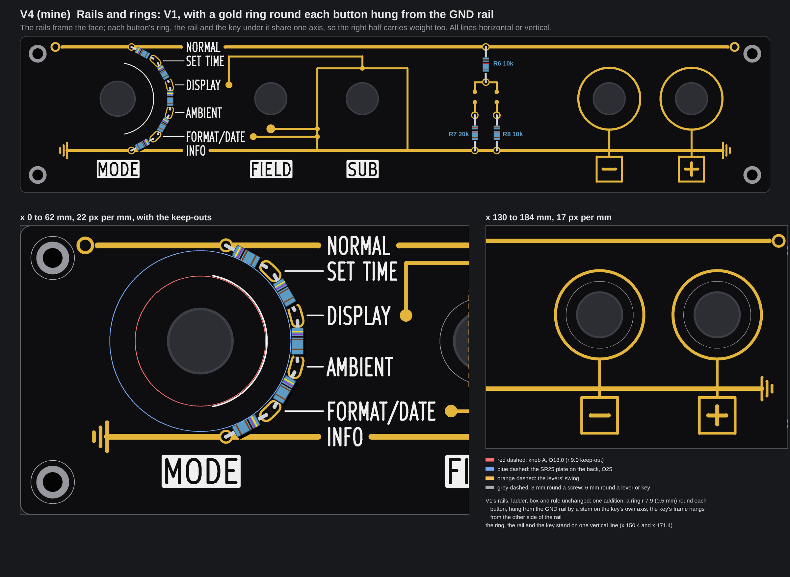

# TS06-FASCIA pass 1: four whole faces, right angles only (concepts, nothing built)

> Pass 2 (three combined faces and an artistic pass on each, with xstream's verdict folded in): [TS06-FASCIA-pass2.md](TS06-FASCIA-pass2.md)

No board file, generator, footprint, `tools/` file, `fab/` file, firmware file or page source was touched, and no board was built. The pictures are
drawn from fascia R's real geometry (the committed board with its control holes opened, the one that was ordered), with the names at their real size
(2.37 mm; the MODE, FIELD and SUB plates 3.2 mm, KiCad's own stroke font), and each face was run through `check()` of `tools/fascia_gold.py`. Items
marked *inferred* are typical figures or arithmetic on the drawing, not something a datasheet, a measurement or a fab told us here. There is **no price**
on this page: none was looked up. The scratch scripts are in the run's output folder, not in the repo.

This is the first pass. A second reader (xstream) looks at it next; nothing here is decided.

## 1. The owner's words

In chat on 2026-10-07 at about 20:58 UTC, after the T3a to T3c faces (verbatim):

> can you use xstream as a fresh set of eyes on latest fascia variants? maybe my ladder location was a mistake? I really
> want something striking and coherent, no weird doglegs, symmetrical and pleasing

and at about 21:05 UTC: "xstream dc for now, can you do the first variance pass before his input?"

## 2. The ladder answer

**Yes, the left spot was the mistake, and it caused the coil.** The dial's marks stand on its right half (-75 to +75 degrees); a straight column of
beads anywhere fights that arc. On the left, six wires have to wrap the knob ([the picture in the T3 page](TS06-FASCIA-T3-variants/topology.png)); on the right
(the first T3, x 52) the leaders slant, because the taps are evenly spaced and the marks are not. The ring (T1) is the column bent round the dial, so all
four faces below keep it.

A new finding from drawing it: **the ring's two end taps, put exactly on -75 and +75 degrees, stand at y 2.77 and 29.23, which are the rows of the names NORMAL
and INFO.** That is what makes a rail along each end possible (V1, V4) and it is the one change to T1's ring (below).

## 3. What held for all four, and what the drawing found

**The rule held.** Every gold line is horizontal or vertical; every arc is concentric with a control (the ring's tails, the ring's pads). A script
found no other angle in any of the four faces (gold lines that are neither horizontal nor vertical: none; arcs not centred on a control: none). Corners are
square (a rounded corner is an arc that is not concentric with a control, so R's rounded corners on SUB's box and the key frames are now square).
**Weights.** Rails 0.8 mm; wires, boxes, frames, rings, earth bars and the ring's tails 0.5 mm; the "-" and "+" of a key 0.7 mm (as R); the +5V terminal ring's
stroke 0.4 mm (as T1); pads 1.9 mm. The silk is T1's, but the white leaders of NORMAL and INFO are gone where a rail takes their place (V1, V4).
**Names stay 2.37 mm** (the brief); 2.8 mm was not tried. **Ring radius 13.7 mm** as T1, so the joints sit 0.25 mm outside the 25 mm plate, as in T1
(the plate is still not measured). Knob A (r 9.0) is never near gold: the nearest gold to the shaft is the pads' inner edge at 12.75 mm.

Three things the drawing found, each by measuring:

1. **The names column and the ring wall the dial in.** The names stand at x 42.5 to 57.3 from y 1.4 to y 30.6 (NORMAL's box top is at 1.43, the edge limit),
   and the beads close the gap between them and the knob. The only openings are 3.5 mm (SET TIME to DISPLAY) and 4.4 mm (DISPLAY to AMBIENT) tall, and each
   ends on a bead. So **nothing can reach the dial's right side from the right**, and a rail cannot run above NORMAL. The rails therefore run *level with*
   NORMAL and INFO and break round the two names (0.9 mm of black each side of the ink): the name stands in the rail like a plate in a bus bar.
2. **The end taps move 3.35 degrees outwards** (to the nominal -75 and +75) so that their rows equal the names' rows. R1 and R5 then span 6.32 mm hole to hole
   (leads 1.36 mm each end) against 5.53 mm for R2 to R4 (0.97 mm); *inferred* fine for a 0204 body, a visible difference in the leads only.
3. **Position 3's trace cannot be level.** FIELD's swing (x 62 to 66, y 9.0 to 22.3) is in its way; the only free corridors are above (y under 8.6) and below
   (y over 22.9), and below is full (FORMAT/DATE's name, FIELD's and position 5's rows). So the SUB rule has **one bridge**: up from DISPLAY's end, level over FIELD
   at y 5.2, down into SUB's top on SUB's own axis (x 87.37). That is 44 mm of gold and two square corners, in V1, V2, V4; V3 has it too.

**SUB's rule, drawn without a diagonal or a jog**, keeps its meaning (a box round SUB; a trace that ends beneath FIELD at its down-throw and runs into the
box; two traces that leave the names DISPLAY and FORMAT/DATE for it; nothing under a swing). What it loses: the box's rounded corners; the two entry rings
(two rings 1.99 mm apart overlap, so they are dots of 0.6 mm radius); position 5's 45-degree drop (now level); and the directness of position 3's trace (the bridge).

**What shorts what (the faces with real copper on the front).** In T1 the front gold was netless art except the ring's pads. Wherever a rail or a wire touches
a pad here, that gold is copper of the pad's net. The back already carries those nets to the same pads, so no plated hole is added (*inferred*; the
back would be routed in the build run).

## 4. V1, Rails: +5V and GND as two full-width gold rails

+5V along the top, GND along the bottom, each 0.8 mm, from x 7.8 to x 183.6 (mirror images about x 95.7; the two rails stand 13.23 mm either side of the
control row, y 16.0, mirror images about it). Each ends in a symbol (a +5V ring above, an earth below) at both ends. **Where they end, and why a screw is safe:** both stop
at x 7.8 and 183.6; the nearest gold to a screw centre is 3.62 mm (the checker's rule is 3.0), which is **1.37 mm from the head** (r 2.25 as drawn); the
bottom rail is 6.27 mm above the lower screws. The ring's end pads sit on the rails (no stub): tap 1 on the +5V rail at (28.44, 2.77), tap 6 on the GND rail at
(28.44, 29.23). The lever divider stands at **x 118.885**, a vertical ladder from rail to rail, 26.5 mm tall: R6 from the +5V rail down to node A7, then R7
(20k, FIELD's) and R8 (10k, SUB's) down into the GND rail, each leg with its lever contact drawn as two dots with a gap (no blade). SUB's box stands on the GND
rail (its bottom wall is the rail, so "SUB" and the other plates sit in one row under it); the keys hang from the rail by a 1.6 mm stem.

**Which rail is on top: +5V, and the cost.** The keys can only hang from GND if GND is the lower rail: a drop from an upper GND rail would pass the button's 6 mm
keep-out (a vertical at x 150.4 goes through the control) or, beside it, cross the lower rail. So +5V is on top, which **flips the ring**: NORMAL (top mark) sits at
+5V, not at ground, so the A6 voltage at position 1 is 5 V (ADC 1023), not 0. The cost, read from `firmware/nixieClock_TS06/ts06pair.ino`, `tools/ts06pair.py` and
`PCB/TS06-pair-testing.md`:
(1) the firmware's `rotaryPos()` (line 98) becomes `6 - (analogRead(ROTARY) + 102) / 205` (one line);
(2) DRV rev B's R72 (1 M, A6 to ground, "a defined 0 with the fascia unplugged") must go to +5V instead, or an unplugged fascia reads position 6 (INFO) instead of
NORMAL (one part's net on a board that is not ordered yet; *inferred* from the README's "Not ordered");
(3) the six rows of the bench table in the pair-testing page reverse (NORMAL 5.00 V, INFO 0.00 V). The other way, **keeping GND on top** (no flip), leaves the keys and
SUB's box hanging from +5V, which is the wrong meaning for a button that pulls to ground; I did not draw it.

**Checker (`check()`)**: no problem. Gold to white 0.45 mm (rule 0.30); gold to the edge 1.57 mm (1.4); gold to a screw 3.62 mm (3.0); gold to the knob
keep-out 3.75 mm over the rule; gold beyond the 6 mm round a lever or key by 0.60 mm; no gold in a swing; narrowest gap between two separate gold pieces: nothing
closer than 1.0 mm; inside one piece the closest parts are FIELD's pad and position 5's trace, 0.64 mm apart; thinnest silk line 0.20 mm, text strokes 0.30 mm;
thinnest gold line 0.40 mm (the +5V terminal ring), wires 0.50 mm.

| V1, Rails | |
|---|---|
| Parts and bodies | R1 to R5 4k7, R6 and R8 10k, R7 20k, all 0204 axial, lying (ring) and standing (ladder); J1 upright SMD on the back (as R rev B) |
| Plated holes | 16 x 0.8 mm: 10 on the ring, 6 on the ladder (no extra: each rail piece meets a real pad) |
| New against T1 | two real-copper rails (about 159 mm of gold each, in two pieces broken at NORMAL and INFO); the ring's tails, GND symbol and +5V terminal gone; SUB's box, FIELD's pad, the rule's traces and the key frames become GND copper; the ladder moves to x 118.885 and grows to rail to rail; SUB's rule redrawn at right angles; R1 and R5 longer; ring order flipped (above) |
| Conflicts | knob A: none; the 25 mm plate: 0.25 mm as T1; corner holes: 1.37 mm to the head; lever swings: none; the plates' band: the GND rail stands 2.5 mm over the plates' top (31.72) |
| Build cost (*inferred*) | the plan's four runs (1.3 to 1.5 M tokens) plus about 0.25 to 0.3 M: the rails with breaks, the right-angle rule, the box on the rail, the ladder rail to rail; plus about 0.05 M for the firmware line, R72 and the test table |
| Risks | **two exposed gold rails at 5 V, 26.5 mm apart** (25.7 mm edge to edge); see below |

**What shorts the rails, and whether it matters.** Anything conductive that spans 26 mm across the face: a metal tool or a coin laid across, a stray wire end, a
conductive spill; a finger does not (the gold is ENIG, the resistance through skin is large). SUB's box, FIELD's pad and the keys are GND copper too, so a bridge
from any of them to the +5V rail does the same. It matters as far as the 5 V source lets it: a short pulls the supply to ground, so the clock resets or the source
current-limits. The driver board's source and any fuse on it were **not read** here (*inferred* from the pair's README only, a regulator). Static is the second
exposure: a zap on a rail reaches the Nano's 5 V and ground pins with nothing in series (A6, A7, D7 and D8 have R72 and the 1 k + 10 nF filters; the rails have
none). Nothing stands in front of the face (`3d/case-pair`), so a short needs a deliberate act; I would still put a resettable fuse on J1 pin 1 (question 3).

## 5. V2, Harness: the face draws the six-wire lead

Six parallel gold lines (0.5 mm, pitch 1.0 mm, so a 5.5 mm ribbon at y 23.5 to 28.5) run from a six-dot J1 mark at x 160.9, between the buttons, to the left, and
peel off at right angles without crossing: D7 turns down into the minus key after 10.5 mm; D8 runs on to the right of the mark into the plus key; +5V, A7 and
GND turn up at x 129.8, 127.2 and 124.6 to the lever ladder (R6 from the +5V line at y 3.0; the A7 node; R7 and R8 down to a GND bar at y 21.0); A6 runs to x 101.5.

**It cannot be drawn as briefed, and the face shows where it fails.**
(1) **The dial cannot be reached** (finding 1): the names column and the beads wall it in, so A6 has nowhere to go (it stops at x 101.5, a 59 mm gold stub that goes
nowhere), and the dial keeps its own earth (top) and +5V ring (bottom) at the ends of its tails, taken round to +-135 degrees and mirrored about y 16. The only route I
found is a perimeter run of three 0.3 mm lines under all the plates (2.0 mm free under them) and up the left margin, about 96 mm of fine gold 1.4 to 2.8 mm from the
edge: not drawn, and I would not build it.
(2) **The pin order cannot hold.** J1's order is +5V, GND, A6, A7, D7, D8. With A7 under +5V and GND its riser to the ladder must cross them; the only line order with no
crossing is **+5V, A7, GND, A6, D7, D8**, and D8 may run along the ribbon only right of the mark (else D7's stem to the minus key crosses it). The mark's dots are in
that order, not J1's pad order (the mark is a picture of the lead, not the footprint).
(3) The mark is six line ends, not six separate dots: dots of 0.55 mm radius at 1.0 mm pitch overlap, and the checker said so.

**Checker (`check()`)**: no problem. Gold to white 0.45 mm; gold to the edge 2.05 mm; gold to a screw 6.96 mm; gold to the knob keep-out 3.75 mm over the rule;
narrowest gap between two separate gold pieces 0.50 mm (neighbouring ribbon lines); thinnest silk line 0.20 mm, text strokes 0.30 mm; thinnest gold line 0.40 mm.

| V2, Harness | |
|---|---|
| Parts and bodies | as V1; J1 upright SMD on the back |
| Plated holes | 16 x 0.8 mm (the ribbon's +5V, A7 and GND lines touch real pads, so they are copper of those nets; D7, D8 and A6 are netless art; no hole at the mark) |
| New against T1 | the ribbon and its mark (about 6 lines, 43 to 65 mm each), the ladder fed by three risers, the keys hung from D7 and D8; the dial block unchanged from T1 but with its tails taken to +-135 degrees |
| Conflicts | knob A: none; plate: 0.25 mm as T1; corner holes: 6.96 mm; swings: none; the buttons' keep-out: the top ribbon line passes 7.5 mm from minus's centre (rule 6.0) |
| Build cost (*inferred*) | the plan plus about 0.35 M: the ribbon and peeling routine, the mark, risers; and the unsolved dial feed |
| Risks | the dial unreached; A6's stub; the busiest right half (ten corners on six lines in 5.5 mm); the dots' order is not J1's; the ribbon sits 7.5 mm under the buttons |

## 6. V3, Medallions: a ring on each control's axis

Five medallions on one axis (y 16.0): the dial's ring of beads (r 13.7), and **gold rings of r 7.9 mm (0.5 mm) round FIELD, SUB, minus and plus**. Each lever's
ring carries its throws as dots, up at the top, down at the bottom; FIELD's contact pad sits on its ring's bottom. The rule: FIELD's down-throw runs level (y 23.9)
into SUB's ring, tangent at its bottom; position 5 joins that run by a 1.8 mm step up; position 3 comes over FIELD (the one long line, finding 3) and drops into SUB's top
dot. Each key hangs from its button's ring by a 6.9 mm stem. The lever divider is a small ladder at **x 118.885**, centred on y 16: a +5V ring above, R6, the node, R7 and R8
with open contacts, an earth below (no rails, so GND stays at NORMAL: no firmware change).
**Radius.** 7.9 mm is the least that keeps every ring clear of a swing: the inner edge is 7.65 from the axis, 0.38 mm outside the swing zone's top corner (at 7.7 it was
0.18 mm). Rings round the keys have no electrical job; they are the look.

**Checker (`check()`)**: no problem. Gold to white 0.45 mm; gold to the edge 1.50 mm; gold to a screw 6.96 mm; gold to the knob keep-out 3.75 mm over the rule; gold beyond
the 6 mm round a lever or key by 0.80 mm; narrowest gap between two separate gold pieces 0.90 mm; closest inside one piece: FIELD's pad and position 5's trace, 0.44 mm; thinnest
silk line 0.20 mm, text strokes 0.30 mm; thinnest gold line 0.40 mm.

| V3, Medallions | |
|---|---|
| Parts and bodies | as V1 |
| Plated holes | 16 x 0.8 mm |
| New against T1 | four rings (r 7.9) and their throw dots; FIELD's contact on its ring; the rule at right angles with a tangent join; keys hung from rings; the ladder small and centred; the tails taken to +-135 degrees with mirrored symbols |
| Conflicts | knob A: none; plate: 0.25 mm as T1; corner holes: 6.96 mm; swings: the ring's inner edge and the up-throw dot stand 0.38 mm and about 0.3 mm outside the top corner of the swing zone (the zone is the checker's own: x +-2, 7 up, 6.3 down); the plates' band: unchanged |
| Build cost (*inferred*) | the plan plus about 0.2 M: rings, tails, the right-angle rule |
| Risks | "no long lines" is not met (position 3's 44 mm bridge); a tangent join leaves a black wedge that narrows to nothing, under 0.1 mm over about 0.3 mm of its length (*inferred* by arithmetic: a fab may merge the openings, which is harmless, or leave a sliver of mask); the ring and the key are far apart (6.9 mm stem); the rings are decoration where the face has no wire to carry |

## 7. V4 (mine), Rails and rings: V1 with a ring round each button

Mine, not from the brief. V1 is the strongest face but its right half is two keys and a ladder under a long bar. V3's rings fix the weight; V1's rails fix the
coherence. V4 takes both with one addition: **a ring (r 7.9, 0.5 mm) round each button, hung from the GND rail by a stem on the key's own axis**, with the key's frame hanging
from the other side of the rail, so ring, rail and key stand on one vertical line at x 150.4 and x 171.4. The ring is GND copper (it touches the rail); nothing else changes
from V1: the rails, the ladder, SUB's box and the rule are V1's.

**Checker (`check()`)**: no problem; the numbers are V1's (the rings add none worse): gold to white 0.45 mm; gold to the edge 1.57 mm; gold to a screw 3.62 mm; gold to the
knob keep-out 3.75 mm over the rule; beyond the 6 mm round a lever or key by 0.60 mm; narrowest gap between two separate gold pieces over 1.0 mm; thinnest silk line 0.20 mm,
text strokes 0.30 mm; thinnest gold line 0.40 mm.

| V4, Rails and rings | |
|---|---|
| Parts and bodies | as V1 |
| Plated holes | 16 x 0.8 mm |
| New against T1 | V1's list, plus two rings with stems (GND copper) |
| Conflicts | as V1; the rings stand 7.9 mm round the buttons (rule 6.0) and clear of the top rail by 4.7 mm |
| Build cost (*inferred*) | V1's plus about 0.03 M |
| Risks | V1's (the exposed rails, the flip of the ring); a larger area of GND copper on the front: the rings add about 110 mm of 0.5 mm line |

## 8. Ranking against the five words

Ranks among the four (1 is best); the look is judged on the pictures above, so "pleasing" is taste, not a measurement.

| | Striking | Coherent | No doglegs | Symmetrical | Pleasing |
|---|---|---|---|---|---|
| V1 Rails | 2: two bars frame the face | 1: one idea, everything hangs from it | 1: one bridge, nothing else | 2: rails mirror about y 16 and x 95.7, the ladder about itself; the rule does not | 3 |
| V2 Harness | 4 | 4: the dial is cut off, the order is bent | 4: ten corners and an A6 stub | 4 | 4 |
| V3 Medallions | 3: calm rather than bold | 3: rings, but the rule is a different language | 1: bridge and one step | 3: rings on one axis, tails mirrored; the rule is lopsided | 2 |
| V4 Rails and rings (mine) | 1 | 1: V1's idea carried to the right half | 1: as V1 | 1: as V1, and the right half now mirrors the dial | 1 |

Against today's faces (R rev B and T1): both have a 45-degree trace from DISPLAY, a jog on FORMAT/DATE's trace, lopsided symbols at the ring's end and a ladder in the
middle tied to nothing; **all four new faces have none of the first three**, and V1, V4 tie the ladder to the rails.

## 9. My pick

**V4 as the look, V3 as the face that costs nothing electrical.** V4 ranks first, or tied first, on all five words in the pictures; it is V1 plus two rings, so the real decision is
whether to accept the rails. The rails cost three things V3 does not: a firmware line and one DRV net (the mode table's flip), two exposed 5 V rails, and the SUB
rule becoming GND copper. If any of those is unwelcome, V3 is the face: no firmware change (GND stays at NORMAL), no rail, 16 holes, and it has the symmetry of its rings.
V2 should not be built: it cannot reach the dial and its order is not J1's. **Not decided: V1's rails' balance with the rings (V4) is an eye's judgement, and the
second reader should check it.**

## 10. Questions for the owner

1. **Rails (V4) or no exposed rails (V3)?** *Recommendation: V4. It is the face that answers "striking, coherent, symmetrical", and the rails' cost is small (a firmware line, one net on an
   unordered board, a fuse). Say V3 if two 5 V rails on a finger-touched face are not welcome.*
2. **If rails: +5V on top (flip the mode table) or GND on top?** *Recommendation: +5V on top. It is the schematic habit, it lets the buttons hang from GND, and the flip costs one
   firmware line, R72's net (1 M, A6 to +5V so an unplugged fascia still reads NORMAL) and the test table, all before the driver board is ordered.*
3. **Add a resettable fuse on J1 pin 1 (+5V) on the driver board?** *Recommendation: yes if V4 or V1 (one part; the source and any existing protection were not read, so the hold
   current, about 0.5 A, is *inferred*). It does nothing for V3.*
