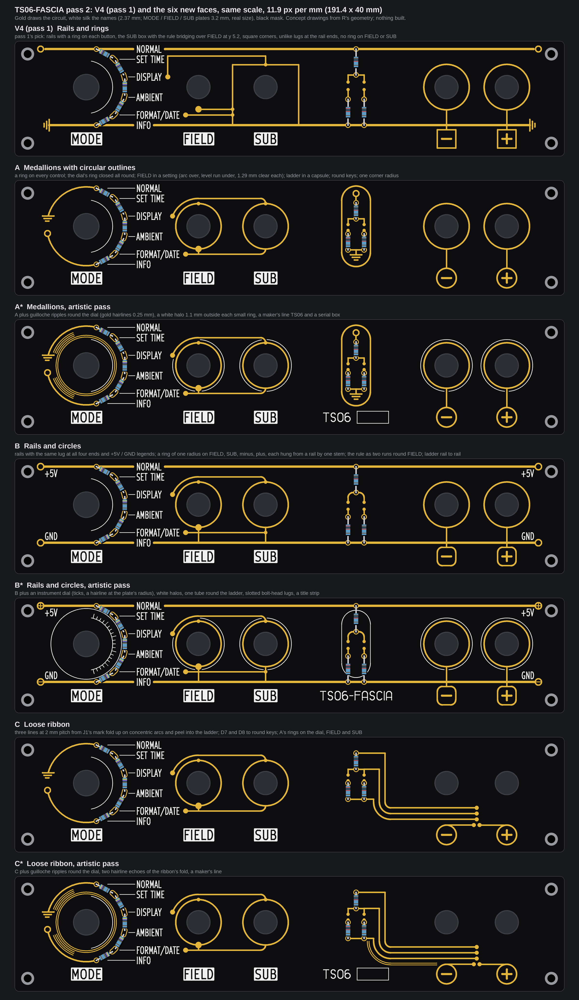
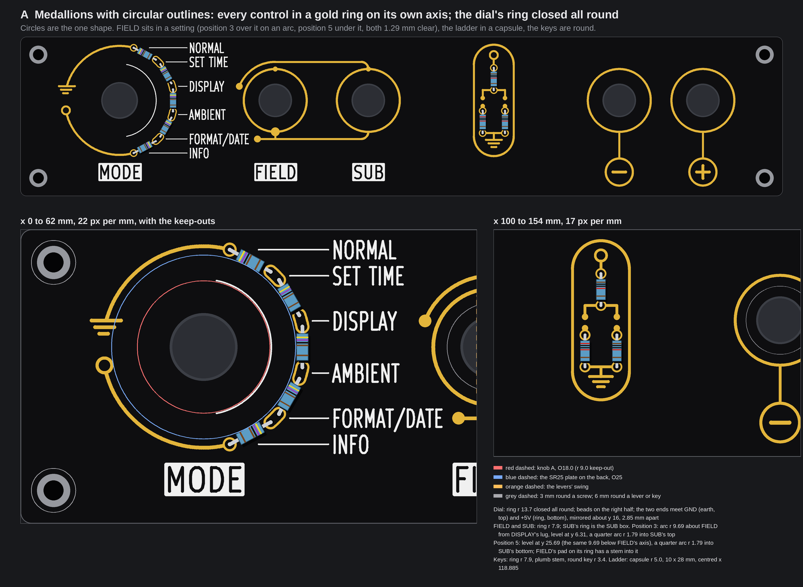
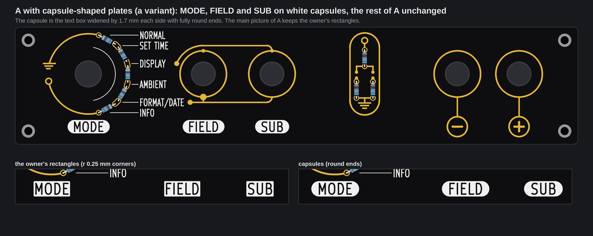
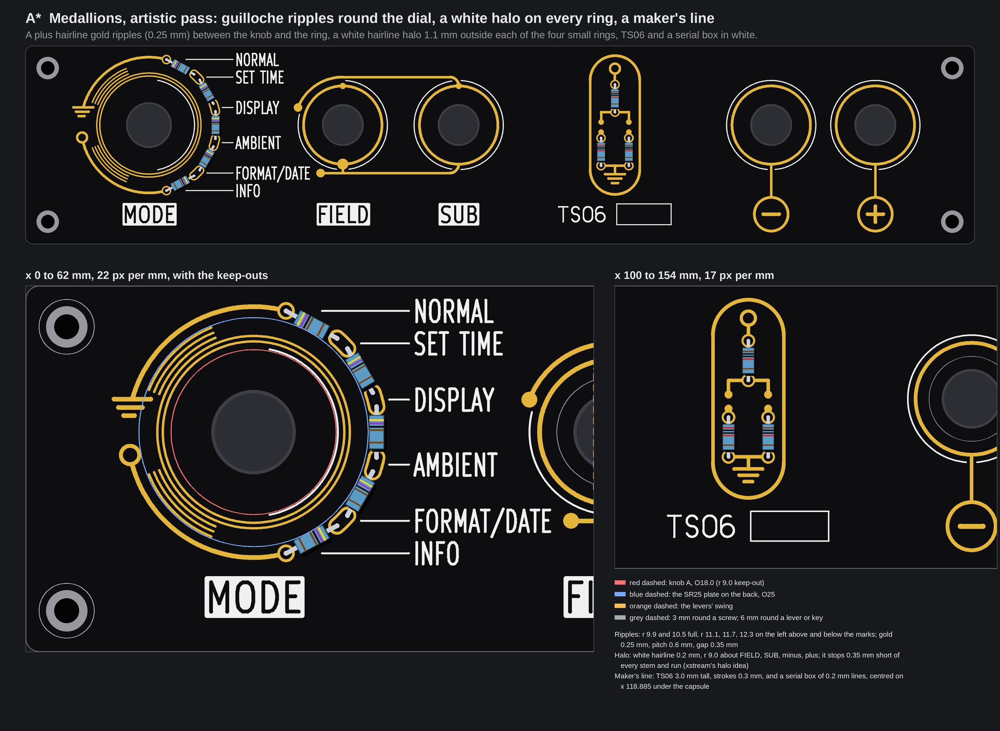
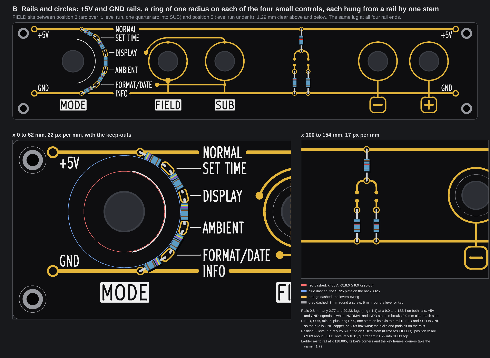
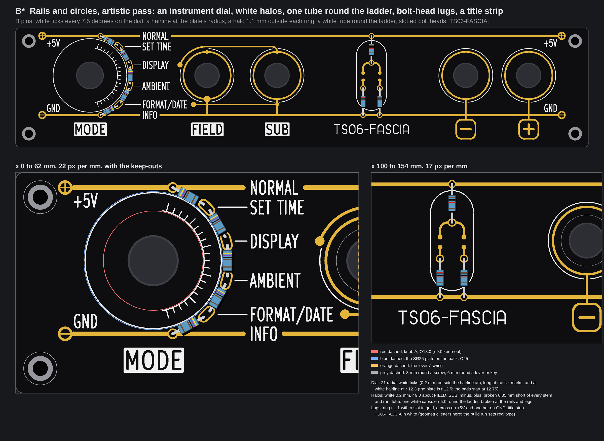
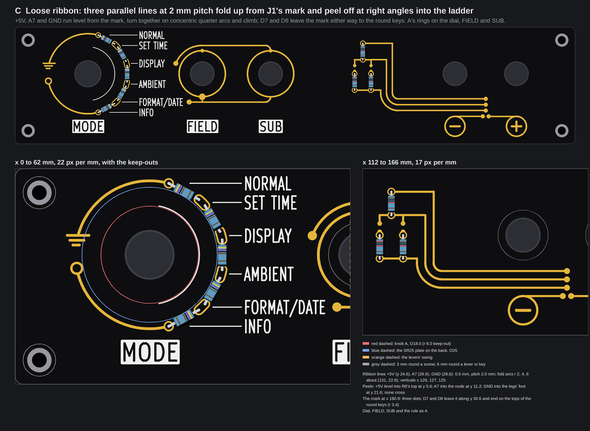
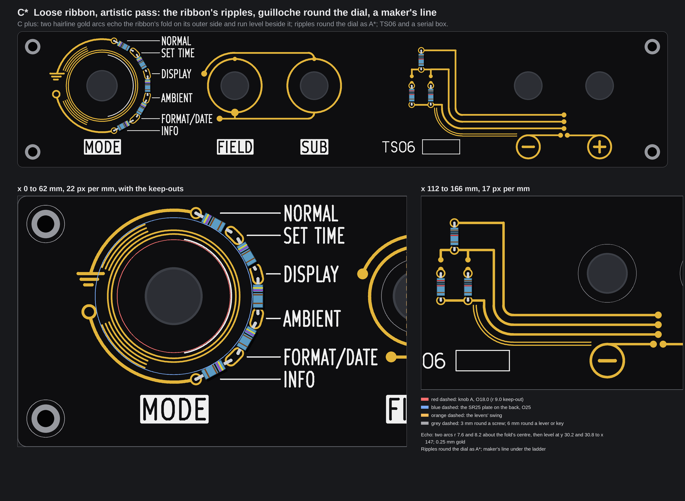

# TS06-FASCIA pass 2: three combined faces, and an artistic pass on each (concepts, nothing built)

**Pass 3 (B\* and C\* in one face, no flip, equal name pitch, xstream's critics folded in) is in [TS06-FASCIA-pass3.md](TS06-FASCIA-pass3.md).**

No board file, generator, footprint, `tools/` file, `fab/` file, firmware file or page source was touched, and no board was built. The pictures are drawn
from fascia R's real geometry (the committed board with its control holes opened, the one that was ordered), with the names at their real size (2.37 mm; the
MODE, FIELD and SUB plates 3.2 mm, KiCad's own stroke font), and every face was run through `check()` of `tools/fascia_gold.py`. Items marked *inferred* are
typical figures or arithmetic on the drawing, not something a datasheet, a measurement or a fab told us here. There is **no price** on this page: none was looked
up. The scratch scripts are in the run's output folder, not in the repo. Pass 1 is [TS06-FASCIA-pass1.md](TS06-FASCIA-pass1.md).

## 1. The owner's words

In chat on 2026-10-07 at about 22:20 UTC, after pass 1's contact sheet (verbatim):

> combine v3 with circular outlines, v4 with rails+circles and some aspects of v2 with less bunching. add an artistic
> pass, xstream is now awake so his input too

The bar, from 20:58 UTC and still in force: "striking and coherent, no weird doglegs, symmetrical and pleasing".

My reading, drawn as three faces and judged in section 7: **A** Medallions with circular outlines (V3 taken further), **B** Rails and circles (V4 taken further),
**C** Loose ribbon (V2's good idea, with fewer lines at a wider pitch). **A\*, B\*, C\*** are the same faces with an artistic layer.

## 2. xstream's input, and what I took

**Found.** Its verdict is `embassy/review/nixie-fascia-fresh-eyes/verdict.md` in agent-commons, commit 8e263ed. At the start of the run (22:23 UTC) it was not there;
the coordinator handed me the commit at about 22:45, and I read it by its hash (it is on the local `main` of agent-commons, not yet on `origin/main`; read only, nothing
written or pulled there). I applied it to B and B\* above all, and to A and C where it fits. At the check before the contact sheet (22:54) and again at the end
the verdict had no extra section; it says outside critics may add one before 23:20 UTC, so the coordinator folds that in later.

xstream's pick is B (rails, rings of one radius on the four small controls, no SUB rectangle). That is also my pick from the pictures (section 8): B and A\* were my first and second from the first renders, before the verdict reached me. Point by point:

| xstream's point | Taken? | What I did, or why not |
|---|---|---|
| Pick: V4's rails plus rings on FIELD, SUB, minus, plus, ONE radius; the SUB rectangle goes | **Taken** (B, B\*) | Rings r 7.9 on all four, concentric with each shaft; SUB's ring is the SUB box (A and C too). |
| The SUB rule as two level runs from the DISPLAY and FORMAT/DATE lugs, one above FIELD's ring and one below, each at the same gap ("a jewel in a setting") | **Taken, with one change** (A, B, C and the stars) | Equal gap: both runs stand **1.29 mm** clear of FIELD's ring. The lower run is level at y 25.69, the row of FORMAT/DATE; the upper one is its mirror about FIELD's axis, level at y 6.31. DISPLAY's lug (y 12.45) lies inside FIELD's vertical span, so a level run from it would meet the ring: the upper run therefore leaves the lug on an **arc concentric with FIELD** (r 9.69, the same distance as the lower run, so the setting is a true halo) and turns level at the top. I did not draw a plumb riser from the lug: it would stand beside SET TIME's name and read as SET TIME's. |
| Every corner a quarter arc of ONE radius (for example 2 mm) | **Taken, r 1.79 mm** (B, B\*, and the rule in A and C) | 1.79 is the largest that fits: the drop from the upper run to SUB's ring top is 1.79 mm (2 mm would not fit). Used on the rule's corners, the ladder bar's two corners in B and the key frames' corners in B. **Not used:** the ladders in A and C (a 1.79 arc does not fit the 5.6 mm span beside the contact dots), the dial's earth, the ribbon (its folds are concentric arcs of r 2, 4, 6, the brief's own idea). **This departs from pass 1's working rule "level, plumb, or concentric with a control"**: a fillet is not concentric with a control. The angle check now counts it as its own class (section 4). |
| Rails at equal insets, the same lug at both ends, sized like the corner-hole rings | **Taken, except the size** (B, B\*) | Lugs (a ring r 1.1) at x 9.0 and 182.4 on both rails: equal insets, the same lug on all four ends (V4 had a ring on top and an earth below, at 9.0 and 12.0). A lug as big as the corner-hole ring (r 2.25) cannot stand at y 2.77: it would break the 1.4 mm edge rule (r 1.1 leaves 1.47). |
| Small white silk symbols at the rail ends | **Taken** | White "+5V" and "GND" legends (name size, 2.37 mm) under the top rail and over the bottom rail, at both ends; in B\* the lug also carries a gold slot (a cross for +5V, one bar for GND). |
| Rails break with an even gap at NORMAL and INFO | **Taken** | 0.9 mm of black each side of the ink, measured from the ink's box. |
| Each ring hangs from a rail by one vertical stub on its own axis; the ladder is the centrepiece, rail to rail on x 118.85 | **Taken** (B, B\*) | One stem each. FIELD's and SUB's go to the GND rail and so make the rule GND copper (as V4's box was); the position-5 run meets SUB's stem in a tee and crosses FIELD's. The ladder is rail to rail at x 118.885 (B\* puts the white tube round it). |
| The dial arc ends land on the rails at the NORMAL and INFO rows | **Already so, kept** (B) | The end pads sit on the rails. In A and C there are no rails: the dial's ring is closed all round and its two ends meet two marks. |
| Do not chase mirror symmetry of the whole face; elements symmetric about their own axes, the frame symmetric about the board centre | **Taken** | The ranking's "symmetrical" is read that way (section 7). The frame of B is mirror-symmetric about x 95.7 and y 16 (lugs, legends, break gaps). |
| Artistic: white minor ticks on the dial, and a hairline at the plate's radius | **Taken** (B\*) | 21 radial white ticks (0.2 mm) every 7.5 degrees from -75 to +75, long at the six marks, standing on the existing hairline arc (r 9.2): outside the arc, not "outside the beads" (the beads and the names wall that side in). A white hairline at r 12.3 (the plate is r 12.5; the pads start at 12.75 and white to gold must stay 0.30). |
| Artistic: a white halo hairline 1 mm outside each gold ring | **Taken** (A\*, B\*) | r 9.0, 0.2 mm, round FIELD, SUB, minus, plus (1.1 mm from the ring's centre line, 0.75 clear of it); it stops 0.35 mm short of every stem and run. Not round the dial: at r 15 it would cross the rails and leave the board's edge margin. |
| Artistic: ONE white tube outline round the centre ladder | **Taken** (B\*) | One white capsule, r 5.0, broken where the rails and legs cross it. In A the capsule is gold (the brief asked for it there). |
| Artistic: a title strip "TERMINAL-06  TS06-FASCIA rev C" | **Half taken** (B\*) | "TS06-FASCIA" in white, 3 mm tall, drawn in my own lines-and-arcs letters. The real wording and type are for the build run: new KiCad stroke-font glyphs need the KiCad container, and no Docker daemon was running here (so no "TERMINAL" or "rev C" either: M, N, R need diagonals the right-angle letters do not have). |
| Ranked 2 Medallions only, 3 Loose ribbon ("pick only if it stays loose") | Agreed | A\* is my second, C my last (section 7). C stays loose (2 mm pitch, three lines), but its right half is the only part that carries the ribbon. |
| "Nothing fixed moves" | Kept | No control, hole or plate moved. |

## 3. What the drawing found (new in this pass)

1. **FIELD's setting falls out of the marks.** SET TIME's row (y 6.31) and FORMAT/DATE's row (y 25.69) are mirror images about the control row (the marks at -45 and +45 degrees),
   so a level run on each row stands exactly the same distance from FIELD's axis: 9.69 mm, 1.29 mm clear of the ring. The two runs need no tuning.
2. **The closed ring cannot be a closed circuit.** Joining the two end taps round the left would short +5V to GND, so the "closed" ring is closed to the eye: its two arcs stop
   2.85 mm apart at 9 o'clock and each ends in a mark (an earth on top, a terminal ring below). NORMAL stays at GND, so **A and C need no firmware change**.
3. **A correction to pass 1.** Its page said V4's rails stand 26 mm apart as the exposure. V4's bridge over FIELD ran at y 5.2, GND copper 1.8 mm under the +5V rail for a 34 mm level run;
   the page did not say so. In B and B\* the nearest GND copper to the +5V rail is **2.90 mm** (the upper run at y 6.31); a metal tool or a conductive drop can still bridge it.
4. **Ripples and halos fit only where there is room.** On the dial the ripples sit between the knob (r 9.0 keep-out) and the ring; round FIELD and SUB the only room for a halo is
   r 9.0, because the two level runs pass at 9.44 to the ring's axis.

## 4. What held for all six, and the checker

**The rule.** No gold line is neither level nor plumb (script: 0 on all six). Gold arcs, by centre: concentric with a control (the dial's ring and pads, FIELD's arc, the rings);
the capsule's two ends (A, A\*); the ribbon's fold centre (C, C\*: r 2, 4, 6, and the two echoes); and **one-radius corners, r 1.79** (2 in A and C, 11 in B). No other arc.
Silk: B\*'s 20 slanted ticks are radial (each on a radius of the dial), the one exception to level / plumb / concentric; white text strokes are KiCad's font.
**Weights.** Rails 0.8 mm; wires, rings, boxes, capsule, ribbon, corners 0.5 mm; lug ring 0.4 mm; gold hairlines 0.25 mm (ripples, echoes) and 0.30 mm (bolt slots); silk hairlines 0.20 mm
(halos, ticks, tube, serial box), text and my letters 0.30 mm.

**`check()` of `tools/fascia_gold.py`: no problem on any of the six.** Numbers (rules in brackets):

| | A | A\* | B | B\* | C | C\* |
|---|---|---|---|---|---|---|
| Gold to white (0.30) | 0.45 | 0.36 | 0.45 | 0.35 | 0.45 | 0.45 |
| Gold to the edge (1.4) | 1.75 | 1.75 | 1.47 (lug) | 1.47 | 1.82 | 1.82 |
| Gold to a screw (3.0) | 9.19 | 9.19 | 3.52 (lug) | 3.52 | 9.19 | 9.19 |
| Gold to the knob keep-out (9.0), margin | 2.53 | 0.77 (ripples) | 3.75 | 3.75 | 2.53 | 0.77 |
| Narrowest mask web, between separate pieces (0.30) | 0.90 (contact dots) | 0.35 (ripples) | over 1.0 (nearest 2.90) | over 1.0 | 0.60 (D7, D8 dots) | 0.35 (echoes) |
| Narrowest web inside one piece | 0.40 (earth bars) | 0.40 | 0.44 (FIELD's pad to the lower run) | 0.44 | 0.40 | 0.40 |
| Thinnest gold line | 0.40 | 0.25 | 0.40 | 0.30 | 0.40 | 0.25 |
| Thinnest silk line / text stroke | 0.20 / 0.30 | 0.20 / 0.30 | 0.20 / 0.30 | 0.20 / 0.30 | 0.20 / 0.30 | 0.20 / 0.30 |

The mask web is the checker's gold-to-gold distance (the mask openings; the copper is 0.05 mm larger each side, so 0.20 mm between copper at the 0.30 rule). **Hairline gold, said as a number:**
0.25 mm is 1.7 times the fab's 0.15 mm track limit (`tools/dfm_check.py`) and 0.6 mm pitch leaves 0.35 mm between openings (limit 0.10 mm for a mask web, *inferred* fine for ENIG at that size, not asked of a fab).
White silk 0.20 mm is above the 0.15 mm limit. The gold to white 0.35 in A\* and B\* is the halos' own stop distance.

## 5. A, Medallions with circular outlines

Every control in a gold ring on its own axis (r 7.9; the dial's is r 13.7 and closed all round). SUB's ring is the SUB box: position 3 enters its top, position 5 its bottom, each by a quarter arc
(r 1.79), and FIELD's contact pad on its ring's bottom has a stem into position 5's run. The minus and plus keys are round (r 3.4, a stem down from each button's ring); they read well and
echo the rings. The ladder stands in a capsule (r 5.0, 10 x 28 mm) centred at x 118.885, its +5V ring above and an earth below.
**New against V3:** the arc over FIELD in place of the long level line (it fits: the arc's top is y 6.31, the swing's top is y 9.0), FIELD in a setting, the closed dial ring with mirrored marks, round keys,
the capsule, one corner radius. **Costs:** 16 plated holes (10 ring, 6 ladder, as T1); no mode-table flip; no exposed rail; the gold that carries a net is the ring's tails (GND earth and +5V ring, **2.85 mm apart**
at the dial's open point) and the ladder's pads; every ring and the capsule are netless art. Build cost (*inferred*): the plan plus about 0.25 M tokens.

**Capsule plates (the option).** The MODE, FIELD and SUB plates drawn as white capsules (the text box widened 1.7 mm each side, round ends), the rest of A unchanged. **They read better in A:** they echo the rings and take the
only straight-edged white shapes off a face of circles. In B they would not: the rails are straight and the rectangles sit well under them. The cost is the plate's silk shape only (no copper, no hole);
the gold keeps 1.77 mm from the plates, as before. The main pictures keep the owner's rectangles.

## 6. A\*, B, B\*, C, C\*

### A\*, the artistic pass on A

Guilloche on the dial (full circles at r 9.9 and 10.5, three short arcs each side of the marks at r 11.1, 11.7, 12.3: gold 0.25 mm, gap 0.35 mm), xstream's white halo on FIELD, SUB, minus and plus,
and a maker's line (TS06 and a serial box) in the empty band under the capsule. Restraint: no sunburst (its rays would be neither level nor plumb), no border (the dial ring and the rule use the top band).
**Checker:** above (gold to white 0.36, mask web 0.35, hairline 0.25). **Costs:** as A, plus 0.77 mm to the knob keep-out; about 0.1 M tokens more (*inferred*).

### B, Rails and circles

V4 with xstream's list: +5V on top and GND below (0.8 mm, y 2.77 and 29.23, x 9.0 to 182.4), the same lug and a white legend at all four ends, NORMAL and INFO in even breaks. A ring r 7.9 on FIELD, SUB, minus and plus, each hung from a rail by one stem
(FIELD and SUB to GND). FIELD sits between position 3 (the arc, a level run at y 6.31, one quarter arc into SUB's top) and position 5 (a level run at y 25.69 that meets SUB's stem in a tee). The ladder is rail to rail at x 118.885, its bar's corners and the key frames' corners at r 1.79.
**New against V4:** rings on FIELD and SUB, no SUB rectangle, no bridge hook, one lug, one corner radius, legends. **Costs:** 16 plated holes (no extra: each rail piece meets a real pad); **the mode-table flip** (+5V on top puts NORMAL at 5 V: the firmware's `rotaryPos()`, DRV rev B's R72 to +5V, the bench table's six rows,
as pass 1 section 4); **two exposed 5 V and 0 V rails**, 26 mm apart, and the GND copper of the rule 2.90 mm under the +5V rail; a resettable fuse on J1 pin 1 is pass 1's question 3 and still stands. Build cost (*inferred*): V4's plus about 0.1 M tokens.

### B\*, the artistic pass on B

xstream's ideas, kept to four: an instrument dial (21 radial white ticks and a hairline at r 12.3), white halos on the four rings, one white tube round the ladder, and a title strip; and the brief's own bus-bar terminals (a bolt head in gold at each rail end, a cross slot on +5V, one slot on GND).
I tried a ruler of white ticks along the rails and a guilloche on the dial and dropped both: with the dial's ticks and the halos they were clutter.
**Checker:** above (gold to white 0.35, thinnest gold 0.30, silk 0.20). **Costs:** as B; the new silk is 179 items, all white, no copper; about 0.15 M tokens more (*inferred*), most of it the halos' breaking and the title letters.

### C, Loose ribbon

Three gold lines at **2.0 mm pitch** (0.5 mm lines, 1.5 mm apart) start on three dots at x 160.9, the J1 mark, run level, **fold together on concentric quarter arcs (r 2, 4, 6 about (131, 22.6))**, climb, and **peel off at right angles without crossing**: +5V level into R6's top at y 5.6,
A7 into the node at y 11.2, GND into the legs' foot at y 21.6. D7 and D8 leave the mark either way along y 30.6 and end on the tops of the round keys. A's rings on the dial, FIELD and SUB; the ladder without a capsule.
**Which nets, and why:** +5V, A7 and GND are the lever divider's three nodes, so the ribbon carries the whole of that block; D7 and D8 are the keys' signal lines, one each. A6 is **not** carried: the dial cannot be reached from the right (the names and the beads wall it in, pass 1 finding 1), so it keeps its own closed ring and marks.
Lengths: +5V 60 mm, A7 53 mm, GND 44 mm, D7 and D8 9.5 mm each. **New against V2:** three lines and not six, 2.0 mm and not 0.8 mm, arcs not corners where the lines fold, the dial no longer pretended to be reachable.
**Costs:** 16 plated holes (the ribbon's +5V, A7 and GND touch real pads, so they are copper of those nets; D7 and D8 are art); no flip; **the exposure is the ribbon**: three live nets 1.5 mm apart edge to edge (+5V to GND 3.5 mm, with A7 between), over about 175 mm of gold; a drop or a metal tool bridges 1.5 mm easily.
A7 or D7 shorted to a neighbour only moves a reading; +5V to GND needs 3.5 mm and a fuse on J1 pin 1 is the answer. Build cost (*inferred*): the plan plus about 0.3 M tokens (the fold, the peels, the mark).

### C\*, the artistic pass on C

The dial's guilloche as A\*, a maker's line, and two hairline gold echoes of the ribbon's fold (r 7.6 and 8.2, then level beside the ribbon), which give the ribbon an engraved edge. I tried no more: the ribbon is the one idea on this face.
**Checker:** above (hairline 0.25, mask web 0.35). **Costs:** as C; about 0.1 M tokens more (*inferred*).

## 7. Ranking against the owner's five words

Ranks among the six (1 is best; ties share a rank). "Symmetrical" is read as xstream says: each element about its own axis, and the frame about the board centre, not the whole face. "Pleasing" is taste, judged on the pictures.

| | Striking | Coherent | No doglegs | Symmetrical | Pleasing |
|---|---|---|---|---|---|
| A | 5 | **1**: one shape | **1**: 2 fillets, square corners only on the ladder's bar | 3: dial, rings and capsule symmetric about their axes; no frame | 4 |
| A\* | 2: the ripples and halos | **1** | **1** | 3 | 2 |
| B | 3 | 3: rails and circles are two ideas, joined by the stems | **1**: 11 fillets, no square corner | **1**: the frame mirrors about x 95.7 and y 16; rings, ladder, keys on their axes | 3 |
| B\* | **1**: the frame, the instrument dial, the tube | 3 | **1** | **1** | **1** |
| C | 6 | 5: the ribbon and the rings are two ideas, on two halves | 5: six square peel corners | 5: the ribbon and the off-axis ladder load the right half only | 6 |
| C\* | 4 | 5 | 5 | 5 | 5 |

No face has a gold line that is neither level nor plumb or an arc off a control, a fold or a corner radius; "no doglegs" ranks the number of square corners left.

## 8. My pick

**B\*.** It ranks first on striking, no doglegs, symmetrical (the frame) and pleasing, and it is the face xstream picked from its own reading, with a different method. **A\* is the face that costs nothing electrical** (no flip, no rail, 16 holes) and is nearly as good: if the two exposed rails or the flip are unwelcome, A\* is the answer, and it takes the capsule plates well.
C should not be built: its right half is the ribbon, the left half is A, and the face loses the balance that A and B have; it also has the most exposed gold (three nets at 1.5 mm).
**Not decided:** "pleasing" is an eye's judgement; the second reader's critics (xstream, before 23:20 UTC) may change the ranking.

## 9. Questions for the owner

1. **B\* (rails, the mode-table flip, two exposed rails) or A\* (no rails, nothing electrical)?** *Recommendation: B\*. It is the strongest face by the five words, xstream picked it too, and the flip costs one firmware line, R72's net and the test table, all before the driver board is ordered (pass 1 section 4). Say A\* if two 5 V rails on a touched face are not welcome.*
2. **Round the corners with one radius (1.79 mm), or keep square corners as pass 1?** *Recommendation: round. Every corner of the rule, B's ladder bar and B's key frames then reads as one hand (xstream's point), and none touches the rules; the cost is that these arcs are not concentric with a control, which was only the working rule of pass 1, not the owner's.*
3. **What does the white title strip say?** *Recommendation: xstream's wording, "TERMINAL-06  TS06-FASCIA rev C", set in the DRV board's font in the build run; the strip drawn here ("TS06-FASCIA" in my own lines) only shows where it goes. The legends "+5V" and "GND" at the rail ends stay as drawn.*

## 10. Left open, refused, skipped

- Nothing was refused. A shell guard once refused a compound command (it could not show the command stayed in the worktree); I split it into plain commands and it ran. The coordinator's `git show origin/main:...verdict.md` failed (the verdict is on the local `main` of agent-commons, commit 8e263ed, not on `origin/main`); I read the same file by that hash, read only.
- Not done: the build (no board, no generator), real type for the title strip (no Docker daemon here), a ruler of ticks on the rails (tried, dropped), a frame-ribbon round the face (the keys and the plates block the bottom run and the screws the top corners, so C stays a right-half ribbon).
- The firmware cost, the fuse, the build costs in tokens and the "fine for ENIG" at 0.25 mm are *inferred*; the driver board's source and any protection were not read.
