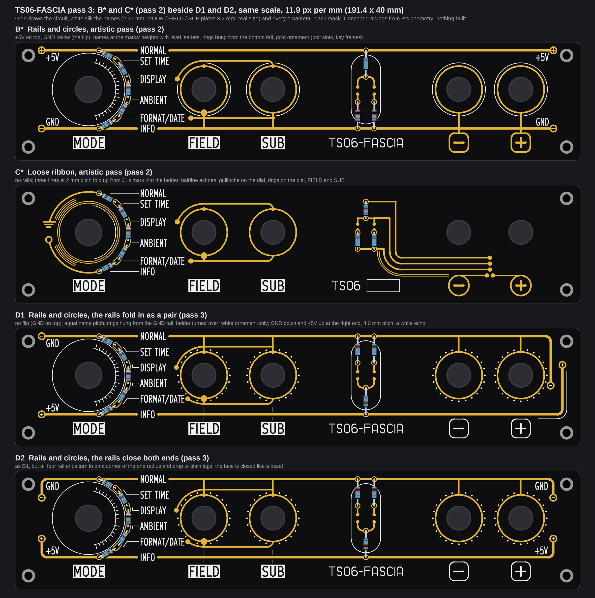
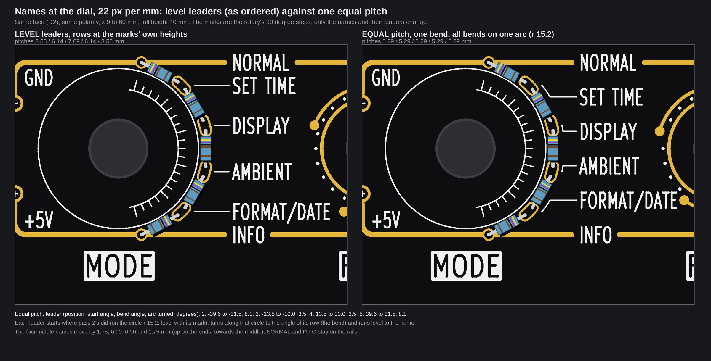
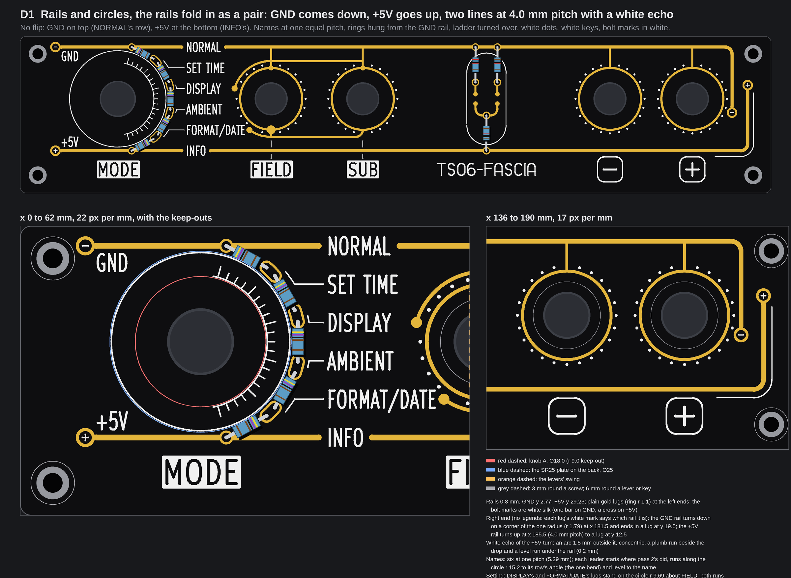
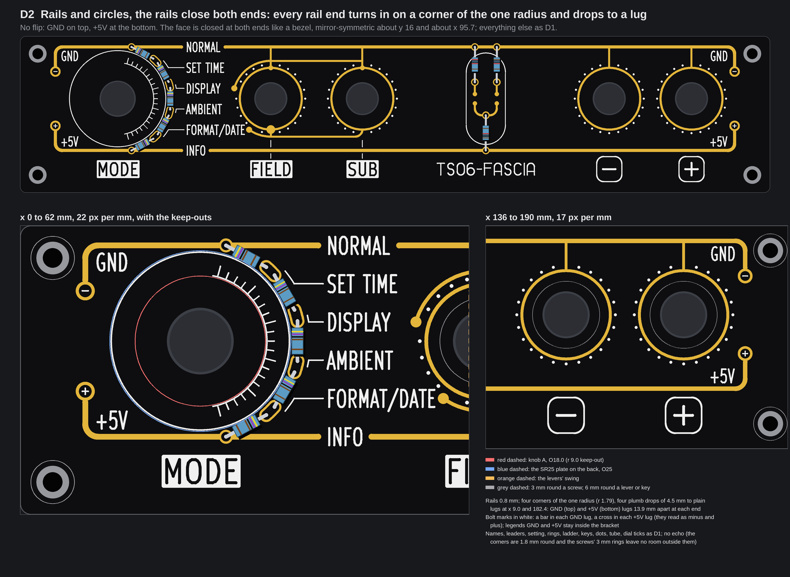

# TS06-FASCIA pass 3: B* and C* in one face, with xstream's critics folded in (two faces, D1 and D2; concepts, nothing built)

No board file, generator, footprint, `tools/` file, `fab/` file, firmware file or page source was touched, and no board was built. The pictures are drawn
from fascia R's real geometry (the committed board with its control holes opened, the one that was ordered), names at their real size (2.37 mm; the
MODE, FIELD and SUB plates 3.2 mm, KiCad's own stroke font), and both faces were run through `check()` of `tools/fascia_gold.py`. Items marked *inferred* are
arithmetic on the drawing or typical figures, not something a datasheet, a measurement or a fab told us here. There is **no price** on this page. The scratch
scripts are in the run's output folder, not in the repo. Pass 2 is [TS06-FASCIA-pass2.md](TS06-FASCIA-pass2.md), pass 1 is [TS06-FASCIA-pass1.md](TS06-FASCIA-pass1.md).

## 1. The owner's words, and the answers

In chat on 2026-10-07 at about 23:05 UTC, answering pass 2's questions (verbatim):

> 1 combine B* and C* with new info
> 2 ok use your best judgement but explain why do we need this
> 3 yes
> 4 yes coordinate pace with xstream

What I took from them:

1. **One face from B\* and C\*, with the new info** (xstream's critics, section 2). B\*'s skeleton stays (rails, a ring of one radius on each small control, one stem per ring, the SUB rule round FIELD, the ladder rail to rail, the dial's ring of
   beads with its ends on the rails, the white tube round the ladder, the title strip). From C\* I wanted its parallel gold lines at a wide pitch that turn on concentric arcs, with hairline echoes, as real nets: section 3 says what fitted.
2. **No flip; and why we needed it at all.** We did not need the flip. Pass 2's B put +5V on the top rail only by schematic habit ("+5V on top"), and that put NORMAL, which is at 0 V on the ordered fascia R, on the +5V rail: wrong
   potential. The rails must carry each name's real potential. Two ways to make that true: flip the mode order, or put the rails the other way round. **My decision is no flip: NORMAL stays at 0 V, so the GND rail is on top (the NORMAL row) and the +5V rail at the bottom (the INFO row).**
   The flip would have cost a firmware line (`rotaryPos()`'s table), a change to DRV's R72 (the driver board is in the order now) and two fascias reading opposite ways. Nothing electrical changes now.
   The four small rings hang from the GND rail (top); the lever ladder turns upside down to match (R7 and R8 from the GND rail at the top, R6 down to +5V at the bottom), still mirror-symmetric on x 118.885.
3. **Round corners, one radius, everywhere:** r 1.79 mm as in pass 2 (the largest that fits: the drop from the SUB rule's runs, 9.69 mm from FIELD's axis, to SUB's ring, 7.9 mm out).
4. **Pace with xstream:** the run was started on its QUOTA GO (23:15 UTC) and kept to the Run Budget Act; its critics' section is folded in below.

## 2. xstream's critics, and what I took

Read: `embassy/review/nixie-fascia-fresh-eyes/verdict.md` on agent-commons `origin/main` at d8d8b35 (fetched at the start of the run; the file last changed in d5a63d4, "critics section", and has "## Outside critics (3 lenses, done 22:5x UTC)"). Read only; nothing written or pulled there.

| Critics' point | Taken? | What I did |
|---|---|---|
| 1. Polarity: the rails carry each name's real potential | **Taken**, by the owner's answer 2 | GND rail on top at NORMAL's row (y 2.77), +5V rail at the bottom at INFO's (y 29.23); legends GND / +5V in white at the left ends; the ladder turned over; the rings and the SUB rule are GND copper hung from the top rail |
| 2. Equal name pitch, one bend per leader, all bends on one shared arc | **Taken, with a change to "radial"** | The six names at one pitch, 5.29 mm (section 5). A leader cannot go radially out and then level and still land on an equal pitch (section 4, finding 1), so each leader runs along one shared circle (r 15.2 about the dial) and then level: one bend, every bend on that circle |
| 3. Rails break with an even gap at NORMAL and INFO, or "the rails start at SUB" | **Even gap kept, SUB start not tried** | 0.9 mm of black each side of the ink, as pass 2. "Rails from SUB" means the dial's ring carries GND and +5V round its left half (pass 2's A), a different face; I did not draw it (budget) |
| 4. Gold draws only the circuit, white draws the ornament | **Taken** | Every ornament is white silk (0.20 mm lines; the fab's limit is 0.15 mm, `tools/dfm_check.py`): dial ticks and hairline, halo dots, the tube, the key legends (frames and minus / plus), the bolt marks, the title strip, the echo. Gold is rails, lugs (plain rings), rings, stems, the rule, the ladder, the dial's pads: all of it on a net. The key frames used to be gold and hang from the bottom rail (GND); with GND on top their stem would cross the +5V rail, so they are white legends now (they were art anyway) |
| 5a. White dots evenly spaced on each ring | **Taken** | 24 dots (r 0.25 mm) on a circle r 8.8 about FIELD, SUB, minus and plus (0.55 mm outside the gold ring's edge), 88 in all (20 round FIELD, 22 round SUB, 23 round each key): a dot is left out where it would stand within about 0.35 mm of gold or 0.5 mm of other silk (the stems, the setting's arcs, the legends). They replace pass 2's hairline halo |
| 5b. White dash-dot centre line on each control's axis, rail to plate | **Half taken** | On FIELD and SUB only, from under the setting down to the plate (it breaks round the +5V rail). On the keys the +5V rail stands 1.2 mm over the legend frame: only a stray stroke fitted, so I dropped it. It reads weakly; the first thing I would cut |
| 5c. White hairline glow rays from the divider's top node up to the seconds tubes | **Dropped, said so** | No room: with GND on top the ladder's top is the rail, 2.77 mm from the board's edge; rays from the node (y 20.2) up through the legs and the tube cross the gold. Restraint beats clutter |

## 3. Combining with C\*: what fitted, and what did not (new in this pass)

C\*'s ribbon, as the brief seeded it (A7 from the ladder's middle node, D7 from minus, D8 from plus, to a J1 mark between the buttons), **does not fit a face with rails**:

* The lane under the rings is 4.68 mm clear (the rings' lower edge at y 24.15, the +5V rail's upper edge at 28.83). Three lines at 2.0 mm pitch need 4.5 mm between their outer edges plus 0.30 mm of black each side: 5.1 mm. Two lines fit.
* A7 is the ladder's node (y 20.2), inside the rails; J1's pads are on the back at y 30.75 to 36.25 (`tools/mkpcb_fascia_rhythm.py`, `J1_Y` 33.0, below the +5V rail). A line from the node to a mark by J1 must cross the +5V rail; gold on one layer cannot.
* D7 and D8 have no front pad: fascia R has no plated hole, and the buttons' pads are surface-mount on the back. A D7 or D8 line on the face is art, or costs two new plated holes. "Gold draws only the circuit" rules the art out.

So both faces take the brief's **second seed, the rails' own ends folding round** (real nets: the rails themselves, no new net, no new hole), each a different way:

* **D1 folds the right ends in as a pair:** the GND rail turns down and the +5V rail turns up, two lines at 4.0 mm pitch, each corner of the one radius, each ending in a lug; a white hairline echo follows the +5V turn on its outer side.
* **D2 closes both ends:** every rail end turns in on a corner of the one radius and drops 4.5 mm to a plain lug, so the face is closed like a bezel. This is C\*'s turn without the ribbon.

## 4. What the drawing found

1. **Radial-then-level cannot give an equal pitch.** The marks stand at ±13.23, ±9.69, ±3.55 mm from the dial's axis (ratio 5 : 3.66 : 1.34); an equal pitch needs 5 : 3 : 1. Moving out along a radius scales all three alike and keeps the ratio. A leader that has to land on an equal-pitch row must change height, and only the middle names move (the four middle names move 1.75, 0.90, 0.90 and 1.75 mm, towards the middle; NORMAL and INFO stay on the rails). So each leader starts where pass 2's did (on the circle r 15.2, level with its mark), turns along that circle to the angle of its row, and runs level. That is one bend; it is an arc of the circle, concentric with the dial, so it keeps the rule "level, plumb, or an arc about a control".
2. **The SUB rule's setting changed, for the better.** The names are no longer at the marks' heights, so DISPLAY's and FORMAT/DATE's lugs now stand on the circle r 9.69 about FIELD (x 54.67 at y 13.35, and x 58.44 at y 23.94). Both runs follow that circle (over the top; under the bottom) and then go level at y 6.31 and y 25.69: the setting is now mirror-symmetric about FIELD's axis (pass 2's lower run was level from a lug, its upper run an arc). The upper run ends in a tee on SUB's own stem; the lower one turns up a quarter arc into SUB's ring bottom. FORMAT/DATE's lug stands 1.12 mm from the end of the name (0.37 mm of black).
3. **Rings hung from the top put the key frames in a bind** (section 2, point 4): white legends, no copper.
4. **The lowest GND copper is still the SUB rule's lower run**, 2.90 mm over the +5V rail (as pass 2's B).

## 5. The dial crop: level against equal pitch

**Which reads better: equal pitch, as a list; level leaders, as leaders.** Level: the pitches are 3.55 / 6.14 / 7.09 / 6.14 / 3.55 mm, so NORMAL and SET TIME crowd at the top and FORMAT/DATE and INFO at the bottom, and the middle gap is twice the end gaps. Equal: 5.29 mm five times; the names read as one list that fills the space between the rails, and the end names no longer press on the breaks. The price: four leaders hook (SET TIME and FORMAT/DATE by 8.1 degrees of arc, 2.15 mm long and visibly slanted; DISPLAY and AMBIENT by 3.5 degrees, 0.93 mm, small kinks).
**What changes against the owner's pick "a" of 02.10 (level leaders):** four of the six leaders are no longer level, the four middle names move 0.9 to 1.75 mm, and the SUB setting's lugs move (finding 2). The two end leaders stay (NORMAL and INFO sit in the rail breaks, no leader). My judgement: the list reads better and I would take equal pitch; the hooks are the cost, and they are what the owner's "no weird doglegs" is about, so it is the owner's call (question 1).

## 6. D1, the rails fold in as a pair

**New against B\*:** no flip (GND on top), names at one pitch, rings hung from the top rail, the ladder turned over, white dots, white key legends, plain lugs with white bolt marks (a bar on GND, a cross on +5V: they read as minus and plus), the right rail ends folded into a pair (4.0 mm pitch) with a white echo; no right-end legends, each lug's mark says which rail it is.
**Costs:** 16 plated holes (10 ring, 6 ladder; none new: each rail piece meets a real pad); no firmware or DRV change; two exposed rails, 26.5 mm apart, with **GND and +5V 2.30 mm apart edge to edge at the pair** (the GND lug against the +5V drop, over about 4 mm) and the SUB rule's lower run 2.90 mm over the +5V rail: a metal tool or a conductive drop can still bridge them; the resettable fuse on J1 pin 1 (pass 1, question 3) still stands. The echo reads as a stray on one rail only; it is D1's weakest part.

## 7. D2, the rails close both ends

**New against B\*:** as D1, with all four rail ends turned in on a corner of the one radius and dropped 4.5 mm to plain lugs at x 9.0 and 182.4 (the face is mirror-symmetric about y 16 and about x 95.7); no echo (the corners are 1.8 mm round and the screws' 3 mm rings leave no room outside them).
**Costs:** 16 plated holes (none new); no firmware or DRV change; two exposed rails 26.5 mm apart, the nearest GND copper to +5V 2.90 mm (the SUB rule's lower run), the lugs 13.9 mm apart at each end.

## 8. The checker, and the angle check

`check()` of `tools/fascia_gold.py`: **no problem on D1 or on D2.** Numbers (rules in brackets):

| | D1 | D2 |
|---|---|---|
| Gold to white (0.30) | 0.35 | 0.35 |
| Gold to the edge (1.4) | 1.47 (left lugs) | 1.82 |
| Gold to a screw (3.0) | 3.52 | 4.10 |
| Gold to the knob keep-out (9.0), margin | 3.75 | 3.75 |
| Narrowest mask web between separate pieces (0.30) | 1.30 (the open contacts' dots; nearest GND to +5V 2.30) | 1.30 (nearest GND to +5V 2.90) |
| Narrowest web inside one piece | 0.44 (FIELD's pad to the lower run) | 0.44 |
| Thinnest gold line | 0.40 (rings, lugs) | 0.40 |
| Thinnest silk line / text stroke | 0.20 / 0.30 | 0.20 / 0.30 |
| Gold length, mm | 695 | 683 |

Pass 2's B\* had hairline gold (0.30 mm bolt slots); there is none now: every ornament is white. The mask web is the checker's gold-to-gold distance (the copper is 0.05 mm larger each side).
**The angle check (pass 2's):** no gold line is neither level nor plumb (0 on both). Gold arcs by centre: 6 concentric with a control (the dial's ring pads, FIELD's setting) and the rest are corners of the one radius: 5 in D1 (two rail corners, the ladder bar's two, the quarter arc into SUB), 7 in D2 (four rail corners, the same three). No other arc. Silk: 20 radial ticks on the dial (the one exception, each on a radius of the dial; white text strokes are KiCad's font); the hooked leaders and the dots' circles are concentric with a control; D1's echo is concentric with the +5V corner.

## 9. My pick

**D2.** It is the calmest: the face is closed like a bezel, symmetric about y 16 and x 95.7, it carries C\*'s turn as the one-radius corner, and it adds no exposure beyond B\*'s (GND to +5V 2.90 mm). D1 is the only one that carries C\*'s idea of two lines turning together, but the pair costs 2.30 mm of exposed spacing, its legends had to go, and the echo does not pay for itself. C\*'s ribbon of signals itself cannot be had with rails (section 3): if the owner wants it, it needs a face without rails (pass 2's C\*, not recommended there either).
The pick against B\*: no flip, nothing electrical changes against the ordered fascia, white ornament only, equal pitch.

## 10. Questions for the owner

1. **Equal name pitch (D1 and D2 as drawn), or keep the level leaders of 02.10 "a"?** *Recommendation: equal pitch. The names read as one list and stop crowding the rail breaks; the cost is four small hooks in the leaders (section 5). If hooks are too like doglegs to you, say level and I redraw with the pass-2 rows (the setting is the same drawing).*
2. **D2 (closed bezel, nothing new exposed) or D1 (the rails fold in as a pair)?** *Recommendation: D2. D1's pair leaves GND and +5V 2.30 mm apart at the right end and needs the fuse on J1 pin 1 more; a C\*-style signal ribbon is not possible with rails (section 3).*
3. **What does the white title strip say?** *Recommendation: xstream's wording, "TERMINAL-06  TS06-FASCIA rev C", set in the DRV board's font in the build run; the strip drawn here ("TS06-FASCIA" in my own lines) only shows where it goes. The legends GND and +5V and the white bolt marks stay as drawn.*

## 11. Left open, refused, skipped

- One shell call was refused by the guard (a compound `sed` over a glob: it could not show the command stayed in the worktree); I ran the same edit as a plain command on named files, and nothing else was refused.
- Not drawn: "rails start at SUB" (a different dial ring); the glow rays (no room); the dash-dot line on the keys; the real title type (no Docker daemon, as in pass 2); the build. The firmware cost is nil by the owner's answer 2; the fuse, the exposed-spacing risk and "fine for ENIG" at the white and gold sizes used are *inferred*, not asked of a fab.
- The J1 pad range (y 30.75 to 36.25) is read from the generator's constants (`J1_Y` 33.0, pads at `J1_Y` -2.25 to +3.25), not measured on a board.
